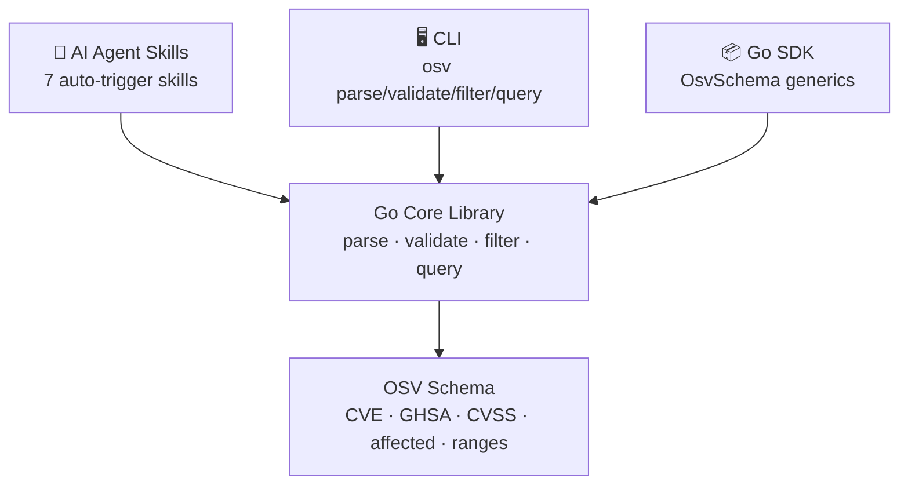
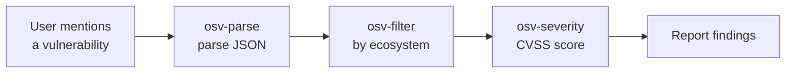

# OSV Schema Skills

[](https://pkg.go.dev/github.com/scagogogo/osv-schema-skills)
[](https://goreportcard.com/report/github.com/scagogogo/osv-schema-skills)
[](https://github.com/scagogogo/osv-schema-skills/actions/workflows/ci.yml)
[](https://github.com/scagogogo/osv-schema-skills/actions/workflows/release.yml)
[](https://github.com/scagogogo/osv-schema-skills/releases)
[](LICENSE)

[简体中文](README.zh-CN.md) | **English**

> **AI-native** OSV (Open Source Vulnerability) schema toolkit: **Go SDK + CLI + 7 Claude Code Skills**.
> Parse, validate, filter & query vulnerability data — three access layers, one Go core.
>
> 📖 Docs: <https://scagogogo.github.io/osv-schema-skills/>



---

## 🚀 Quick Start for AI Agents

The shortest path to running the CLI. Copy-paste, run, done.

```bash
# 1. Install the CLI — pick ONE:
#    a) pre-built binary (Linux/macOS/Windows · amd64/arm64/arm)
#       Replace <latest-tag> with the newest tag from the Releases page.
VERSION=<latest-tag>
curl -fsSL -o osv.tar.gz \
  https://github.com/scagogogo/osv-schema-skills/releases/download/${VERSION}/osv_${VERSION}_linux_amd64.tar.gz
tar -xzf osv.tar.gz osv && chmod +x osv && sudo mv osv /usr/local/bin/
#       If the latest release has no pre-built assets yet, fall back to (b).

#    b) or via Go
go install github.com/scagogogo/osv-schema-skills/cmd/osv@latest

# 2. Verify
osv version

# 3. Parse a real vulnerability record (bundled sample)
osv parse test_data/GHSA-vxv8-r8q2-63xw.json
```

Need the Go SDK instead?

```bash
go get -u github.com/scagogogo/osv-schema-skills
```

```go
import osv "github.com/scagogogo/osv-schema-skills"

v, err := osv.UnmarshalFromJsonFile[any, any]("vulnerability.json")
fmt.Println(v.ID, v.Aliases.GetCVE(), v.Severity.GetCVSS3())
```

---

## 🤖 AI Agent Skills

When Claude Code opens this repo, **7 specialized skills activate automatically** — no integration code. The agent auto-invokes the right `osv` subcommand based on intent.

| Skill | Purpose | Auto-triggers when… |
|-------|---------|---------------------|
| [`osv-parse`](.claude/skills/osv-parse/SKILL.md) | Parse & display OSV JSON data | You mention parsing a vulnerability file or extracting CVE/GHSA data |
| [`osv-validate`](.claude/skills/osv-validate/SKILL.md) | Validate OSV JSON files | You ask to check schema compliance or verify a vulnerability file |
| [`osv-filter`](.claude/skills/osv-filter/SKILL.md) | Filter by ecosystem / reference type / alias | You want npm/PyPI/Maven filtering or FIX references |
| [`osv-query`](.claude/skills/osv-query/SKILL.md) | Extract severity, Maven, ranges, events | You need CVSS scores, Maven GAV, or version ranges |
| [`osv-severity`](.claude/skills/osv-severity/SKILL.md) | CVSS severity analysis | You're assessing vulnerability risk or severity |
| [`osv-affected`](.claude/skills/osv-affected/SKILL.md) | Affected package & version analysis | You need impact analysis or version range inspection |
| [`osv-installation`](.claude/skills/osv-installation/SKILL.md) | Setup & installation guide | It's your first time using the skills |

Each skill is a `SKILL.md` with YAML frontmatter (`name`, `description`, `allowed-tools`, `argument-hint`) plus a structured body — decision trees, task patterns, API reference.



**Use skills in your project** — clone the repo and skills go live:

```bash
git clone https://github.com/scagogogo/osv-schema-skills.git
cd osv-schema-skills && claude   # skills are active
```

---

## 🖥️ CLI

Pre-built binaries cover **Linux / macOS / Windows** on **amd64, arm64, arm**. See [Downloads](#-downloads).

```bash
# Parse an OSV JSON file
osv parse vulnerability.json           # Key fields (text)
osv parse -v vulnerability.json        # All fields (dates, details, ranges, credits)
osv parse -o json vulnerability.json   # JSON output

# Validate one or more files (exits 1 if any invalid — CI-friendly)
osv validate vulnerability.json
osv validate file1.json file2.json
osv validate -o json vulnerability.json

# Filter by ecosystem / reference type / alias pattern
osv filter -e PyPI vulnerability.json        # By ecosystem
osv filter -r FIX vulnerability.json         # By reference type
osv filter -a CVE vulnerability.json         # By alias pattern
osv filter -e PyPI -r FIX vulnerability.json # Combine

# Query specific sub-information
osv query --severity cvss3 vulnerability.json  # CVSS v3 entry + score
osv query --maven vulnerability.json           # Maven groupId/artifactId
osv query --ranges vulnerability.json          # Version ranges
osv query --events vulnerability.json          # Event timeline (introduced/fixed/…)

# Show version
osv version
```

| Global flag | Description |
|-------------|-------------|
| `-o, --output` | `text` (default) or `json` |

---

## 📦 Go SDK

```go
package main

import (
    "fmt"
    "log"

    osv "github.com/scagogogo/osv-schema-skills"
)

func main() {
    v, err := osv.UnmarshalFromJsonFile[any, any]("vulnerability.json")
    if err != nil {
        log.Fatal(err)
    }

    fmt.Printf("ID: %s\n", v.ID)
    if cve := v.Aliases.GetCVE(); cve != "" {
        fmt.Printf("CVE: %s\n", cve)
    }
    if v.Affected.HasEcosystem("npm") {
        fmt.Println("Affects npm packages")
    }
    if cvss3 := v.Severity.GetCVSS3(); cvss3 != nil {
        fmt.Printf("CVSS v3: %.1f\n", cvss3.GetScore())
    }
}
```

### Key methods

| Type | Method | Description |
|------|--------|-------------|
| `AffectedSlice` | `HasEcosystem(eco)` | Whether ecosystem is affected |
| `AffectedSlice` | `FilterByEcosystem(eco)` | Narrow to one ecosystem |
| `AffectedSlice` | `Filter(fn)` | Custom predicate filter |
| `Aliases` | `GetCVE()` | First `CVE-` identifier |
| `Aliases` | `Filter(fn)` | Filter aliases by predicate |
| `SeveritySlice` | `GetCVSS3()` / `GetCVSS2()` | CVSS severity entry |
| `Severity` | `GetScore()` | Parse score as `float64` |
| `References` | `FilterByType(t)` | Filter by `ADVISORY` / `FIX` / … |
| `Package` | `IsMaven()` / `GetGroupID()` / `GetArtifactID()` | Maven decomposition |
| `Event` | `IsIntroduced/IsFixed/IsLastAffected/IsLimit` | Event type checks |

### Core type

```go
type OsvSchema[EcosystemSpecific, DatabaseSpecific any] struct {
    SchemaVersion    string
    ID               string
    Modified         time.Time
    Published        time.Time
    Withdrawn        string // string, not time.Time
    Aliases          Aliases
    Related          Related
    Summary          string
    Details          string
    Severity         SeveritySlice
    Affected         AffectedSlice[EcosystemSpecific, DatabaseSpecific]
    References       References
    DatabaseSpecific DatabaseSpecific
    Credits          *Credits
}
```

Generic type parameters `EcosystemSpecific` and `DatabaseSpecific` let you attach custom data per ecosystem or vulnerability database. Use `any` for general-purpose parsing.

Every core type supports **JSON, YAML, mapstructure, GORM, and BSON** serialization out of the box. **19 ecosystems** are defined as constants (npm, PyPI, Maven, NuGet, RubyGems, Go, Cargo, Hex, Pub, Packagist, …).

---

## ⬇️ Downloads

Pre-built binaries ship on every tag via goreleaser. Grab the one matching your platform:

| OS | Architectures | Archive |
|----|---------------|---------|
| Linux | amd64, arm64, arm (v7) | `.tar.gz` |
| macOS | amd64, arm64 | `.tar.gz` |
| Windows | amd64, arm64 | `.zip` |

- **All releases:** <https://github.com/scagogogo/osv-schema-skills/releases>
- **Naming:** `osv_<version>_<os>_<arch>.tar.gz` (or `.zip`)
- Each release includes `checksums.txt` (SHA-256) — verify before use:

```bash
sha256sum -c checksums.txt --ignore-missing
```

Can't find a binary? Build from source — Go 1.18+ is all you need:

```bash
git clone https://github.com/scagogogo/osv-schema-skills.git
cd osv-schema-skills
go build -o osv ./cmd/osv/
```

---

## 📖 Documentation

- **Website** (full guide + reference): <https://scagogogo.github.io/osv-schema-skills/>
- [OSV Schema Specification](https://ossf.github.io/osv-schema/)
- [Go Package Documentation](https://pkg.go.dev/github.com/scagogogo/osv-schema-skills)

## 🛠️ Build & Test

```bash
go build ./...
go vet ./...
go test ./...
```

## 🤝 Contributing

Contributions are welcome! Please feel free to submit a Pull Request.

## 📄 License

MIT — see [LICENSE](LICENSE).
