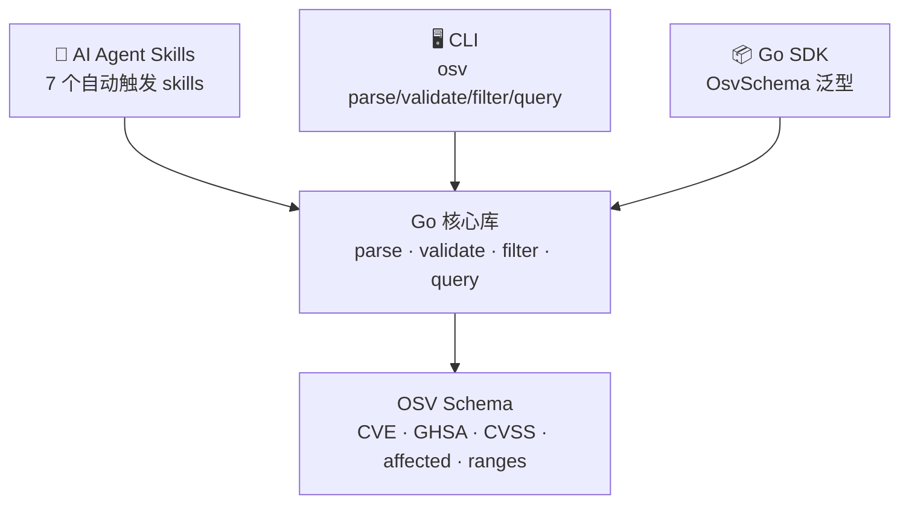
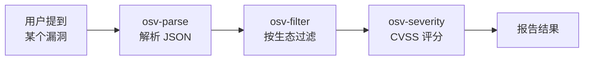

# OSV Schema Skills

[](https://pkg.go.dev/github.com/scagogogo/osv-schema-skills)
[](https://goreportcard.com/report/github.com/scagogogo/osv-schema-skills)
[](https://github.com/scagogogo/osv-schema-skills/actions/workflows/ci.yml)
[](https://github.com/scagogogo/osv-schema-skills/actions/workflows/release.yml)
[](https://github.com/scagogogo/osv-schema-skills/releases)
[](LICENSE)

**简体中文** | [English](README.md)

> **AI 原生** 的 OSV（开源漏洞）Schema 工具包：**Go SDK + CLI + 7 个 Claude Code Skills**。
> 解析、校验、过滤、查询漏洞数据 —— 三层访问方式，同一个 Go 核心。
>
> 📖 文档：<https://scagogogo.github.io/osv-schema-skills/>



---

## 🚀 AI Agent 快速上手

运行 CLI 的最短路径。复制即跑：

```bash
# 1. 安装 CLI —— 任选其一：
#    a) 预编译二进制（Linux/macOS/Windows · amd64/arm64/arm）
#       将 <latest-tag> 替换为 Releases 页面上最新的 tag。
VERSION=<latest-tag>
curl -fsSL -o osv.tar.gz \
  https://github.com/scagogogo/osv-schema-skills/releases/download/${VERSION}/osv_${VERSION}_linux_amd64.tar.gz
tar -xzf osv.tar.gz osv && chmod +x osv && sudo mv osv /usr/local/bin/
#       若最新 release 暂无预编译资产，改用 (b)。

#    b) 或通过 Go
go install github.com/scagogogo/osv-schema-skills/cmd/osv@latest

# 2. 验证
osv version

# 3. 解析一条真实漏洞记录（仓库自带样本）
osv parse test_data/GHSA-vxv8-r8q2-63xw.json
```

需要 Go SDK？

```bash
go get -u github.com/scagogogo/osv-schema-skills
```

```go
import osv "github.com/scagogogo/osv-schema-skills"

v, err := osv.UnmarshalFromJsonFile[any, any]("vulnerability.json")
fmt.Println(v.ID, v.Aliases.GetCVE(), v.Severity.GetCVSS3())
```

---

## 🤖 AI Agent Skills

当 Claude Code 打开本仓库时，**7 个专用 skills 自动可用** —— 无需任何集成代码。Agent 根据意图自动调用对应的 `osv` 子命令。

| Skill | 用途 | 自动触发条件 |
|-------|------|-------------|
| [`osv-parse`](.claude/skills/osv-parse/SKILL.md) | 解析 & 展示 OSV JSON 数据 | 提到解析漏洞文件或提取 CVE/GHSA 数据 |
| [`osv-validate`](.claude/skills/osv-validate/SKILL.md) | 校验 OSV JSON 文件 | 要求检查 Schema 合规性或校验漏洞文件 |
| [`osv-filter`](.claude/skills/osv-filter/SKILL.md) | 按生态/引用类型/别名过滤 | 需要按 npm/PyPI/Maven 过滤或查找 FIX 引用 |
| [`osv-query`](.claude/skills/osv-query/SKILL.md) | 提取 severity/maven/ranges/events | 需要 CVSS 评分、Maven GAV 或版本范围 |
| [`osv-severity`](.claude/skills/osv-severity/SKILL.md) | CVSS 严重级别分析 | 评估漏洞风险或严重性 |
| [`osv-affected`](.claude/skills/osv-affected/SKILL.md) | 受影响包 & 版本分析 | 需要影响分析或版本范围检查 |
| [`osv-installation`](.claude/skills/osv-installation/SKILL.md) | 安装与配置指南 | 首次使用 skills |

每个 skill 是一个 `SKILL.md`，含 YAML 前置数据（`name`、`description`、`allowed-tools`、`argument-hint`）和结构化正文 —— 决策树、任务模式、API 参考。



**在你的项目中使用 skills** —— 克隆仓库即激活：

```bash
git clone https://github.com/scagogogo/osv-schema-skills.git
cd osv-schema-skills && claude   # skills 已激活
```

---

## 🖥️ CLI

预编译二进制覆盖 **Linux / macOS / Windows** 的 **amd64、arm64、arm** 架构。见 [下载](#-下载)。

```bash
# 解析 OSV JSON 文件
osv parse vulnerability.json           # 关键字段（文本）
osv parse -v vulnerability.json        # 全字段（日期、详情、范围、致谢）
osv parse -o json vulnerability.json   # JSON 输出

# 校验一个或多个文件（任一无效则退出码 1，适配 CI）
osv validate vulnerability.json
osv validate file1.json file2.json
osv validate -o json vulnerability.json

# 按生态/引用类型/别名过滤
osv filter -e PyPI vulnerability.json        # 按生态
osv filter -r FIX vulnerability.json         # 按引用类型
osv filter -a CVE vulnerability.json         # 按别名模式
osv filter -e PyPI -r FIX vulnerability.json # 组合

# 查询特定子信息
osv query --severity cvss3 vulnerability.json  # CVSS v3 条目 + 评分
osv query --maven vulnerability.json           # Maven groupId/artifactId
osv query --ranges vulnerability.json          # 版本范围
osv query --events vulnerability.json          # 事件时间线（introduced/fixed/…）

# 查看版本
osv version
```

| 全局参数 | 说明 |
|---------|------|
| `-o, --output` | `text`（默认）或 `json` |

---

## 📦 Go SDK

```go
package main

import (
    "fmt"
    "log"

    osv "github.com/scagogogo/osv-schema-skills"
)

func main() {
    v, err := osv.UnmarshalFromJsonFile[any, any]("vulnerability.json")
    if err != nil {
        log.Fatal(err)
    }

    fmt.Printf("ID: %s\n", v.ID)
    if cve := v.Aliases.GetCVE(); cve != "" {
        fmt.Printf("CVE: %s\n", cve)
    }
    if v.Affected.HasEcosystem("npm") {
        fmt.Println("影响 npm 包")
    }
    if cvss3 := v.Severity.GetCVSS3(); cvss3 != nil {
        fmt.Printf("CVSS v3: %.1f\n", cvss3.GetScore())
    }
}
```

### 核心方法

| 类型 | 方法 | 说明 |
|------|------|------|
| `AffectedSlice` | `HasEcosystem(eco)` | 是否影响某生态 |
| `AffectedSlice` | `FilterByEcosystem(eco)` | 按生态过滤 |
| `AffectedSlice` | `Filter(fn)` | 自定义谓词过滤 |
| `Aliases` | `GetCVE()` | 首个 `CVE-` 标识符 |
| `Aliases` | `Filter(fn)` | 按谓词过滤别名 |
| `SeveritySlice` | `GetCVSS3()` / `GetCVSS2()` | CVSS 严重级别条目 |
| `Severity` | `GetScore()` | 解析评分为 `float64` |
| `References` | `FilterByType(t)` | 按引用类型过滤（`ADVISORY`/`FIX`…） |
| `Package` | `IsMaven()` / `GetGroupID()` / `GetArtifactID()` | Maven 拆解 |
| `Event` | `IsIntroduced/IsFixed/IsLastAffected/IsLimit` | 事件类型判断 |

### 核心类型

```go
type OsvSchema[EcosystemSpecific, DatabaseSpecific any] struct {
    SchemaVersion    string
    ID               string
    Modified         time.Time
    Published        time.Time
    Withdrawn        string // 字符串，非 time.Time
    Aliases          Aliases
    Related          Related
    Summary          string
    Details          string
    Severity         SeveritySlice
    Affected         AffectedSlice[EcosystemSpecific, DatabaseSpecific]
    References       References
    DatabaseSpecific DatabaseSpecific
    Credits          *Credits
}
```

泛型参数 `EcosystemSpecific` 和 `DatabaseSpecific` 让你按生态或漏洞库附加自定义数据。通用解析用 `any` 即可。

所有核心类型开箱即支持 **JSON、YAML、mapstructure、GORM、BSON** 序列化。**19 个生态** 定义为常量（npm、PyPI、Maven、NuGet、RubyGems、Go、Cargo、Hex、Pub、Packagist……）。

---

## ⬇️ 下载

每个 tag 由 goreleaser 构建全平台二进制。按平台选取：

| OS | 架构 | 归档格式 |
|----|------|---------|
| Linux | amd64、arm64、arm (v7) | `.tar.gz` |
| macOS | amd64、arm64 | `.tar.gz` |
| Windows | amd64、arm64 | `.zip` |

- **全部发布：** <https://github.com/scagogogo/osv-schema-skills/releases>
- **命名：** `osv_<version>_<os>_<arch>.tar.gz`（或 `.zip`）
- 每个发布附带 `checksums.txt`（SHA-256），使用前校验：

```bash
sha256sum -c checksums.txt --ignore-missing
```

找不到二进制？从源码编译 —— 只需 Go 1.18+：

```bash
git clone https://github.com/scagogogo/osv-schema-skills.git
cd osv-schema-skills
go build -o osv ./cmd/osv/
```

---

## 📖 文档

- **官网**（完整指南 + 参考）：<https://scagogogo.github.io/osv-schema-skills/>
- [OSV Schema 规范](https://ossf.github.io/osv-schema/)
- [Go 包文档](https://pkg.go.dev/github.com/scagogogo/osv-schema-skills)

## 🛠️ 构建与测试

```bash
go build ./...
go vet ./...
go test ./...
```

## 🤝 贡献

欢迎贡献！请随时提交 Pull Request。

## 📄 许可证

MIT —— 见 [LICENSE](LICENSE)。
