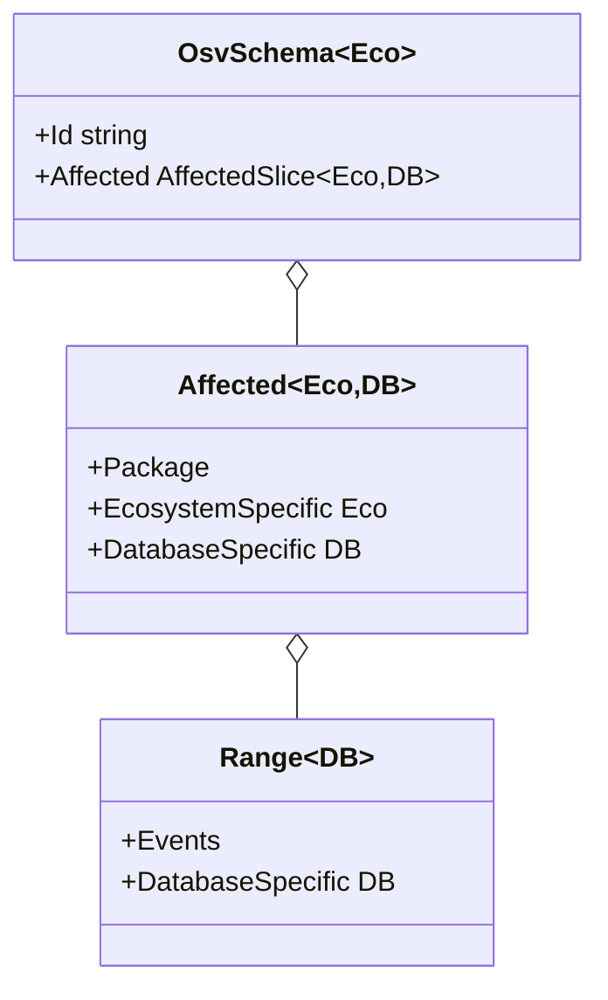

# Custom Ecosystem & Database Specifics

The `OsvSchema` type is generic so you can attach **ecosystem-specific** and **database-specific** metadata without forking the library. This page shows how.

---

## Why generics

The OSV schema allows each `affected` entry to carry an `ecosystem_specific` object (free-form fields unique to that ecosystem) and a `database_specific` object (fields unique to the database that published the record). A generic core lets you capture those fields as typed Go structs instead of `map[string]any`.



Note: `Range` only carries `DatabaseSpecific` — there is no `EcosystemSpecific` on ranges (per the OSV spec).

---

## Default: use `any` for general parsing

For general-purpose parsing where you don't care about the specific shape:

```go
v, err := osv_schema.UnmarshalFromJsonFile[any, any]("vuln.json")
```

The `ecosystem_specific` and `database_specific` fields are then `any` (typically `map[string]any` after JSON unmarshal).

---

## Custom ecosystem-specific struct

If you know the record comes from, say, PyPI and you want typed access to PyPI-specific fields:

```go
package main

import (
    "fmt"
    "github.com/scagogogo/osv-schema-skills"
)

// PyPI puts its own fields under ecosystem_specific
type PyPISpecific struct {
    AffectedArchitectures []string `json:"affected_architectures"`
}

type AnyDB struct{} // not used; placeholder

func main() {
    v, err := osv_schema.UnmarshalFromJsonFile[PyPISpecific, AnyDB]("pypi-vuln.json")
    if err != nil { panic(err) }

    for _, a := range v.Affected {
        fmt.Println(a.EcosystemSpecific.AffectedArchitectures)
    }
}
```

---

## Custom database-specific struct

GitHub advisories put their own metadata under `database_specific`:

```go
type GitHubDB struct {
    Severity       string `json:"severity"`
    CvssScore      float64 `json:"cvss_score"`
    References     []string `json:"references"`
}

v, err := osv_schema.UnmarshalFromJsonFile[any, GitHubDB]("ghsa-vuln.json")
if err != nil { panic(err) }

// On the top-level record:
fmt.Println(v.DatabaseSpecific.Severity)

// On each affected entry:
for _, a := range v.Affected {
    fmt.Println(a.DatabaseSpecific.CvssScore)
}

// On each range:
for _, a := range v.Affected {
    for _, r := range a.Ranges {
        fmt.Println(r.DatabaseSpecific)
    }
}
```

---

## Mixing both

You can specify both ecosystem and database types at once:

```go
v, err := osv_schema.UnmarshalFromJsonFile[PyPISpecific, GitHubDB]("vuln.json")
```

The core unmarshal fills in the typed fields. Any JSON key that doesn't fit your struct is silently ignored (standard `encoding/json` behavior) — so partial coverage is fine.

---

## GORM persistence

The `ecosystem_specific` and `database_specific` fields are stored as JSON strings via GORM's `serializer:json`:

```go
import "gorm.io/gorm"

db, _ := gorm.Open(/* ... */, &gorm.Config{})
db.AutoMigrate(&osv_schema.OsvSchema[PyPISpecific, GitHubDB]{})

v, _ := osv_schema.UnmarshalFromJsonFile[PyPISpecific, GitHubDB]("vuln.json")
db.Create(&v)

// Later — load it back
var loaded osv_schema.OsvSchema[PyPISpecific, GitHubDB]
db.First(&loaded, "id = ?", "GHSA-vxv8-r8q2-63xw")
```

The `Affected` and `Severity` slices are stored as JSON columns; the simple fields (id, summary, etc.) are stored as proper columns.

---

## See also

- [OSV Schema reference](/reference/osv-schema) — full field list
- [Methods reference](/reference/methods) — what the SDK exposes
- [SDK guide](/guide/sdk) — getting started with the Go SDK