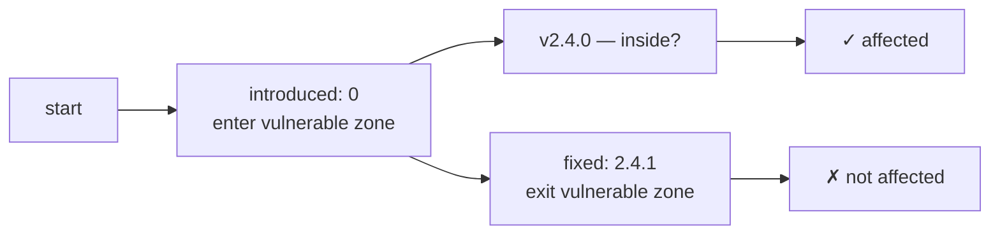

# Version Range Semantics

OSV uses **event timelines** instead of prose to describe which versions are affected. This page explains how those timelines work and how the SDK interprets them.

---

## The problem with "before X"

A phrase like "Affects versions before 2.4.1" is easy for a human but hard for a machine:

- What about `2.4.0-rc2`? Is it before `2.4.1`?
- What about `2.4.1-alpha`?
- Different ecosystems have different version ordering rules.

OSV solves this by encoding version ranges as **ordered events** — a timeline the machine can walk through without parsing natural language.

---

## Event timeline

A `range` is a list of `events`, each carrying exactly one key: `introduced`, `fixed`, `last_affected`, or `limit`.

```json
{
  "ranges": [
    {
      "type": "ECOSYSTEM",
      "events": [
        { "introduced": "0" },
        { "fixed": "2.4.1" }
      ]
    }
  ]
}
```

Read as: *"Vulnerable from the beginning (`0`) up to — but not including — `2.4.1`."*

To decide whether version `2.4.0` is affected, a machine walks the timeline:



---

## Timeline types

The `type` field says how to compare version strings:

| Type | Meaning |
|------|---------|
| `ECOSYSTEM` | Use the ecosystem's native ordering (PyPI semver-like, Go pseudo-version, etc.) |
| `SEMVER` | Strict semantic versioning comparison |
| `GIT` | Compare commit hashes (topological ordering) |

The CLI and SDK do **not** perform the comparison themselves — they expose the events so you can feed them to a version-comparison library appropriate for the ecosystem.

---

## Multiple events

A timeline can have more than two events:

```json
{
  "events": [
    { "introduced": "0" },
    { "fixed": "1.0.0" },
    { "introduced": "2.0.0" },
    { "fixed": "2.1.0" }
  ]
}
```

This means: vulnerable in `[0, 1.0.0)` and `[2.0.0, 2.1.0)` — two separate windows.

The SDK exposes `Range.Events` as a slice you can iterate:

```go
for _, a := range v.Affected {
    for _, r := range a.Ranges {
        for _, e := range r.Events {
            if e.Introduced != "" {
                fmt.Println("introduced:", e.Introduced)
            }
            if e.Fixed != "" {
                fmt.Println("fixed:", e.Fixed)
            }
        }
    }
}
```

---

## `last_affected` and `limit`

- `last_affected`: The last known vulnerable version. The range is `[introduced, last_affected]` — inclusive on both ends. Use this when there's no fix yet.
- `limit`: An upper bound beyond which the database doesn't track. Not a vulnerability marker — just a data boundary.

---

## CLI: extract the timeline

```bash
osv query --events -o json vuln.json | jq '.ranges[]'
```

**Sample output**:

```json
{
  "package": { "ecosystem": "PyPI", "name": "django" },
  "type": "ECOSYSTEM",
  "events": [
    { "introduced": "0" },
    { "fixed": "2.2.24" }
  ]
}
```

---

## SDK: iterate over events

```go
v, _ := osv_schema.UnmarshalFromJsonFile[any, any]("vuln.json")
for _, a := range v.Affected {
    for _, r := range a.Ranges {
        for _, e := range r.Events {
            // Each event has exactly one non-empty field:
            // e.Introduced, e.Fixed, e.LastAffected, e.Limit
            switch {
            case e.Introduced != "":
                fmt.Println("vulnerable from:", e.Introduced)
            case e.Fixed != "":
                fmt.Println("fixed at:", e.Fixed)
            }
        }
    }
}
```

---

## Why `versions[]` exists alongside

Some records also have a `versions` array — an explicit list of known-vulnerable versions. This is simpler but can't cover versions released after the record was published.

In practice, most real-world records use `ranges[]` (timeline) rather than `versions[]` (enumerated list). The SDK gives you both.

---

## See also

- [osv-query skill](/guide/skills/query) — `--events` flag
- [OSV Schema reference](/reference/osv-schema#affectedranges) — field spec
- [Affected skill](/guide/skills/affected) — how `versions[]` and `ranges[]` interact