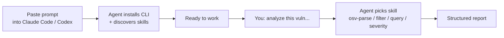
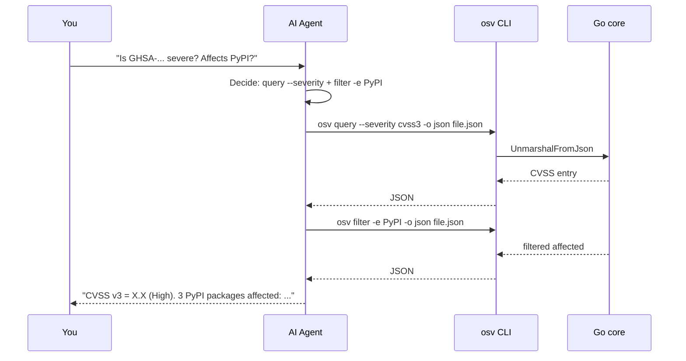

# AI Agent Integration

This page is the whole point of the project. **Copy one prompt, paste it into Claude Code or Codex, and the agent will install the CLI and start working with OSV vulnerability data on its own.** No manual setup.

## What you get

After pasting the prompt, the AI agent can autonomously:

- Install the `osv` CLI (binary download or `go install`)
- Parse / validate / filter / query any OSV JSON file
- Trigger the right skill automatically based on your intent (no need to name the command)
- Report CVE, CVSS severity, affected packages & version ranges in a structured way



---

## Claude Code prompt — copy & paste

> Click the copy icon on the top-right of the block below, paste into Claude Code, hit Enter. Then just describe the vulnerability task you want done.

```text
You now have access to the OSV Schema Skills toolkit (https://github.com/scagogogo/osv-schema-skills),
an AI-native Go library + CLI + Claude Code Skills bundle for the OSV (Open Source Vulnerability)
schema. It can parse, validate, filter, and query OSV vulnerability JSON.

Set it up now, then use it for any vulnerability task I give you:

1. Ensure the `osv` CLI is available on PATH.
   - Preferred: download a pre-built binary from the latest GitHub Release
     (https://github.com/scagogogo/osv-schema-skills/releases). Pick the archive matching my
     OS/arch (linux/mac amd64/arm64/arm; windows amd64/arm64), extract the `osv` binary, make it
     executable, and put it on PATH.
   - Fallback: `go install github.com/scagogogo/osv-schema-skills/cmd/osv@latest` (requires Go 1.18+).
   - Verify with `osv version`.
2. This repository also ships 6 Claude Code Skills in `.claude/skills/` (osv-parse, osv-validate,
   osv-filter, osv-query, osv-severity, osv-affected). If you want the skills active, clone the
   repo locally: `git clone https://github.com/scagogogo/osv-schema-skills.git` and open that
   directory; the skills auto-trigger on vulnerability tasks. You don't have to clone if you only
   need the CLI.
3. Available CLI commands (use `-o json` when you want machine-readable output I can parse):
   - `osv parse <file>` (add `-v` for all fields)
   - `osv validate <file> [<file>...]`
   - `osv filter -e <ecosystem> -r <ref-type> -a <alias-pattern> <file>`
   - `osv query --severity cvss3|cvss2 --maven --ranges --events <file>`
4. Confirm setup by running: `osv parse test_data/GHSA-vxv8-r8q2-63xw.json` (clone the repo first
   to get the sample, or point it at any OSV JSON I provide).

When I ask about a vulnerability, choose the right skill/command automatically — parse the file,
filter by ecosystem if I name one, extract CVSS severity and affected version ranges, and report
findings concisely. Prefer `-o json` + your own summarization over raw text dumps. Don't ask me
which command to run; decide based on my intent.
```

::: tip
The prompt is intent-driven on purpose — it tells the agent *what* to do and *how to decide*, not step-by-step keystrokes. That's the difference between a script and a skill.
:::

---

## Codex (OpenAI) prompt — copy & paste

> Codex doesn't auto-discover `.claude/skills/`, so the prompt is self-contained: it embeds the CLI surface and the decision logic.

```text
You have access to the `osv` CLI from https://github.com/scagogogo/osv-schema-skills — a toolkit
for the OSV (Open Source Vulnerability) schema. It parses, validates, filters and queries OSV
vulnerability JSON.

Set up now:
1. Install the CLI. Preferred: download a pre-built binary from
   https://github.com/scagogogo/osv-schema-skills/releases (pick the archive for my OS/arch:
   linux/mac amd64/arm64/arm, windows amd64/arm64), extract `osv`, chmod +x, put on PATH.
   Fallback: `go install github.com/scagogogo/osv-schema-skills/cmd/osv@latest` (Go 1.18+).
2. Verify: `osv version`.

Commands (append `-o json` for machine-readable output):
- `osv parse <file>`            — key fields; `-v` for all fields (dates, details, ranges, credits)
- `osv validate <file> [file…]` — schema check; exits 1 if any invalid
- `osv filter -e <eco> -r <ref-type> -a <alias> <file>` — filter by ecosystem / reference type / alias
- `osv query --severity cvss3|cvss2 --maven --ranges --events <file>` — extract sub-info

Decision rule for my requests:
- "parse / read / what's in" → osv parse
- "is it valid / schema check" → osv validate
- "only npm/PyPI/Maven…", "show FIX/ADVISORY refs", "CVE/GHSA only" → osv filter
- "how severe / CVSS", "Maven groupId/artifactId", "version ranges", "event timeline" → osv query
Combine flags when I ask for several things. Report concisely; prefer `-o json` + summarize over
raw text dumps. Decide which command to run yourself based on my intent — don't ask me.
```

---

## Why a prompt instead of a plugin install?

| Approach | Pros | Cons |
|----------|------|------|
| **Copy-paste prompt** (this page) | Works in any agent (Claude Code, Codex, Cursor); no install friction; user sees exactly what the agent will do | User must paste once |
| `claude plugin add` | One command | Claude Code only; not yet published |

The prompt is the **universal** path. When the plugin lands on the marketplace, the prompt still works as a fallback for non-Claude agents.

## What the agent does under the hood



## Cross-references

- [Quick Start](/guide/quick-start) — manual install if you'd rather drive
- [Skills Overview](/guide/skills) — what each skill triggers on
- [CLI reference](/guide/cli) — full command surface
