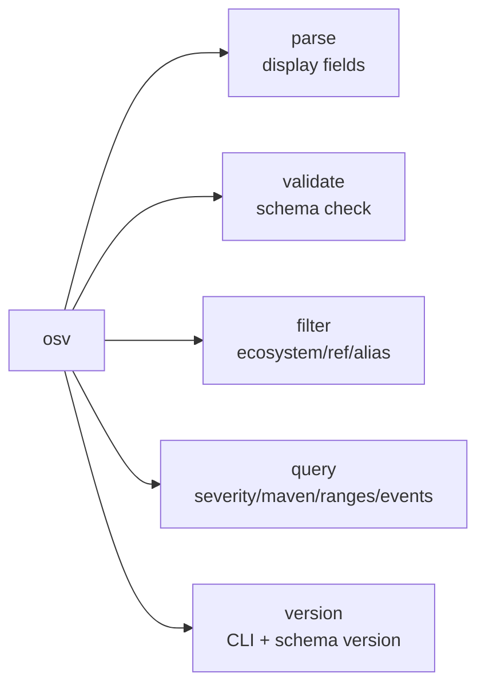
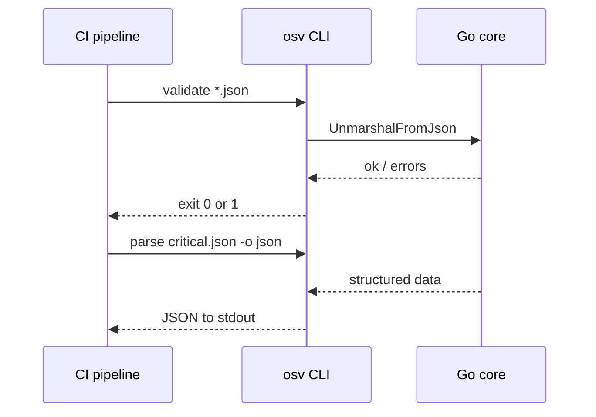

# CLI

The `osv` CLI is a thin shell front-end over the Go core — ideal for quick lookups, shell scripting, and CI pipelines.

## Install

See [Quick Start](/guide/quick-start) for install options (pre-built binary, `go install`, or build from source). Pre-built binaries cover:

| OS | Architectures |
|----|---------------|
| Linux | amd64, arm64, arm (v7) |
| macOS | amd64, arm64 |
| Windows | amd64, arm64 |

Download from [GitHub Releases](https://github.com/scagogogo/osv-schema-skills/releases).

## Commands



### `osv parse`

Parse an OSV JSON file and display its fields.

```bash
osv parse vulnerability.json           # Key fields (text)
osv parse -v vulnerability.json        # All fields (dates, details, ranges, credits)
osv parse -o json vulnerability.json   # JSON output
```

| Flag | Description |
|------|-------------|
| `-v, --verbose` | Show all fields: published/modified, withdrawn, related, details, ranges, credits |
| `-o, --output` | Output format: `text` (default) or `json` |

Output includes ID, schema version, summary, aliases/CVE, severity, affected packages, and references.

### `osv validate`

Validate one or more OSV JSON files against the schema (parses, checks required `id` and `schema_version`).

```bash
osv validate vulnerability.json              # Single file
osv validate file1.json file2.json           # Batch
osv validate -o json vulnerability.json      # JSON output
```

Exits with code `1` if any file is invalid — friendly for CI gating.

| Flag | Description |
|------|-------------|
| `-o, --output` | Output format: `text` (default) or `json` |

### `osv filter`

Filter by affected package ecosystem, reference type, or alias pattern. At least one filter flag required; flags combine.

```bash
osv filter -e PyPI vulnerability.json        # Filter affected by ecosystem
osv filter -r FIX vulnerability.json         # Filter references by type
osv filter -a CVE vulnerability.json         # Filter aliases by pattern
osv filter -e PyPI -r FIX vulnerability.json # Combine
osv filter -o json -e PyPI vulnerability.json
```

| Flag | Description |
|------|-------------|
| `-e, --ecosystem` | Ecosystem name, case-sensitive per OSV spec (`PyPI`, `npm`, `Maven`) |
| `-r, --ref-type` | Reference type, auto-uppercased (`ADVISORY`, `FIX`, `WEB`) |
| `-a, --alias` | Alias prefix pattern (`CVE`, `GHSA`, or `CVE-2024`) |
| `-o, --output` | `text` (default) or `json` |

### `osv query`

Extract focused sub-information. At least one flag required; flags combine.

```bash
osv query --severity cvss3 vulnerability.json  # CVSS v3 entry + parsed score
osv query --severity cvss2 vulnerability.json  # CVSS v2
osv query --maven vulnerability.json           # Maven groupId/artifactId decomposition
osv query --ranges vulnerability.json          # Version ranges per affected package
osv query --events vulnerability.json          # Event timeline (introduced/fixed/…)
osv query --ranges --events vulnerability.json # Combine
```

| Flag | Description |
|------|-------------|
| `--severity` | `cvss3` or `cvss2` |
| `--maven` | Decompose Maven `groupId:artifactId` |
| `--ranges` | Show version ranges |
| `--events` | Show event timeline |
| `-o, --output` | `text` (default) or `json` |

::: tip
`GetScore()` returns `0.0` when the OSV `score` field is a CVSS vector string rather than a number — see [Methods](/reference/methods#severity).
:::

### `osv version`

```bash
osv version
```

Prints the CLI version (injected at build time by goreleaser) and the supported OSV schema version.

## Global flag

| Flag | Description |
|------|-------------|
| `-o, --output` | `text` (default) or `json` — applies to all subcommands |

## Typical pipeline


