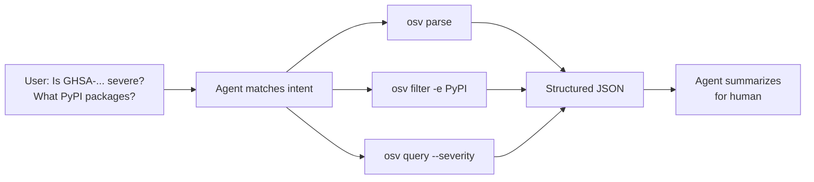

# Examples & Cookbook

Real-world patterns for using the CLI, SDK, and Skills in pipelines, scripts, and AI workflows.

---

## 1. CI Validation Gate

Validate every OSV JSON in a directory; fail the pipeline if any file is invalid.

```bash
# In your CI (GitHub Actions, GitLab CI, etc.)
osv validate advisories/*.json
```

**Why it works**: `osv validate` exits with code `1` if any file fails, stopping the pipeline. Use `-o json` to produce a machine-readable report for downstream processing.

```yaml
# .github/workflows/validate.yml
name: Validate OSV
on: [push, pull_request]
jobs:
  validate:
    runs-on: ubuntu-latest
    steps:
      - uses: actions/checkout@v4
      - uses: actions/setup-go@v5
      - run: go install github.com/scagogogo/osv-schema-skills/cmd/osv@latest
      - run: osv validate advisories/*.json
```

---

## 2. Extract CVSS Scores Across a Directory

Pull the CVSS v3 vector and parsed score from every record.

```bash
for f in vulns/*.json; do
  echo "=== $f ==="
  osv query --severity cvss3 -o json "$f" | jq -r '.severity.score, .severity.scoreVector'
done
```

**Output** (per file):
```
7.5
CVSS:3.1/AV:N/AC:L/PR:N/UI:N/S:U/C:N/I:N/A:H
```

**Gotcha**: When the OSV `score` field is a vector string rather than a number, `GetScore()` returns `0.0` — see [Methods → severity](/reference/methods#severity). In that case, you must parse the vector yourself or rely on a CVSS library.

---

## 3. Aggregate Affected Packages by Ecosystem

List every `ecosystem` mentioned in your advisory corpus.

```bash
for f in vulns/*.json; do
  osv parse -o json "$f" | jq -r '.affected[].package.ecosystem'
done | sort | uniq -c | sort -rn
```

**Sample output**:
```
    42 PyPI
    28 npm
    15 Maven
     8 Go
```

---

## 4. Filter by Ecosystem + Pipe to `jq`

Extract PyPI-affected packages and their version ranges.

```bash
osv filter -e PyPI -o json vuln.json | jq '.affected[] | {name: .package.name, ranges: .ranges}'
```

**Key point**: `osv filter -e` only returns `affected` entries matching that ecosystem — the rest of the record (id, summary, severity) is unchanged. If you need *only* the affected slice, `jq` the output.

---

## 5. Find All FIX References

Collect every `FIX` reference URL across multiple files.

```bash
for f in vulns/*.json; do
  osv filter -r FIX -o json "$f" | jq -r '.references[].url'
done | sort -u
```

---

## 6. Maven GAV Decomposition

When the package ecosystem is `Maven`, the `name` field is `groupId:artifactId`. Use `--maven` to split it.

```bash
osv query --maven -o json vuln.json | jq '.maven | {groupId, artifactId}'
```

**Sample output**:
```json
{
  "groupId": "org.apache.logging.log4j",
  "artifactId": "log4j-core"
}
```

---

## 7. AI Agent Workflow: From Intent to Report

An AI agent receives a user request and picks the right CLI call automatically.



**Prompt template** (copy into Claude Code / Codex):

```text
You have access to the osv CLI from osv-schema-skills.
When I ask about a vulnerability file:
1. Use `osv parse -o json <file>` to inspect it.
2. If I name an ecosystem, filter with `osv filter -e <eco> -o json <file>`.
3. If I ask about severity, use `osv query --severity cvss3 -o json <file>`.
Return concise answers — do not dump raw JSON unless I ask.
```

---

## 8. Validate + Report in One Pass

Produce a JSON validation report while still gating the pipeline.

```bash
osv validate -o json *.json > validation-report.json
# Exit code is still 0/1, but you now have a report:
cat validation-report.json | jq '.[] | select(.valid == false)'
```

---

## 9. Extract Event Timelines

Show the introduced/fixed timeline for each affected package.

```bash
osv query --events -o json vuln.json | jq '.ranges[] | {package: .package.name, events: .events}'
```

---

## 10. SDK Pattern: Filter in Go

```go
package main

import (
    "fmt"
    "github.com/scagogogo/osv-schema-skills"
)

func main() {
    v, err := osv_schema.UnmarshalFromJsonFile[any, any]("vuln.json")
    if err != nil { panic(err) }

    pypi := v.Affected.FilterByEcosystem(osv_schema.EcosystemPyPI)
    for _, a := range pypi {
        fmt.Println(a.Package.Name)
    }
}
```

---

## See Also

- [CLI Reference](/guide/cli) — all commands and flags
- [Skills Overview](/guide/skills) — auto-triggering agent skills
- [Methods Reference](/reference/methods) — SDK method signatures
