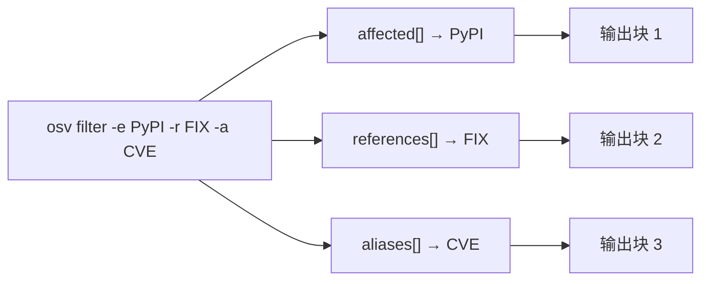

# FAQ & Troubleshooting

Common questions and gotchas when using the CLI, SDK, and Skills.

---

## CLI

### Q: Why does `osv version` ignore `-o json`?

`osv version` is **not a data subcommand** — it always prints exactly two text lines:

```text
osv-cli version: v0.1.0
OSV schema version: 1.4.0
```

This is by design: the version is a fixed two-field fact, not queryable data. The `-o` flag is a persistent (global) flag inherited by every subcommand, but only `parse`/`validate`/`filter`/`query` actually read `outputFormat`. Passing `-o json` to `version` is silently ignored.

### Q: Why does `osv parse` show the same package (e.g. `PyPI/tensorflow`) on multiple lines?

Because `parse` loops over `affected[]` and prints **once per affected entry** — not once per range. A single OSV record can have multiple `affected` entries for the same package name (e.g. one per patch branch), so `PyPI/tensorflow` can legitimately appear 3 times.

This is faithful to the source data, not a bug.

### Q: Does `osv validate` short-circuit on the first error?

**No.** `validate` collects both the missing-`id` error and the missing-`schema_version` error independently — if a record is missing both, you get both errors, not just the first. See the [CLI page](/guide/cli#osv-validate).

### Q: Does `-o yaml` work?

No. The `-o` flag accepts only `text` (default) or `json`. An invalid value (e.g. `-o yaml`) silently falls back to `text` on the data subcommands.

### Q: What's the difference between `osv parse -o json` and `osv filter -o json`?

Both emit JSON, but through different layers:

- `parse -o json` marshals the **raw** `*OsvSchema` struct (no `omitempty`) — you see every field, including empty strings.
- `filter`/`query -o json` go through a **DTO layer** with `omitempty` — empty fields are omitted, producing cleaner output for AI agents.

This is why `filter` output is often shorter than `parse` output for the same file.

---

## Filtering

### Q: Does `osv filter -e PyPI -r FIX` mean "FIX references inside PyPI packages"?

**No.** The three filter flags (`-e`, `-r`, `-a`) act on **independent slices**:

- `-e` filters `affected[]`
- `-r` filters `references[]`
- `-a` filters `aliases[]`

Each emits its own output block. `-e PyPI -r FIX` gives you "PyPI affected entries" AND "FIX references" — two separate filtered views, not a nested query.



### Q: Is ecosystem matching case-sensitive?

Yes, per the OSV spec. `PyPI` (capital P, capital I) is correct; `pypi` or `PyPi` will not match. Reference types (`-r`) and alias patterns (`-a`) are auto-uppercased before matching, so those are case-insensitive.

---

## Severity

### Q: Why does `GetScore()` return `0.0` for a known-severe vulnerability?

Because the OSV `score` field is usually a **CVSS vector string** (e.g. `CVSS:3.1/AV:N/AC:L/...`), not a number. `GetScore()` only returns a non-zero value when `score` is a plain numeric string. When it's a vector, you must parse the vector yourself to derive the numeric score.

See [Methods → severity](/reference/methods#severity) for the full explanation.

---

## Installation

### Q: `go install` works, but the pre-built binary download fails.

Make sure you're using the correct archive name for your platform:

| OS | Arch | Archive |
|----|------|---------|
| Linux | amd64 | `osv_v0.1.0_linux_amd64.tar.gz` |
| Linux | arm64 | `osv_v0.1.0_linux_arm64.tar.gz` |
| Linux | arm (v7) | `osv_v0.1.0_linux_arm.tar.gz` |
| macOS | amd64 (Intel) | `osv_v0.1.0_darwin_amd64.tar.gz` |
| macOS | arm64 (Apple Silicon) | `osv_v0.1.0_darwin_arm64.tar.gz` |
| Windows | amd64 | `osv_v0.1.0_windows_amd64.zip` |
| Windows | arm64 | `osv_v0.1.0_windows_arm64.zip` |

Always verify the checksum:

```bash
sha256sum -c checksums.txt --ignore-missing
```

### Q: The latest Release has no pre-built assets. What do I do?

Fall back to `go install`:

```bash
go install github.com/scagogogo/osv-schema-skills/cmd/osv@latest
```

This requires Go 1.18+.

---

## Skills

### Q: How do the 7 Skills get activated?

Clone the repo. The `.claude/skills/*/SKILL.md` files are automatically discovered by Claude Code when the repo is your working directory. Each skill's `description` field tells the agent **when** to trigger it; `allowed-tools: Bash(osv:*)` tells it **what** it may call.

You never invoke a skill by name — the agent matches your intent against the descriptions and picks the right `osv` subcommand.

### Q: Do the Skills work without the CLI installed?

No. The Skills are **declarative contracts** — they tell the agent which `osv` command to run, but the actual logic lives in the CLI (and the Go core beneath it). If the CLI isn't on `PATH`, the skill's `Bash(osv:*)` call will fail.

Install the CLI first (see [Installation](/guide/installation)).

---

## SDK

### Q: Why is `Withdrawn` a string, not `time.Time`?

Per the OSV spec, `withdrawn` is an RFC 3339 timestamp string. We keep it as a string (not `time.Time`) so that unmarshalling never fails on a malformed timestamp — you check for a non-empty string to determine withdrawal status.

### Q: Why does `OsvSchema` use generics?

So you can attach **ecosystem-specific** and **database-specific** metadata to `Affected` and `Range` entries without forking the library. For general-purpose parsing, use `any`:

```go
v, err := osv_schema.UnmarshalFromJsonFile[any, any]("vuln.json")
```

For a custom ecosystem with extra fields, define your own struct and substitute it.

---

## Still stuck?

- [Examples & Cookbook](/guide/examples) — working patterns
- [CLI Reference](/guide/cli) — every command and flag
- [GitHub Issues](https://github.com/scagogogo/osv-schema-skills/issues) — report bugs or ask questions
