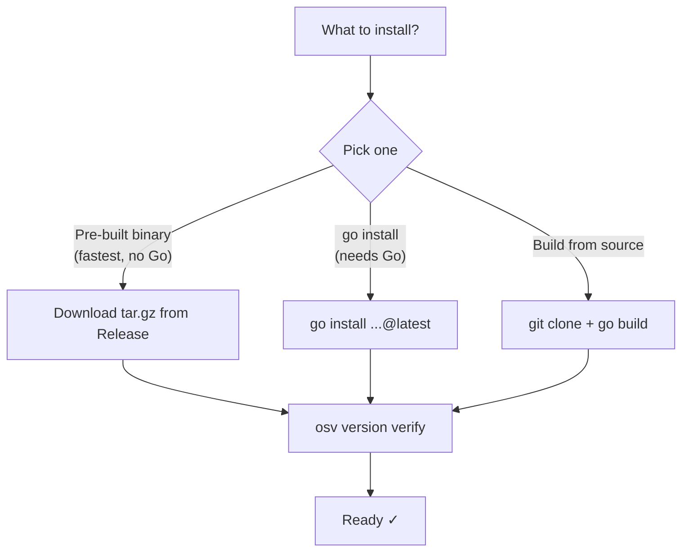
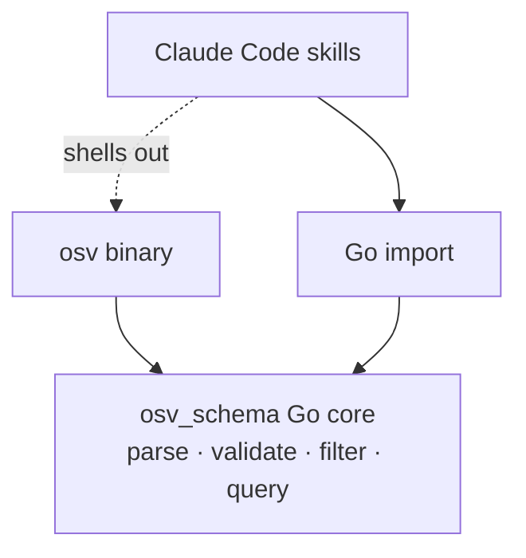
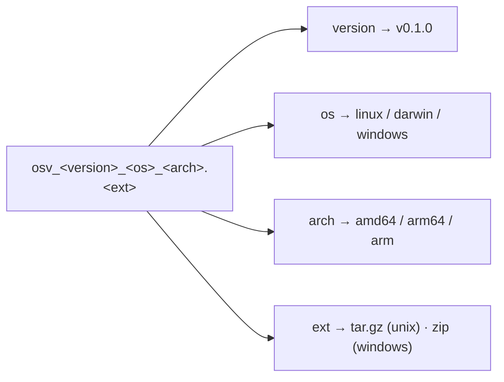
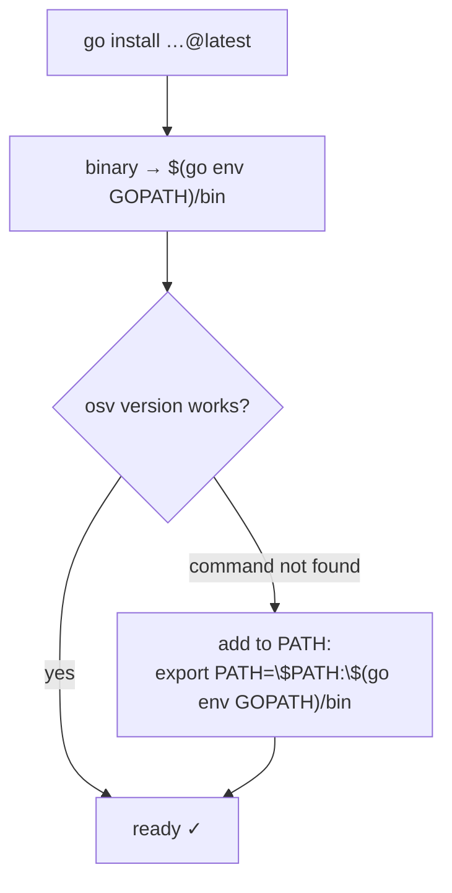

# Installation

Install the `osv` CLI, the Go SDK, and enable the Claude Code Skills.

## Requirements

- **Go 1.18+** (for SDK and building from source)
- Internet access only needed for `go get` / `go install` / downloading binaries

## Install options at a glance



## Three ways in, one core

Whichever you install, all three access layers resolve to the same Go core — so a fact you learn via the CLI holds in the SDK and the skills.



## CLI

::: tabs
== Pre-built binary

Pre-built binaries ship for every tag via goreleaser. If the latest release has no pre-built assets yet (e.g. before the first goreleaser-tagged release), fall back to `go install` below.

| OS | Architectures |
|----|---------------|
| Linux | amd64, arm64, arm (v7) |
| macOS | amd64, arm64 |
| Windows | amd64, arm64 |

The archive name is composed from the version, OS, and arch — build yours by filling the same template:



```bash
# Linux amd64 example — swap version/platform for your case.
# Replace v0.1.0 with the newest tag from the Releases page.
VERSION=v0.1.0
curl -fsSL -o osv.tar.gz \
  https://github.com/scagogogo/osv-schema-skills/releases/download/${VERSION}/osv_${VERSION}_linux_amd64.tar.gz
tar -xzf osv.tar.gz osv
chmod +x osv && sudo mv osv /usr/local/bin/
osv version
```

Verify integrity with the bundled `checksums.txt`:

```bash
sha256sum -c checksums.txt --ignore-missing
```

Releases: <https://github.com/scagogogo/osv-schema-skills/releases>

== Go install

```bash
go install github.com/scagogogo/osv-schema-skills/cmd/osv@latest
osv version
```

`go install` drops the binary in `$(go env GOPATH)/bin`. If `osv version` then says *command not found*, that directory isn't on your `PATH`:



== Build from source

```bash
git clone https://github.com/scagogogo/osv-schema-skills.git
cd osv-schema-skills
go build -o osv ./cmd/osv/
./osv version
```
:::

## Go SDK

```bash
go get -u github.com/scagogogo/osv-schema-skills
```

```go
import osv "github.com/scagogogo/osv-schema-skills"
```

See the [Go SDK guide](/guide/sdk) for usage.

## Claude Code Skills

The 7 skills activate automatically when Claude Code opens this repo — no install step:

```bash
git clone https://github.com/scagogogo/osv-schema-skills.git
cd osv-schema-skills
claude   # skills are live
```

Or install as a plugin — the manifest is already in `.claude-plugin/`, so once the marketplace listing is live you can add it directly:

```bash
claude plugin add scagogogo/osv-schema-skills
```

See [Skills Overview](/guide/skills).

## Verify

```bash
osv version                                   # CLI + schema version
osv parse test_data/GHSA-vxv8-r8q2-63xw.json  # parse a sample record
```
