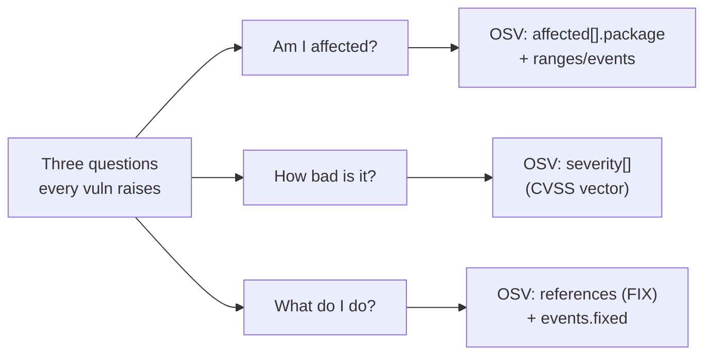
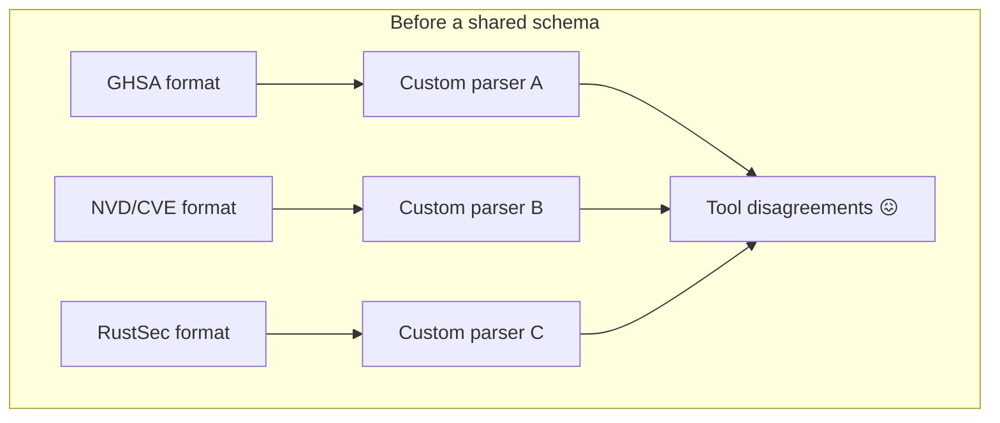
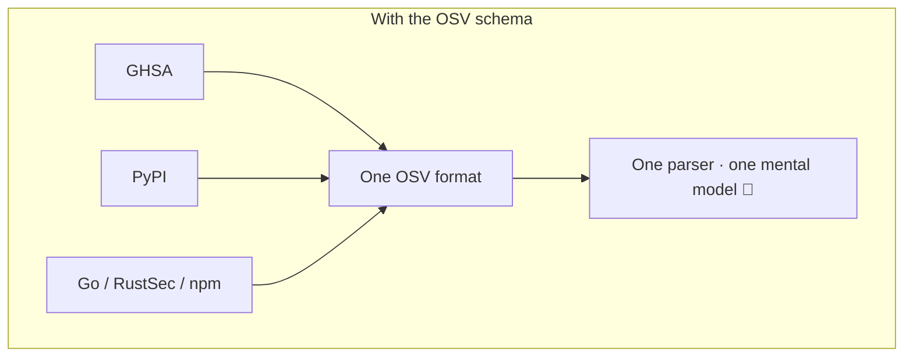
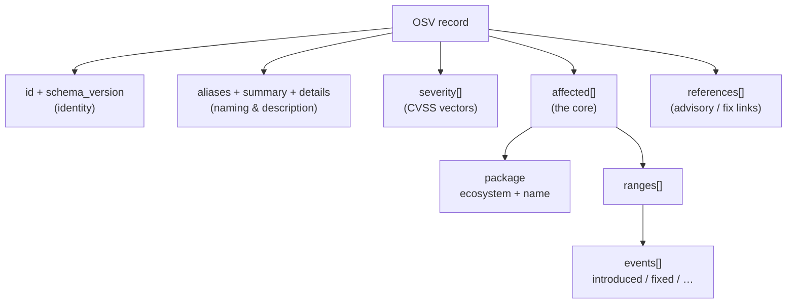
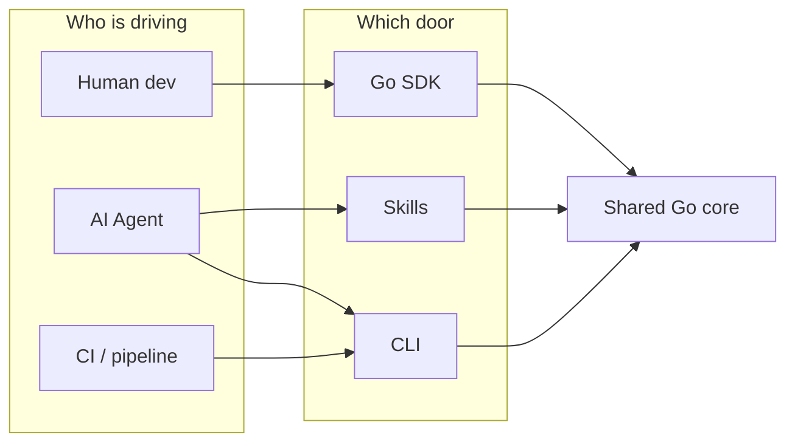
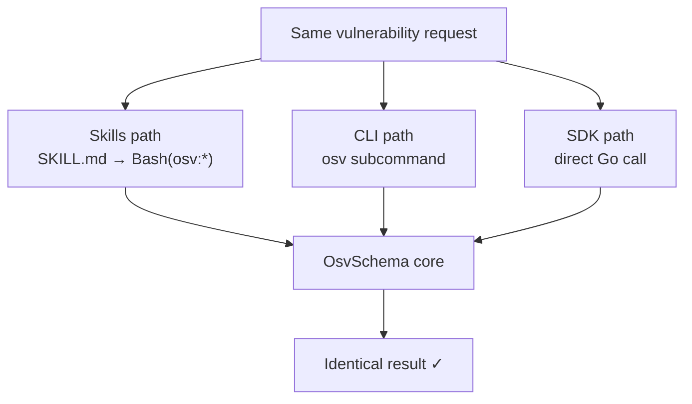
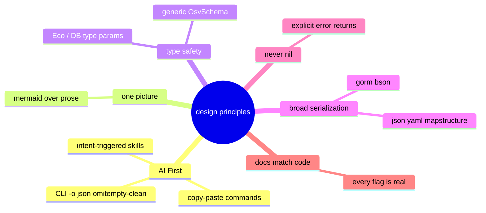

# Introduction

**OSV Schema Skills** is an **AI-native** Go library + CLI + Skills bundle for the [OSV (Open Source Vulnerability) Schema](https://ossf.github.io/osv-schema/). It lets you parse, validate, filter, and query vulnerability data — through a **Go SDK**, a **CLI tool**, or directly via **AI agent skills**.

If you only have thirty seconds, here is the whole idea:

> One Go core understands the OSV vulnerability format. Three thin layers expose it — a library for programs, a command for shells, and a set of skills for AI agents. Whichever door you walk through, the answer is the same.

The rest of this page is written to be read like the first chapter of a book: start from *why vulnerability data is hard*, build up *what OSV is*, then unfold *the data model one field at a time*, and finally show *where this toolkit fits*. You do not need any prior OSV knowledge — we introduce every term the first time it appears.

## Architecture at a glance


All three access layers share **one Go core**, so behavior is identical whether an AI agent, a shell script, or a Go program is driving.

---

## Chapter 1 — Why vulnerability data is hard

Imagine you maintain a service that depends on two hundred open-source packages. One morning you read that a popular library has a security hole. Three questions immediately matter:

1. **Am I affected?** Which of my exact versions are vulnerable?
2. **How bad is it?** Is this "patch this quarter" or "wake people up tonight"?
3. **What do I do?** Is there a fixed version, and which one?

These three questions are exactly what the OSV schema is built to answer — each maps onto a dedicated part of the record (unfolded in Chapter 3):



To answer these at scale — across hundreds of packages, automatically — you need the answers in a *structured, machine-readable* form. And this is exactly where the pre-OSV world fell apart:

- **Every database spoke its own dialect.** GitHub Security Advisories (GHSA), the National Vulnerability Database (NVD/CVE), Go's vuln DB, RustSec, PyPA, npm audit — each published the *same underlying facts* in a *different shape*. A tool that understood one could not read another.
- **Version ranges were prose, not data.** "Affects versions before 2.4.1" is easy for a human and useless for a machine that has to compare `2.4.0-rc2` against it.
- **Package identity was ambiguous.** Is `requests` a PyPI package, a RubyGem, or an npm module? Without an explicit *ecosystem*, the name alone means nothing.

The cost of this fragmentation is real: every security tool had to write and maintain a bespoke parser for every source, and they still disagreed with each other.



## Chapter 2 — What OSV is

**OSV** (Open Source Vulnerability) is a schema — a shared JSON format — created under the [OpenSSF](https://openssf.org/) to end that fragmentation. Its premise is simple but powerful:

> If every database describes vulnerabilities in the *same* shape, then one tool can read *all* of them.

Two ideas make OSV work where earlier attempts stalled:

- **Ecosystem-scoped package names.** A package is never just `requests`; it is `requests` *in the PyPI ecosystem*. That pairing (`ecosystem` + `name`) is globally unambiguous.
- **Version ranges as events, not sentences.** Instead of the prose "before 2.4.1", OSV records an ordered timeline: *introduced* at `0`, *fixed* at `2.4.1`. A machine can walk that timeline and decide whether any concrete version falls inside it — without understanding English.

Today OSV is exported natively by GitHub, PyPI, Go, RustSec, npm, and many others, and aggregated at [osv.dev](https://osv.dev/). Learning OSV once lets you read all of them.



## Chapter 3 — The data model, one field at a time

The best way to understand OSV is to grow a record from nothing, adding one layer at a time. Each step below is *valid* OSV — the format lets you say as little or as much as you need.

### Step 1 — Identity

Every record needs a globally unique `id` and declares which schema version it follows.

```json
{
  "schema_version": "1.4.0",
  "id": "GHSA-vxv8-r8q2-63xw"
}
```

That `id` is the primary key. Prefixes tell you the source: `GHSA-…` from GitHub, `CVE-…` from NVD, `GO-…` from the Go database, `PYSEC-…` from PyPA, and so on.

### Step 2 — Aliases and a human summary

The same vulnerability is often known by several IDs across databases. `aliases` links them; `summary` and `details` describe it for humans.

```json
{
  "id": "GHSA-vxv8-r8q2-63xw",
  "aliases": ["CVE-2021-33203"],
  "summary": "Potential directory traversal in Django admin",
  "details": "A longer Markdown explanation of the issue…"
}
```

This is why "find the CVE for this GHSA" is a one-liner with this toolkit — the mapping already lives in the record.

### Step 3 — How bad is it? (`severity`)

`severity` carries machine-readable scores, almost always as **CVSS vector strings** (Common Vulnerability Scoring System). A vector like `CVSS:3.1/AV:N/AC:L/PR:N/UI:N/S:U/C:N/I:N/A:H` encodes *how* the score was derived, not just the number.

```json
{
  "severity": [
    { "type": "CVSS_V3", "score": "CVSS:3.1/AV:N/AC:L/PR:N/UI:N/S:U/C:N/I:N/A:H" }
  ]
}
```

::: warning A subtlety you will hit
The `score` field holds the *vector string*, not a number. Turning it into a `7.5` requires parsing the vector. This toolkit does that for you — but note that `GetScore()` returns `0.0` when the field is a vector rather than a plain number. See [Methods → severity](/reference/methods#severity).
:::

### Step 4 — Who is affected? (`affected`)

This is the heart of the record. `affected` is a list; each entry names one `package` (ecosystem + name) and describes which versions are hit.

```json
{
  "affected": [
    {
      "package": { "ecosystem": "PyPI", "name": "django" },
      "ranges": [ /* see Step 5 */ ],
      "versions": ["3.1.0", "3.1.1", "3.2.0"]
    }
  ]
}
```

Two ways to express "which versions":

- **`versions`** — an explicit enumerated list. Simple, exact, but doesn't cover versions released later.
- **`ranges`** — a rule that covers open-ended spans. Preferred for real-world data. That's Step 5.

### Step 5 — Ranges as event timelines

A `range` is an ordered list of `events`. The most common events are `introduced` (vulnerability starts) and `fixed` (vulnerability ends). Read them as a timeline.

```json
{
  "ranges": [
    {
      "type": "ECOSYSTEM",
      "events": [
        { "introduced": "0" },
        { "fixed": "2.2.24" }
      ]
    }
  ]
}
```

Read this as: *"vulnerable from the very first version (`0`) up to — but not including — `2.2.24`."* To decide whether version `2.2.10` is affected, a machine walks the timeline; it never has to parse a sentence. `type` says how to compare versions — `ECOSYSTEM` (the ecosystem's own version rules), `SEMVER`, or `GIT` (commit hashes).

::: tip The golden rule of events
Each event object carries **exactly one** key — `introduced`, `fixed`, `last_affected`, or `limit`. That is why the CLI's `-o json` output uses `omitempty` on event fields: emitting `"fixed": ""` next to a real `"introduced"` would violate the spec and confuse an AI agent reading it. (The SDK's `Event` struct itself does **not** tag `omitempty` — the CLI adds a clean DTO layer on top for JSON output.)
:::

### Step 6 — Where to learn more? (`references`)

Finally, `references` links to advisories, fixes, and discussion. Each has a `type` (`ADVISORY`, `FIX`, `WEB`, `REPORT`, …) and a `url`.

```json
{
  "references": [
    { "type": "ADVISORY", "url": "https://github.com/advisories/GHSA-vxv8-r8q2-63xw" },
    { "type": "FIX", "url": "https://github.com/django/django/commit/abc123" }
  ]
}
```

### Putting it together

Stack all six layers and you have a complete record. Here is the whole shape on one diagram:



Every method in this toolkit maps onto one of these boxes — `GetCVE()` reads `aliases`, `FilterByEcosystem()` reads `affected[].package`, `query --events` reads `ranges[].events`, and so on. Once the model above clicks, the whole API is predictable.

---

## Chapter 4 — Where this toolkit fits

Understanding the model is half the battle; the other half is *acting on it* without rewriting a parser every time. That is what the three access layers give you — one core, three doors.



| Layer | Best for | You write |
|-------|----------|-----------|
| 🤖 **Skills** | Claude Code, AI workflows | Nothing — the agent picks the skill from your intent |
| 🖥️ **CLI** | Shells, CI pipelines | `osv filter -e PyPI -o json vuln.json` |
| 📦 **SDK** | Go applications | `v.Affected.FilterByEcosystem(osv.EcosystemPyPI)` |

Because all three call the *same* typed core, the CLI, the SDK, and the skills can never disagree — a property we lean on heavily for the "AI First" promise.



## Chapter 5 — Design principles



| Principle | How it shows up |
|-----------|-----------------|
| **AI First** | Skills auto-trigger from intent; docs lead with copy-paste commands an agent can run; the CLI's `-o json` output routes through clean DTOs with `omitempty`, so an agent never reads a misleading empty field |
| **One picture beats a thousand words** | This site leans on Mermaid diagrams instead of walls of prose |
| **Type safety** | Generic `OsvSchema[EcosystemSpecific, DatabaseSpecific any]` — customize per ecosystem/database, or use `any` for general parsing |
| **Broad serialization** | Every core type supports JSON, YAML, mapstructure, GORM, BSON tags |
| **Never nil from constructors** | Unmarshal functions return an explicit `error`, never a silent `nil` |
| **Docs match code** | Every command shown in these docs actually exists — an agent following the docs will not hit a missing flag |

## Glossary

New to the space? These are the terms used throughout the docs.

| Term | Meaning |
|------|---------|
| **OSV** | Open Source Vulnerability — the shared JSON schema this toolkit speaks |
| **Ecosystem** | The package universe a name belongs to: `PyPI`, `npm`, `Maven`, `Go`, … |
| **CVE** | Common Vulnerabilities and Exposures — the canonical global vuln ID (`CVE-2021-…`) |
| **GHSA** | GitHub Security Advisory ID (`GHSA-…`) |
| **CVSS** | Common Vulnerability Scoring System — the vector/score describing severity |
| **Alias** | Another ID for the same vulnerability across databases |
| **Range** | A rule (timeline of events) describing which versions are affected |
| **Event** | One point on a range's timeline: `introduced`, `fixed`, `last_affected`, `limit` |
| **Skill** | A `SKILL.md` contract telling an AI agent when to act and which `osv` command to call |

## What's next

- 🤖 **[AI Agent Integration](/guide/ai-agent)** — copy one prompt into Claude Code / Codex, done
- [Quick Start](/guide/quick-start) — running against a real record in 30 seconds
- [Skills Overview](/guide/skills) — the 7 auto-triggering skills
- [OSV Schema Reference](/reference/osv-schema) — the model above, as an exhaustive field reference
- [CLI](/guide/cli) / [Go SDK](/guide/sdk) — the two hands-on doors
