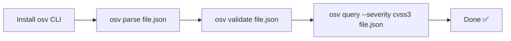

# Quick Start

Get the `osv` CLI running against a real vulnerability record in under a minute.

## Install the CLI

::: tabs
== Pre-built binary (any platform)

Download the right binary for your OS/arch from the [latest Release](https://github.com/scagogogo/osv-schema-skills/releases).

```bash
# Linux amd64 示例（替换版本号与平台）
VERSION=v0.1.0
curl -fsSL -o osv.tar.gz \
  https://github.com/scagogogo/osv-schema-skills/releases/download/${VERSION}/osv_${VERSION}_linux_amd64.tar.gz
tar -xzf osv.tar.gz osv
sudo mv osv /usr/local/bin/
osv version
```

== Go install

```bash
go install github.com/scagogogo/osv-schema-skills/cmd/osv@latest
osv version
```

== Build from source

```bash
git clone https://github.com/scagogogo/osv-schema-skills.git
cd osv-schema-skills
go build -o osv ./cmd/osv/
./osv version
```
:::

## Parse your first OSV file

Grab the bundled sample and parse it:

```bash
osv parse test_data/GHSA-vxv8-r8q2-63xw.json
```

Expected output:

```
ID:             GHSA-vxv8-r8q2-63xw
Schema Version: 1.4.0
Summary:        ...

Severity:
  CVSS_V3: CVSS:3.1/... (score: 7.5)

Affected Packages:
  ...
```

## The 30-second workflow



## Use the Go SDK

```bash
go get -u github.com/scagogogo/osv-schema-skills
```

```go
package main

import (
    "fmt"
    "log"

    osv "github.com/scagogogo/osv-schema-skills"
)

func main() {
    v, err := osv.UnmarshalFromJsonFile[any, any]("vulnerability.json")
    if err != nil {
        log.Fatal(err)
    }
    fmt.Printf("ID: %s\n", v.ID)
    fmt.Printf("CVE: %s\n", v.Aliases.GetCVE())
}
```

## Enable Claude Code skills

Just open the repo in Claude Code — the 6 skills activate automatically:

```bash
git clone https://github.com/scagogogo/osv-schema-skills.git
cd osv-schema-skills
claude  # skills are live
```

See [Skills Overview](/guide/skills) for what triggers each one.
