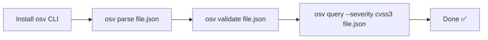
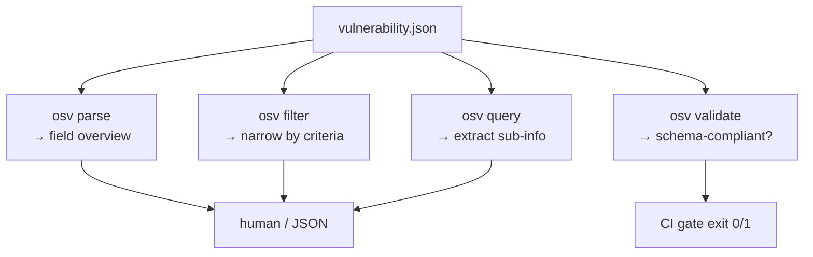

# Quick Start

This chapter takes you from *nothing installed* to *reading a real vulnerability record* — with a short explanation after each step so you understand not just **what** to type, but **what just happened**.

## Two paths

There are two ways to get going. Pick one.

- **Path A — let the AI do it (recommended, "AI First").** If you use Claude Code or Codex, you do not install anything by hand. Copy the onboarding prompt from the [AI Agent Integration](/guide/ai-agent) page, paste it into your agent, and it installs the CLI, discovers the skills, and starts working. Skip to [Enable Claude Code skills](#enable-claude-code-skills) to see why that works.
- **Path B — do it yourself.** Install the CLI and run the commands manually. That is the rest of this page.

---

## Step 1 — Install the CLI

Choose whichever fits your machine. All three end with `osv version`, which both confirms the install and prints the supported OSV schema version.

::: tabs
== Pre-built binary (any platform)

The zero-dependency option — no Go toolchain needed. Download the binary for your OS/arch from the [latest Release](https://github.com/scagogogo/osv-schema-skills/releases):

```bash
# Linux amd64 example (swap the version and platform for yours)
VERSION=v0.1.0
curl -fsSL -o osv.tar.gz \
  https://github.com/scagogogo/osv-schema-skills/releases/download/${VERSION}/osv_${VERSION}_linux_amd64.tar.gz
tar -xzf osv.tar.gz osv
sudo mv osv /usr/local/bin/
osv version
```

Binaries are published for Linux (amd64/arm64/arm), macOS (amd64/arm64) and Windows (amd64/arm64). Each release also ships a `checksums.txt` you can verify against.

== Go install

If you already have Go 1.18+:

```bash
go install github.com/scagogogo/osv-schema-skills/cmd/osv@latest
osv version
```

This drops `osv` into `$(go env GOPATH)/bin` — make sure that is on your `PATH`.

== Build from source

To hack on it or build a specific commit:

```bash
git clone https://github.com/scagogogo/osv-schema-skills.git
cd osv-schema-skills
go build -o osv ./cmd/osv/
./osv version
```
:::

::: tip What just happened
You now have a single self-contained binary named `osv`. It embeds the whole Go core — no runtime, no config file, nothing else to install. Everything below is that one binary reading JSON.
:::

## Step 2 — Parse your first record

Grab the sample bundled in the repo and parse it:

```bash
osv parse test_data/GHSA-vxv8-r8q2-63xw.json
```

Expected output (abridged):

```
ID:             GHSA-vxv8-r8q2-63xw
Schema Version: 1.4.0
Summary:        ...

Severity:
  CVSS_V3: CVSS:3.1/... (score: 7.5)

Affected Packages:
  ...
```

### Reading the output

Every line maps back to a layer of the OSV model from the [Introduction](/guide/introduction#chapter-3-—-the-data-model-one-field-at-a-time):

| Output line | OSV field | Meaning |
|-------------|-----------|---------|
| `ID` | `id` | The record's unique key |
| `Schema Version` | `schema_version` | Which OSV version it follows |
| `Summary` | `summary` | One-line human description |
| `Severity → CVSS_V3` | `severity[]` | The CVSS vector, plus the parsed numeric score |
| `Affected Packages` | `affected[]` | Which ecosystem + package + versions are hit |

Want *everything* — dates, related IDs, full details, per-range events? Add `-v`:

```bash
osv parse -v test_data/GHSA-vxv8-r8q2-63xw.json
```

Need machine-readable output for a script or an agent? Add `-o json`:

```bash
osv parse -o json test_data/GHSA-vxv8-r8q2-63xw.json
```

## Step 3 — The 30-second workflow

Parsing is just the first verb. In practice you chain a few:



Try each verb on the sample:

```bash
osv validate test_data/GHSA-vxv8-r8q2-63xw.json        # is it schema-compliant?
osv filter -e PyPI test_data/GHSA-vxv8-r8q2-63xw.json  # only PyPI-affected entries
osv query --severity cvss3 test_data/GHSA-vxv8-r8q2-63xw.json  # just the CVSS score
```

### What each command gives you



Think of it as a natural progression: **parse** to see it, **validate** to trust it, **filter** to narrow it, **query** to extract exactly one fact. Full flag-by-flag details live in the [CLI reference](/guide/cli).

## Step 4 — Use the Go SDK (optional)

If you are writing Go rather than driving a shell, the same core is one import away:

```bash
go get -u github.com/scagogogo/osv-schema-skills
```

```go
package main

import (
    "fmt"
    "log"

    osv "github.com/scagogogo/osv-schema-skills"
)

func main() {
    v, err := osv.UnmarshalFromJsonFile[any, any]("vulnerability.json")
    if err != nil {
        log.Fatal(err) // constructors never return a silent nil
    }
    fmt.Printf("ID: %s\n", v.ID)
    fmt.Printf("CVE: %s\n", v.Aliases.GetCVE())
}
```

The `[any, any]` type parameters are the `EcosystemSpecific` and `DatabaseSpecific` generics — use `any` for general parsing, or plug in your own structs to get typed access to custom fields. See the [Go SDK guide](/guide/sdk).

## Enable Claude Code skills

Here is the AI-First payoff. Open the repo in Claude Code and the 6 skills activate automatically — no plugin, no config:

```bash
git clone https://github.com/scagogogo/osv-schema-skills.git
cd osv-schema-skills
claude  # skills are live
```

Why this works with zero setup: each skill is a `SKILL.md` file under `.claude/skills/`. Claude Code discovers them on open, reads each one's `description` (its *trigger*), and when your request matches, runs the declared `osv` command for you. You never name the command — you describe the intent. See [Skills Overview](/guide/skills) for what triggers each one, or [AI Agent Integration](/guide/ai-agent) for the copy-paste prompt that also works in Codex.

## Troubleshooting

| Symptom | Likely cause & fix |
|---------|--------------------|
| `osv: command not found` | The binary isn't on your `PATH`. For `go install`, add `$(go env GOPATH)/bin` to `PATH`; for the binary, move it into `/usr/local/bin`. |
| `at least one filter flag is required` | `osv filter`/`osv query` need at least one flag — e.g. `-e PyPI` or `--severity cvss3`. |
| Numeric score shows `0.0` | The `score` field is a CVSS *vector string*, not a number — that's expected. See [Methods → severity](/reference/methods#severity). |
| `go install` fails on Go < 1.18 | The generics core needs Go 1.18+. Run `go version` and upgrade. |

## What's next

- [CLI reference](/guide/cli) — every command and flag
- [Skills Overview](/guide/skills) — the 6 auto-triggering skills
- [Go SDK guide](/guide/sdk) — typed access from Go
- [OSV Schema reference](/reference/osv-schema) — the full data model
