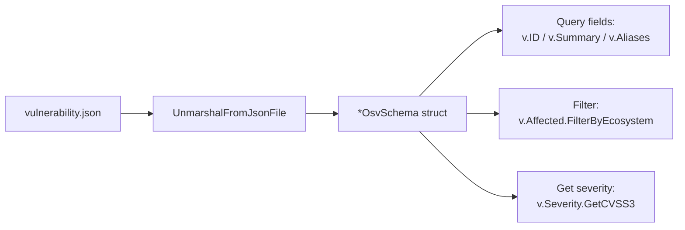
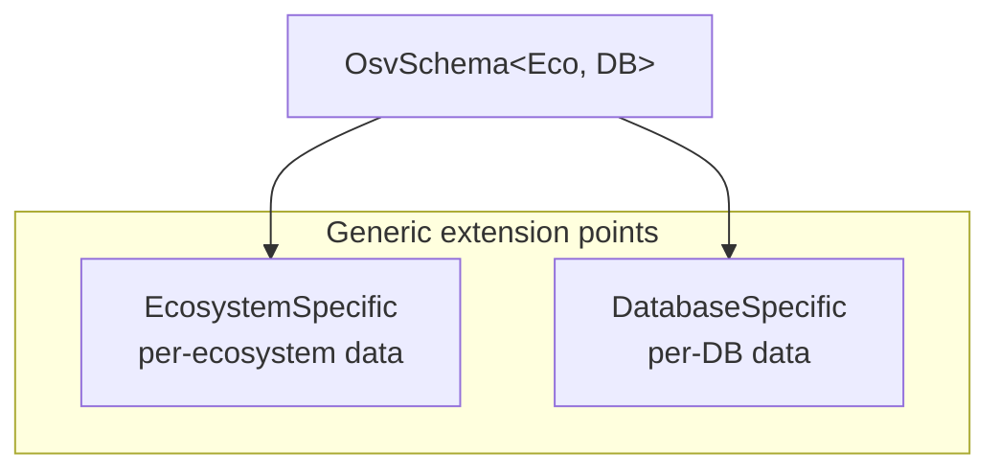
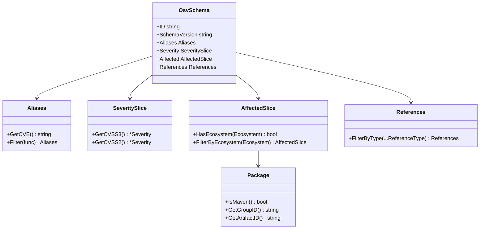
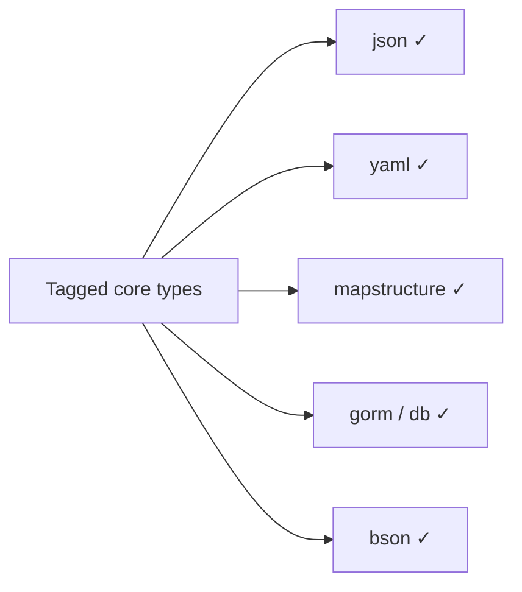
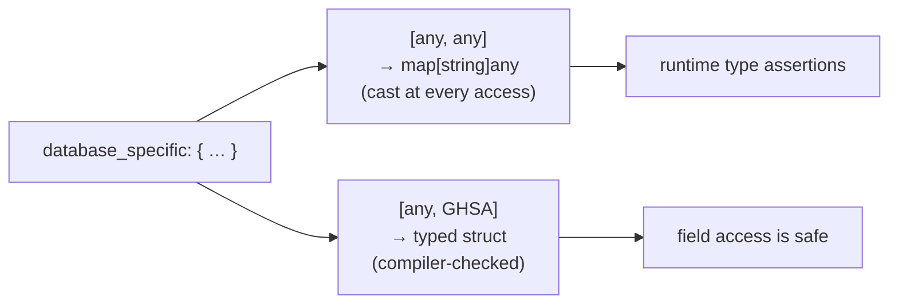

# Go SDK

The Go SDK is the type-safe foundation under both the CLI and the Skills. Use it when embedding OSV parsing/filtering/querying into a Go application.

## Install

```bash
go get -u github.com/scagogogo/osv-schema-skills
```

```go
import osv "github.com/scagogogo/osv-schema-skills"
```

## Quick start

```go
package main

import (
    "fmt"
    "log"

    osv "github.com/scagogogo/osv-schema-skills"
)

func main() {
    // Parse OSV data from a JSON file
    v, err := osv.UnmarshalFromJsonFile[any, any]("vulnerability.json")
    if err != nil {
        log.Fatal(err)
    }

    fmt.Printf("ID: %s\n", v.ID)
    fmt.Printf("Summary: %s\n", v.Summary)

    // Get CVE from aliases
    if cve := v.Aliases.GetCVE(); cve != "" {
        fmt.Printf("CVE: %s\n", cve)
    }

    // Check if a specific ecosystem is affected
    if v.Affected.HasEcosystem("npm") {
        fmt.Println("Affects npm packages")
    }

    // Get CVSS v3 score
    if cvss3 := v.Severity.GetCVSS3(); cvss3 != nil {
        fmt.Printf("CVSS v3: %.1f\n", cvss3.GetScore())
    }
}
```

## From JSON to code: object lifecycle



## Core type

```go
type OsvSchema[EcosystemSpecific, DatabaseSpecific any] struct {
    SchemaVersion    string
    ID               string
    Modified         time.Time
    Published        time.Time
    Withdrawn        string // string, not time.Time — check non-empty for withdrawn
    Aliases          Aliases
    Related          Related
    Summary          string
    Details          string
    Severity         SeveritySlice
    Affected         AffectedSlice[EcosystemSpecific, DatabaseSpecific]
    References       References
    DatabaseSpecific DatabaseSpecific
    Credits          *Credits
}
```

Generic type parameters `EcosystemSpecific` and `DatabaseSpecific` let you attach custom data per ecosystem or vulnerability database. Use `any` for general-purpose parsing.



## Type relationships at a glance



## Key methods

See the full table in [Reference → Methods](/reference/methods). Highlights:

| Type | Method | Description |
|------|--------|-------------|
| `OsvSchema` | `Affected.HasEcosystem(eco)` | Check if ecosystem is affected |
| `AffectedSlice` | `FilterByEcosystem(eco)` | Filter affected packages |
| `Aliases` | `GetCVE()` | Get first CVE identifier |
| `SeveritySlice` | `GetCVSS3()` / `GetCVSS2()` | Get CVSS severity entry |
| `Severity` | `GetScore()` | Parse score as float64 |
| `References` | `FilterByType(t)` | Filter by reference type |
| `Package` | `IsMaven()` / `GetGroupID()` / `GetArtifactID()` | Maven decomposition |

## Serialization

Every core type carries `json`, `yaml`, `mapstructure`, `db`, `bson`, `gorm` tags — JSON, YAML, mapstructure, GORM, and MongoDB (BSON) work out of the box.



## Typed vendor fields — a worked example

`[any, any]` is right for most parsing, but when you repeatedly read a known `database_specific` shape (e.g. GitHub's advisory blob), give it a concrete type and the compiler checks your field access.

```go
// Define the shape of the vendor blob you care about
type GHSA struct {
    Severity   string   `json:"severity"`
    CWEIDs     []string `json:"cwe_ids"`
    GitHubURL  string   `json:"github_reviewed_at"`
}

// Parse with the concrete type as DatabaseSpecific
v, err := osv.UnmarshalFromJsonFile[any, GHSA]("ghsa.json")
if err != nil {
    log.Fatal(err)
}
// v.DatabaseSpecific is now a typed GHSA — no map[string]any casting
fmt.Println(v.DatabaseSpecific.Severity, v.DatabaseSpecific.CWEIDs)
```



::: tip Only pay for the types you need
The two parameters are independent. Type just `DatabaseSpecific` and leave `EcosystemSpecific` as `any` (or vice-versa) — you don't have to model both blobs to get typing on one.
:::

## Design notes

- **Never nil from constructors** — `UnmarshalFromJsonFile` / `UnmarshalFromJson` return errors explicitly; the result is never a nil pointer on success.
- **Withdrawn is a string** — not `time.Time`. Check for a non-empty string to determine withdrawal status.
- **Database strategy** — simple fields are columns; complex nested structures (`AffectedSlice`, `SeveritySlice`) are stored as JSON strings via the GORM serializer.

## Requirements

- Go 1.18+
