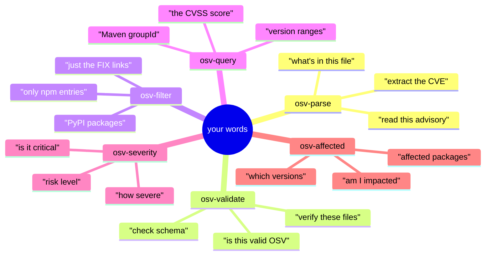
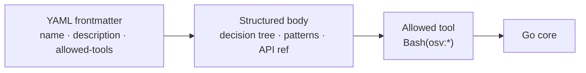
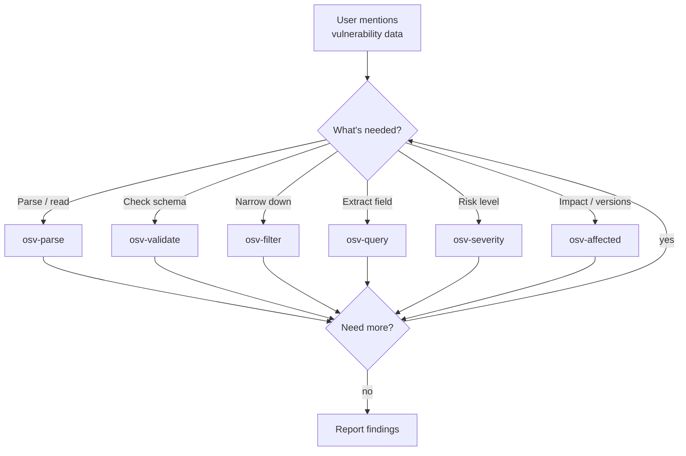
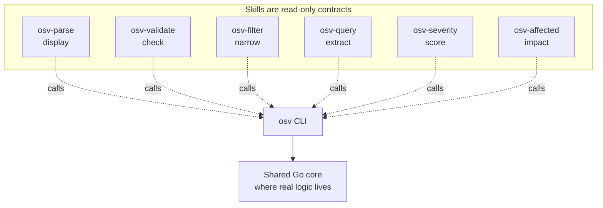
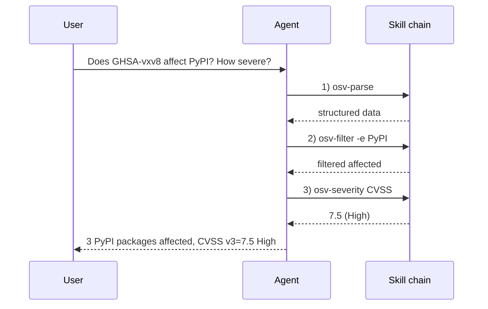

# Skills Overview

This repository is designed as a **Skills repository**. When Claude Code opens it, 6 specialized skills become automatically available — no integration code required.

## The skills

Six **data skills** do the real work — parse, validate, filter, query, score, and map impact. A seventh, `osv-installation`, is a **setup guide** that triggers on first use; it doesn't call `osv` (its `allowed-tools` is `Bash(go:*)`, not `Bash(osv:*)`).

| Skill | Purpose | Auto-triggers when… |
|-------|---------|---------------------|
| [`osv-parse`](/guide/skills/parse) | Parse & display OSV JSON data | You mention parsing a vulnerability file or extracting CVE/GHSA data |
| [`osv-validate`](/guide/skills/validate) | Validate OSV JSON files | You ask to check schema compliance or verify a vulnerability file |
| [`osv-filter`](/guide/skills/filter) | Filter by ecosystem / reference type / alias | You want npm/PyPI/Maven filtering or FIX references |
| [`osv-query`](/guide/skills/query) | Extract severity, Maven, ranges, events | You need CVSS scores, Maven GAV, or version ranges |
| [`osv-severity`](/guide/skills/severity) | CVSS severity analysis | You're assessing vulnerability risk or severity |
| [`osv-affected`](/guide/skills/affected) | Affected package & version analysis | You need impact analysis or version range inspection |
| [`osv-installation`](/guide/installation) | Setup & installation guide | It's your first time using the skills |

## What phrasing lands on which skill

You never name a skill — you describe intent, and the agent matches your words against each skill's `description`. These are the phrases that route to each:



## How a skill is wired

Each skill is a `SKILL.md` file in `.claude/skills/<name>/`:



1. **YAML frontmatter** — tells the agent *when* to trigger and *what tools* it may use.
2. **Structured body** — decision trees, task patterns, API reference, code examples.

Example — `osv-parse` frontmatter:

```yaml
---
name: osv-parse
description: Parse an OSV JSON file and display structured vulnerability data.
             Triggers on mentions of OSV parsing, CVE/GHSA data extraction...
allowed-tools: "Bash(osv:*)"
argument-hint: <osv-json-file>
---
```

## Skill decision tree

When an agent encounters a vulnerability task, it routes through the skills:



## Capability boundaries between skills



Skills carry no logic themselves — they only declare *when to trigger* and *which command to call*.

## A real workflow

```
User: "Check if GHSA-vxv8-r8q2-63xw affects any PyPI packages and how severe it is"

Agent workflow:
1. → osv-parse:     Parse the OSV JSON file
2. → osv-filter:    Filter affected packages by PyPI ecosystem
3. → osv-severity:  Extract CVSS v3 score
4. → Report findings to user
```



## Using skills in your project

**Option 1 — Clone this repo.** Skills activate automatically when Claude Code opens the directory:

```bash
git clone https://github.com/scagogogo/osv-schema-skills.git
cd osv-schema-skills
```

**Option 2 — Install as a Claude Code plugin** (coming soon):

```bash
claude plugin add scagogogo/osv-schema-skills
```

::: tip
Skills are read-only contracts — they only declare *when* to trigger and *which CLI command* to call. All real logic lives in the shared Go core, so behavior is identical across skills, CLI, and SDK.
:::
