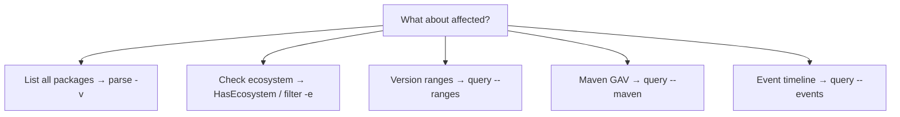

# osv-affected

Analyze affected packages and version ranges.

> **Trigger:** mentions of affected packages, version ranges, impacted ecosystems, or determining which packages/versions are affected.
> **Skill source:** [`.claude/skills/osv-affected/SKILL.md`](https://github.com/scagogogo/osv-schema-skills/blob/main/.claude/skills/osv-affected/SKILL.md)

## CLI

```bash
osv parse -v vulnerability.json             # Full affected details + ranges
osv filter -e PyPI vulnerability.json       # Narrow to one ecosystem
osv query --ranges vulnerability.json       # Version ranges
osv query --events vulnerability.json       # Event timeline
```

## SDK

```go
// Presence
v.Affected.HasEcosystem(osv.EcosystemPyPI)

// Filter
pypi := v.Affected.FilterByEcosystem(osv.EcosystemPyPI)

// Iterate ranges & events
for _, a := range v.Affected {
    fmt.Println(a.Package.Ecosystem, a.Package.Name)
    for _, r := range a.Ranges {
        fmt.Println("  range type:", r.Type)   // SEMVER / ECOSYSTEM / GIT
        for _, e := range r.Events {
            // e.IsIntroduced() / IsFixed() / IsLastAffected() / IsLimit()
        }
    }
}
```

## Structure


## Decision tree



## Notes

- `RangeTypeEcosystem` (`ECOSYSTEM`) is the most common; `SEMVER` and `GIT` are less frequent
- Event fields are mutually exclusive per event object
- `affected[].severity` is optional per-package severity, separate from top-level `severity`

## Cross-references

- [[osv-filter]] — narrow affected by ecosystem
- [[osv-query]] — extract ranges/events/maven
- [OSV Schema](/reference/osv-schema) — full type model
