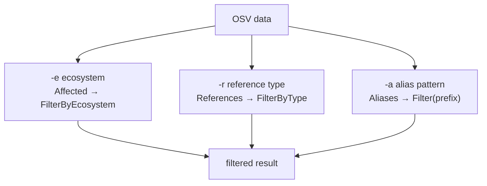
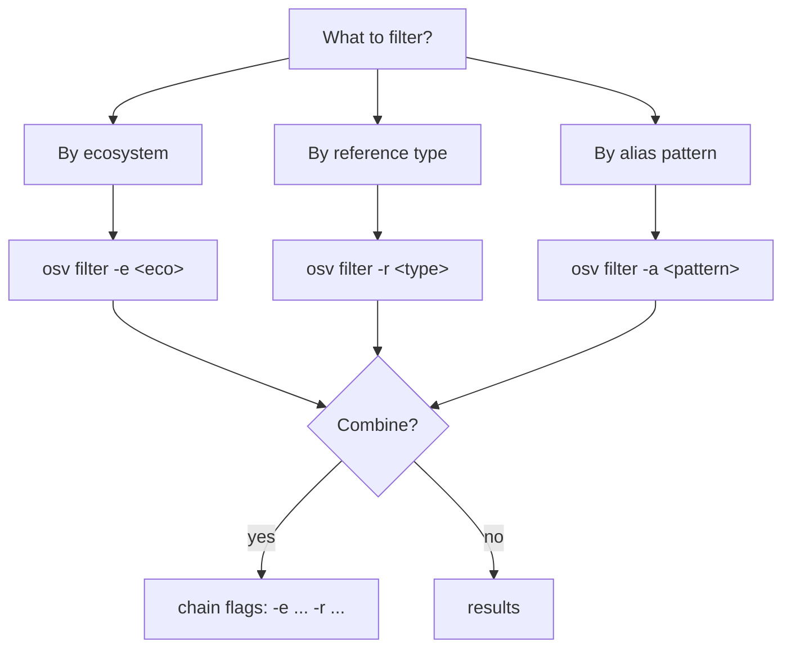
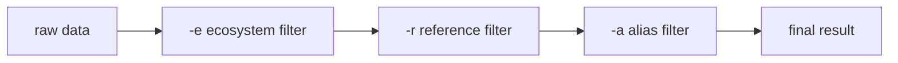
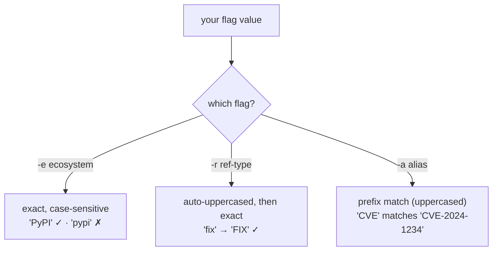

# osv-filter

Filter OSV data by ecosystem, reference type, or alias pattern.

> **Trigger:** mentions of filtering by package ecosystem (npm, PyPI, Maven), reference type (ADVISORY, FIX), or alias pattern (CVE, GHSA).
> **Skill source:** [`.claude/skills/osv-filter/SKILL.md`](https://github.com/scagogogo/osv-schema-skills/blob/main/.claude/skills/osv-filter/SKILL.md)

## CLI

```bash
osv filter -e PyPI vulnerability.json        # By ecosystem
osv filter -r FIX vulnerability.json         # By reference type
osv filter -a CVE vulnerability.json         # By alias pattern
osv filter -e PyPI -r FIX vulnerability.json # Combine
osv filter -o json -e PyPI vulnerability.json
```

| Flag | Description |
|------|-------------|
| `-e, --ecosystem` | Ecosystem, case-sensitive per OSV spec (`PyPI`, `npm`, `Maven`) |
| `-r, --ref-type` | Reference type, auto-uppercased (`ADVISORY`, `FIX`, `WEB`) |
| `-a, --alias` | Alias prefix (`CVE`, `GHSA`, `CVE-2024`) |
| `-o, --output` | `text` (default) or `json` |

At least one filter flag is required.

## The three filter dimensions



## SDK equivalent

```go
// Ecosystem
pypi := v.Affected.FilterByEcosystem(osv.EcosystemPyPI)
hasNpm := v.Affected.HasEcosystem(osv.EcosystemNpm)

// References
fixes := v.References.FilterByType(osv.ReferenceTypeFix)

// Aliases
cves := v.Aliases.Filter(func(a string) bool {
    return strings.HasPrefix(strings.ToUpper(a), "CVE-")
})
```

## Decision tree



## Execution order of combined filters



Each flag independently acts on a different slice of the original data; combining them takes the intersection.

## Matching semantics per flag

The three flags do **not** match the same way — this is the most common source of "why did my filter return nothing?".



::: warning `-e` is the strict one
Ecosystem is compared verbatim against the OSV spec's exact casing, so `-e pypi` silently returns nothing. Reference types are forgiving (auto-uppercased) and aliases are prefix-based. When a filter comes back empty, check `-e` casing first against the [Ecosystems](/reference/ecosystems) list.
:::

## Notes

- Ecosystem names are case-sensitive (`PyPI`, not `pypi`)
- Reference types are auto-uppercased in the CLI
- `HasEcosystem` returns a bool; `FilterByEcosystem` returns the filtered slice

## Cross-references

- [[osv-parse]] — parse first
- [[osv-query]] — extract fields after filtering
- See [Ecosystems](/reference/ecosystems) for the full constant list
