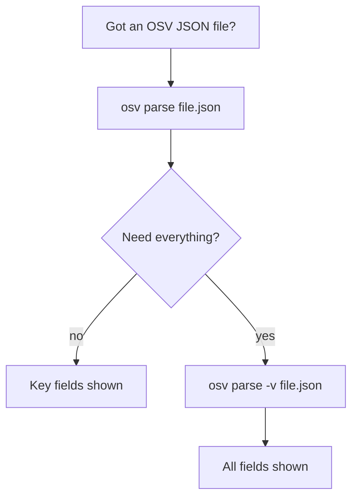
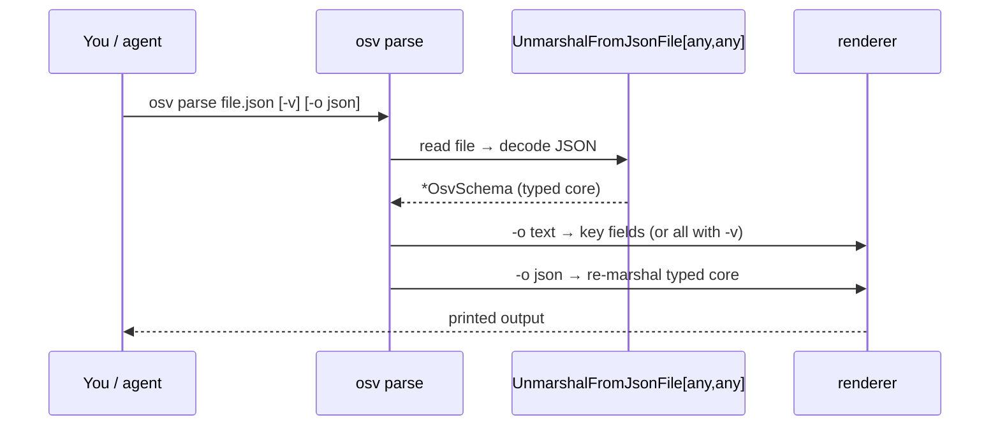
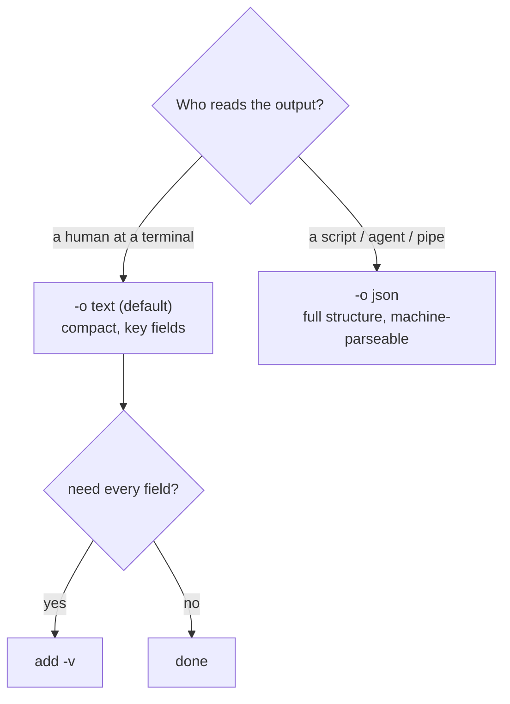

# osv-parse

Parse an OSV JSON file and display structured vulnerability data.

> **Trigger:** mentions of OSV parsing, vulnerability JSON reading, CVE/GHSA data extraction, or when a user provides an OSV JSON file path.
> **Skill source:** [`.claude/skills/osv-parse/SKILL.md`](https://github.com/scagogogo/osv-schema-skills/blob/main/.claude/skills/osv-parse/SKILL.md)

## CLI

```bash
osv parse vulnerability.json           # Key fields (text)
osv parse -v vulnerability.json        # All fields (dates, details, credits, ranges)
osv parse -o json vulnerability.json   # JSON output
```

| Flag | Description |
|------|-------------|
| `-v, --verbose` | Show all fields |
| `-o, --output` | `text` (default) or `json` |

## SDK equivalent

```go
v, err := osv.UnmarshalFromJsonFile[any, any]("vulnerability.json")
fmt.Println(v.ID, v.Summary, v.Aliases.GetCVE())
```

## Decision tree



## Output structure


## What it prints

ID, schema version, summary, aliases/CVE, severity, affected packages, references. With `-v` it additionally shows published/modified dates, withdrawn, related, details, credits, and per-range events.

```bash
osv parse test_data/GHSA-vxv8-r8q2-63xw.json
```

```text
ID:             GHSA-vxv8-r8q2-63xw
Schema Version: 1.4.0
Summary:        TensorFlow vulnerable to `CHECK` fail in `FractionalMaxPoolGrad`
Aliases:        CVE-2022-35981
CVE:            CVE-2022-35981

Severity:
  CVSS_V3: CVSS:3.1/AV:N/AC:H/PR:N/UI:N/S:U/C:N/I:N/A:H (score: 0.0)

Affected Packages:
  PyPI/tensorflow
  PyPI/tensorflow
  PyPI/tensorflow
  PyPI/tensorflow-cpu
  PyPI/tensorflow-cpu
  PyPI/tensorflow-cpu
  PyPI/tensorflow-gpu
  PyPI/tensorflow-gpu
  PyPI/tensorflow-gpu

References:
  [WEB] https://github.com/tensorflow/tensorflow/security/advisories/GHSA-vxv8-r8q2-63xw
  [ADVISORY] https://nvd.nist.gov/vuln/detail/CVE-2022-35981
  [WEB] https://github.com/tensorflow/tensorflow/commit/8741e57d163a079db05a7107a7609af70931def4
  [PACKAGE] https://github.com/tensorflow/tensorflow
  [WEB] https://github.com/tensorflow/tensorflow/releases/tag/v2.10.0
```

Each affected package is printed once **per `affected` entry** it appears in — this record carries three separate `affected` entries for `tensorflow` (one per patched branch), so `PyPI/tensorflow` shows up three times. That's the structure of the data, not a bug. References are listed in source order across all `WEB` / `ADVISORY` / `PACKAGE` / … types (no grouping).

The `(score: 0.0)` next to the CVSS vector is the same vector-string parse-failure documented in [Methods → severity](/reference/methods#severity) — the vector itself is in the `Score:` field.

## What happens under the hood

`osv parse` is a thin shell over the SDK's `UnmarshalFromJsonFile` — the same call you'd make in Go. The text/JSON rendering is the only difference from the SDK path.



## Text vs JSON: which to pick



`-o json` re-marshals the typed `OsvSchema` core, so the output is a standard OSV record — field names match the [OSV Schema](/reference/osv-schema) exactly:

```bash
osv parse -o json vulnerability.json | jq '{id, summary, severity, affected}'
```

```json
{
  "id": "GHSA-vxv8-r8q2-63xw",
  "summary": "TensorFlow vulnerable to `CHECK` fail in `FractionalMaxPoolGrad`",
  "severity": [{ "type": "CVSS_V3", "score": "CVSS:3.1/AV:N/AC:H/PR:N/UI:N/S:U/C:N/I:N/A:H" }],
  "affected": [{ "package": { "ecosystem": "PyPI", "name": "tensorflow", "purl": "" }, "ranges": [...] }]
}
```

::: tip Parsing never mutates the file
`parse` only reads. It decodes into the typed core and prints — it never writes back. To check that a file is *well-formed* before parsing, reach for [[osv-validate]]; a malformed file makes `parse` exit non-zero with the decode error.
:::

## Cross-references

- [[osv-validate]] — check the file is schema-valid first
- [[osv-filter]] / [[osv-query]] — narrow or extract from parsed data
