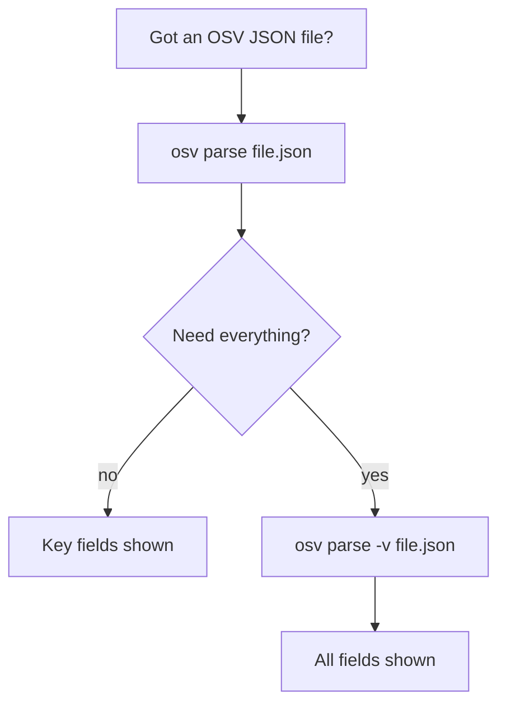
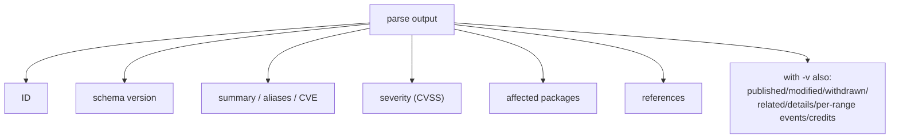

# osv-parse

Parse an OSV JSON file and display structured vulnerability data.

> **Trigger:** mentions of OSV parsing, vulnerability JSON reading, CVE/GHSA data extraction, or when a user provides an OSV JSON file path.
> **Skill source:** [`.claude/skills/osv-parse/SKILL.md`](https://github.com/scagogogo/osv-schema-skills/blob/main/.claude/skills/osv-parse/SKILL.md)

## CLI

```bash
osv parse vulnerability.json           # Key fields (text)
osv parse -v vulnerability.json        # All fields (dates, details, ranges, credits)
osv parse -o json vulnerability.json   # JSON output
```

| Flag | Description |
|------|-------------|
| `-v, --verbose` | Show all fields |
| `-o, --output` | `text` (default) or `json` |

## SDK equivalent

```go
v, err := osv.UnmarshalFromJsonFile[any, any]("vulnerability.json")
fmt.Println(v.ID, v.Summary, v.Aliases.GetCVE())
```

## Decision tree



## Output structure



## What it prints

ID, schema version, summary, aliases/CVE, severity, affected packages, references. With `-v` it additionally shows published/modified dates, withdrawn, related, details, per-range events, and credits.

## Cross-references

- [[osv-validate]] — check the file is schema-valid first
- [[osv-filter]] / [[osv-query]] — narrow or extract from parsed data
