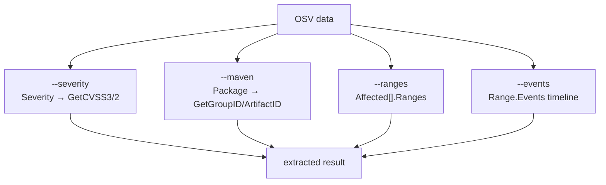
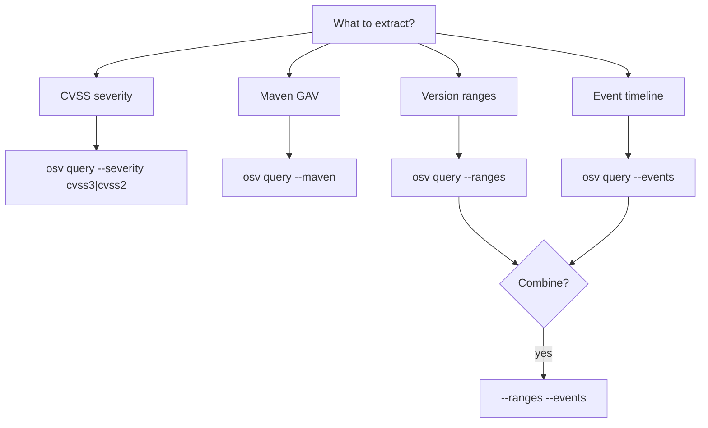
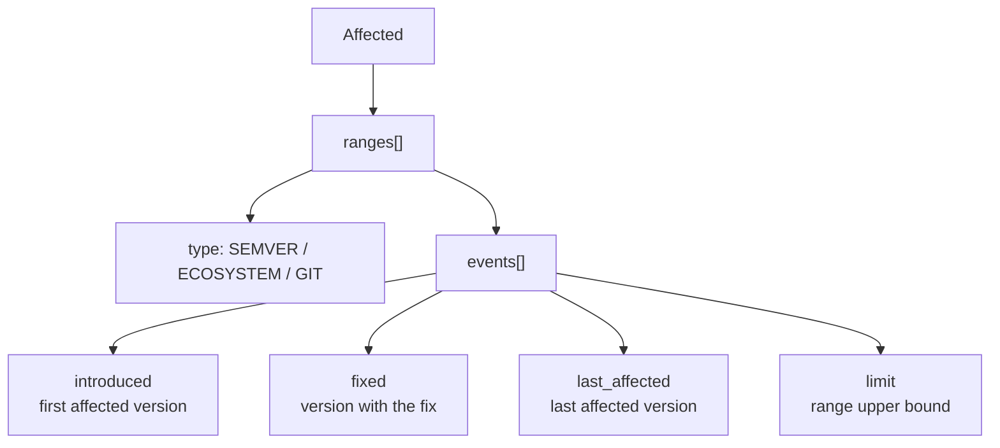

# osv-query

Extract specific sub-information: CVSS severity, Maven decomposition, version ranges, event timelines.

> **Trigger:** queries about CVSS scores, Maven groupId/artifactId, version ranges, or focused extraction from OSV data.
> **Skill source:** [`.claude/skills/osv-query/SKILL.md`](https://github.com/scagogogo/osv-schema-skills/blob/main/.claude/skills/osv-query/SKILL.md)

## CLI

```bash
osv query --severity cvss3 vulnerability.json  # CVSS v3 entry + parsed score
osv query --severity cvss2 vulnerability.json  # CVSS v2
osv query --maven vulnerability.json           # Maven groupId/artifactId
osv query --ranges vulnerability.json          # Version ranges
osv query --events vulnerability.json          # Event timeline
osv query --ranges --events vulnerability.json # Combine
```

| Flag | Description |
|------|-------------|
| `--severity` | `cvss3` or `cvss2` |
| `--maven` | Decompose Maven `groupId:artifactId` |
| `--ranges` | Show version ranges |
| `--events` | Show event timeline |
| `-o, --output` | `text` (default) or `json` |

At least one flag is required.

## The four extraction dimensions



## SDK equivalent

```go
// Severity
if s := v.Severity.GetCVSS3(); s != nil { fmt.Println(s.GetScore()) }

// Maven
for _, a := range v.Affected {
    if a.Package.IsMaven() {
        fmt.Println(a.Package.GetGroupID(), a.Package.GetArtifactID())
    }
}

// Ranges & events
for _, a := range v.Affected {
    for _, r := range a.Ranges {
        for _, e := range r.Events {
            // e.IsIntroduced() / IsFixed() / IsLastAffected() / IsLimit()
        }
    }
}
```

## Decision tree



## Version ranges vs events



Event fields are mutually exclusive per event object — one of introduced/fixed/last_affected/limit each.

## Notes

- `GetCVSS3()` / `GetCVSS2()` return `nil` if the severity type is absent
- `GetScore()` returns `0.0` when the OSV `score` is a CVSS vector string rather than a number — use `GetScoreAsFloat()` for error handling
- Maven decomposition only applies to `Maven`-ecosystem packages
- Event fields are mutually exclusive: one of `introduced`/`fixed`/`last_affected`/`limit` per event

## Cross-references

- [[osv-parse]] — full parse first
- [[osv-severity]] — deeper severity analysis
- [[osv-affected]] — deeper affected/range analysis
