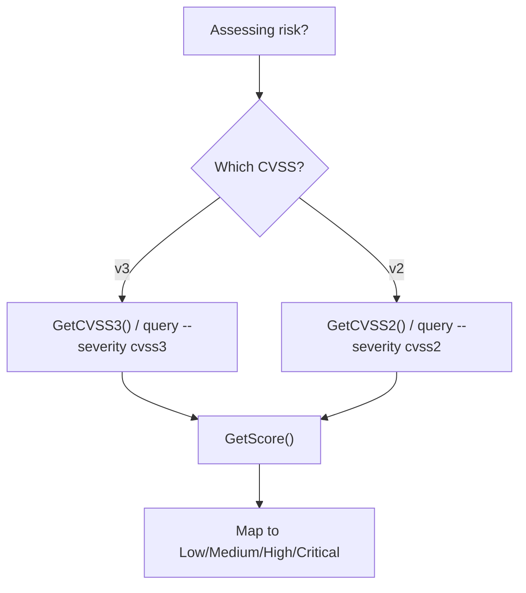
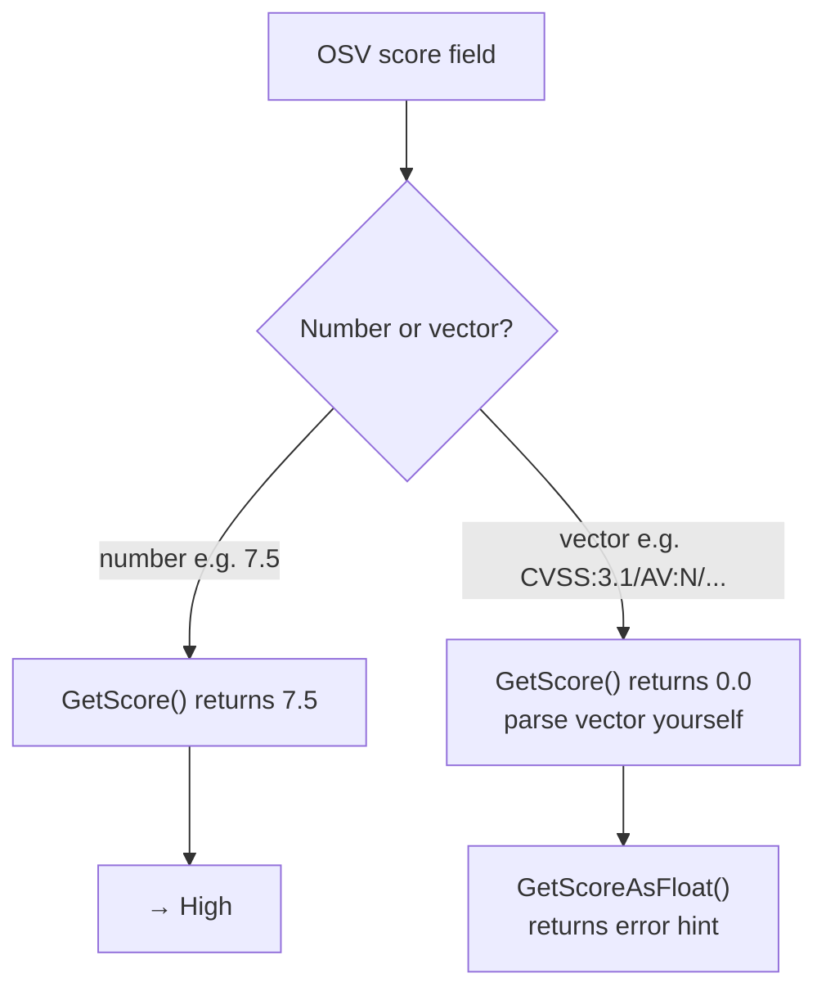
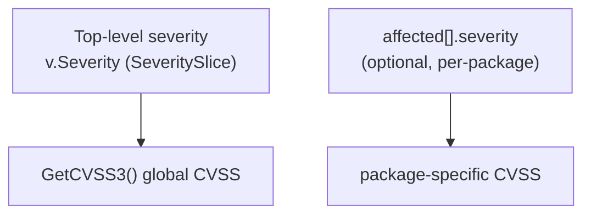

# osv-severity

Analyze CVSS severity data from OSV records.

> **Trigger:** mentions of CVSS scores, vulnerability severity assessment, risk rating, or evaluating impact.
> **Skill source:** [`.claude/skills/osv-severity/SKILL.md`](https://github.com/scagogogo/osv-schema-skills/blob/main/.claude/skills/osv-severity/SKILL.md)

## CLI

Severity is queried via `osv query`:

```bash
osv query --severity cvss3 vulnerability.json  # CVSS v3 entry + parsed score
osv query --severity cvss2 vulnerability.json  # CVSS v2
```

Or see all severities at once with `osv parse -v`.

## SDK

```go
// CVSS v3 entry (nil if absent)
s := v.Severity.GetCVSS3()

// Parsed numeric score
fmt.Println(s.GetScore())        // float64, 0.0 if unparseable
score, err := s.GetScoreAsFloat() // with error
ptr := s.GetScoreAsPointer()     // *float64, nil on error
```

## CVSS score table

| Score range | Severity |
|-------------|----------|
| 0.1–3.9 | Low |
| 4.0–6.9 | Medium |
| 7.0–8.9 | High |
| 9.0–10.0 | Critical |

## Decision tree



## Parsing path: vector vs number



## Top-level vs per-package severity



`affected[].severity` is an optional per-package severity, separate from the top-level `severity`.

## Notes

- OSV `score` may be a CVSS vector string (`CVSS:3.1/AV:N/...`) rather than a number — in that case `GetScore()` returns `0.0`. Parse the vector yourself if you need the numeric score from a vector.
- `SeverityTypeCVSS2 = "CVSS_V2"`, `SeverityTypeCVSS3 = "CVSS_V3"`

## Cross-references

- [[osv-query]] — the `--severity` flag lives here
- [[osv-affected]] — per-package severity (`affected[].severity`)
- [Methods](/reference/methods#severity) — full severity API
