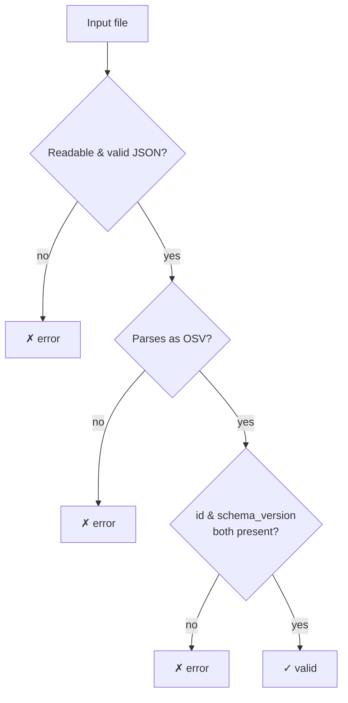
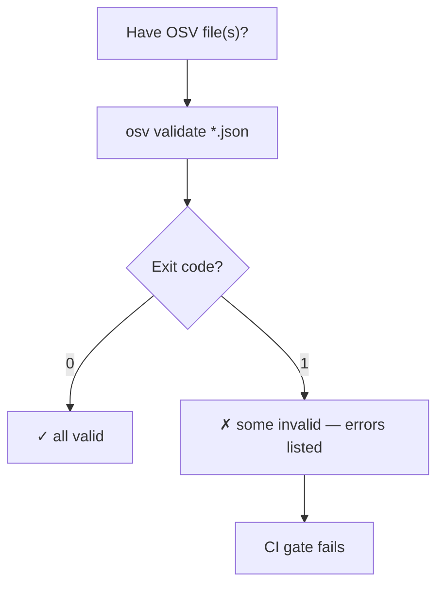
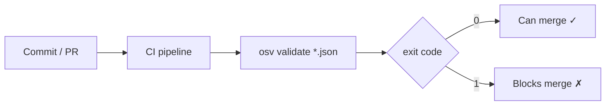
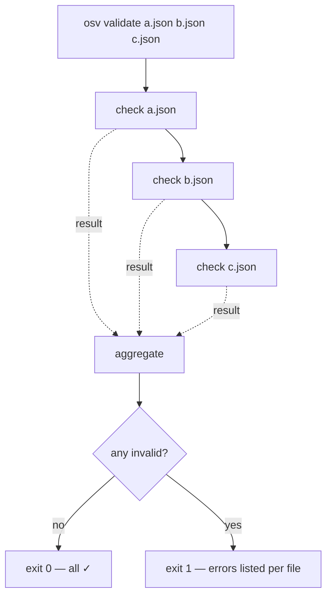

# osv-validate

Validate OSV JSON files against the schema.

> **Trigger:** mentions of OSV validation, vulnerability format checking, schema compliance, or verifying a file is well-formed.
> **Skill source:** [`.claude/skills/osv-validate/SKILL.md`](https://github.com/scagogogo/osv-schema-skills/blob/main/.claude/skills/osv-validate/SKILL.md)

## CLI

```bash
osv validate vulnerability.json              # Single file
osv validate file1.json file2.json           # Batch
osv validate -o json vulnerability.json      # JSON output
```

Exits with code `1` if any file is invalid — CI-friendly.

| Flag | Description |
|------|-------------|
| `-o, --output` | `text` (default) or `json` |

## What it checks

- File is readable and valid JSON
- Parses as OSV (`UnmarshalFromJson`)
- Required fields present: `id` and `schema_version`

## Validation flow



## Decision tree



## Where it sits in CI



## Batch semantics: one bad file fails the run

With multiple files the exit code is the logical AND of every result — a single invalid file makes the whole invocation exit `1`, but every file is still checked and reported. This is exactly the behaviour you want in a pre-merge gate over a directory of advisories.



## SDK equivalent

```go
raw, _ := os.ReadFile("vulnerability.json")
if !json.Valid(raw) { /* not JSON */ }
v, err := osv.UnmarshalFromJson[any, any](raw)
// then check v.ID != "" && v.SchemaVersion != ""
```

## Cross-references

- [[osv-parse]] — display a valid file's contents
- [[osv-installation]] — install the CLI first
