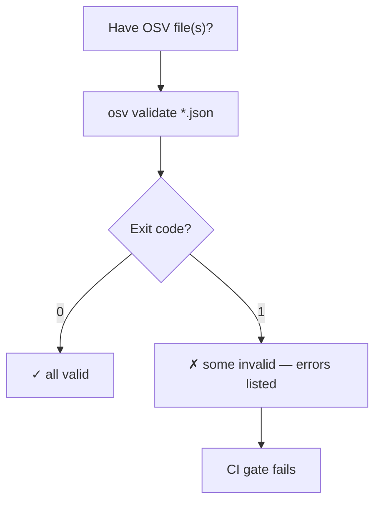
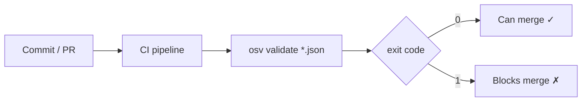
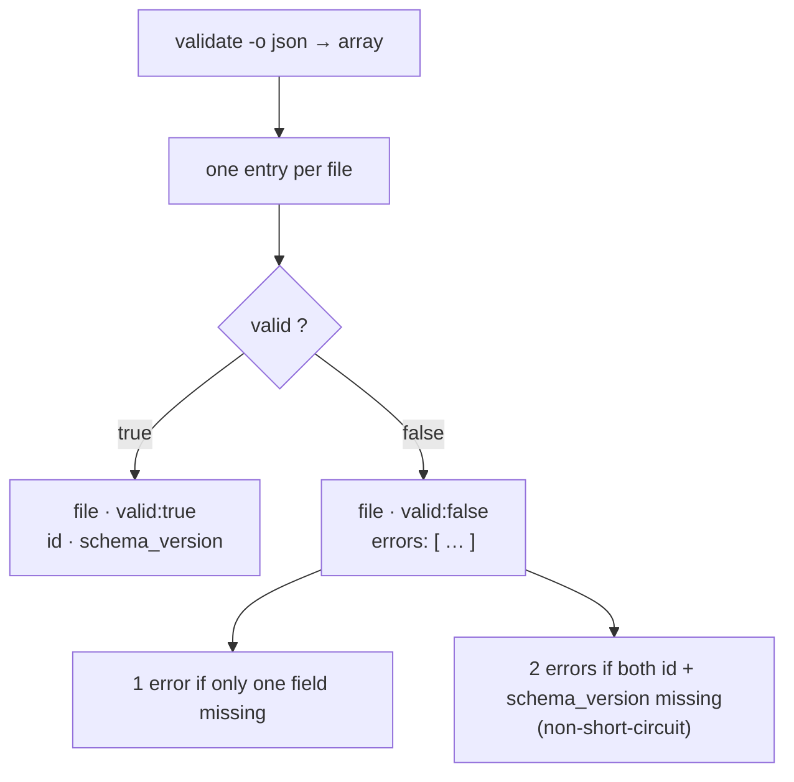
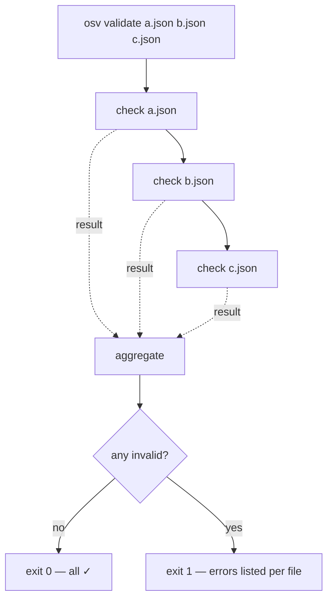

# osv-validate

Validate OSV JSON files against the schema.

> **Trigger:** mentions of OSV validation, vulnerability format checking, schema compliance, or verifying a file is well-formed.
> **Skill source:** [`.claude/skills/osv-validate/SKILL.md`](https://github.com/scagogogo/osv-schema-skills/blob/main/.claude/skills/osv-validate/SKILL.md)

## CLI

```bash
osv validate vulnerability.json              # Single file
osv validate file1.json file2.json           # Batch
osv validate -o json vulnerability.json      # JSON output
```

Exits with code `1` if any file is invalid — CI-friendly.

The default text output uses `✓`/`✗` per file, with the parsed `id` and `schema_version` on success and a bulleted error list on failure (a record missing both fields lists both, since the checks don't short-circuit):

```text
✓ test_data/GHSA-vxv8-r8q2-63xw.json (id=GHSA-vxv8-r8q2-63xw, schema_version=1.4.0)
✗ bad.json
  - missing required field: id
  - missing required field: schema_version
```

| Flag | Description |
|------|-------------|
| `-o, --output` | `text` (default) or `json` |

## What it checks

- File is readable and valid JSON
- Parses as OSV (`UnmarshalFromJson`)
- Required fields present: `id` and `schema_version`

## Validation flow

```mermaid
flowchart TD
  F["Input file"] --> R{"Readable & valid JSON?"}
  R -->|"no"| E1["✗ error"]
  R -->|"yes"| P{"Parses as OSV?"}
  P -->|"no"| E2["✗ error"]
  P -->|"yes"| ID{"id != \"\" ?"}
  ID -->|"no"| E3["+ error: missing id"]
  ID -->|"yes"| SV{"schema_version != \"\" ?"}
  SV -->|"no"| E4["+ error: missing schema_version"]
  SV -->|"yes"| OK["✓ valid"]
  E3 --> FAIL["✗ (errors aggregated)"]
  E4 --> FAIL
```

The `id` and `schema_version` checks are two **independent `if`s, not a short-circuit** — both errors are collected when both fields are empty, so a record missing `id` still gets checked for `schema_version` and can surface two errors. The earlier layers (readable/valid-JSON/OSV-parse) each fail fast on their own condition.

## Decision tree



## Where it sits in CI



Add `-o json` to get a machine-readable report alongside the exit code — one array entry per file, with `valid` plus the parsed `id` / `schema_version`:

```bash
osv validate -o json advisories/*.json
```

```json
[
  { "file": "advisories/GHSA-vxv8-r8q2-63xw.json", "valid": true, "id": "GHSA-vxv8-r8q2-63xw", "schema_version": "1.4.0" },
  { "file": "advisories/bad.json", "valid": false, "errors": ["missing required field: id"] }
]
```

Each array entry is one file; its shape branches on `valid`:



## Batch semantics: one bad file fails the run

With multiple files the exit code is the logical AND of every result — a single invalid file makes the whole invocation exit `1`, but every file is still checked and reported. This is exactly the behaviour you want in a pre-merge gate over a directory of advisories.



## SDK equivalent

```go
raw, _ := os.ReadFile("vulnerability.json")
if !json.Valid(raw) { /* not JSON */ }
v, err := osv.UnmarshalFromJson[any, any](raw)
if err != nil { /* decode error — v is nil, don't touch it */ }
// then check v.ID != "" && v.SchemaVersion != ""
```

## Cross-references

- [[osv-parse]] — display a valid file's contents
- [[osv-installation]] — install the CLI first
