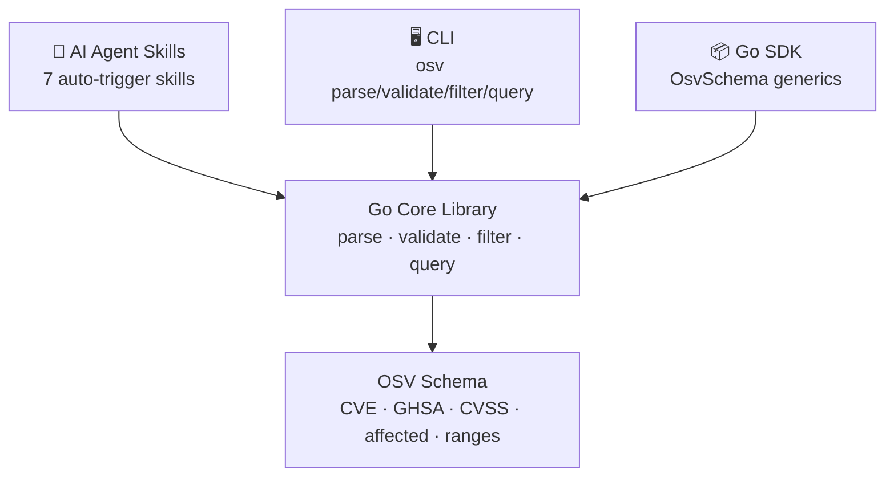
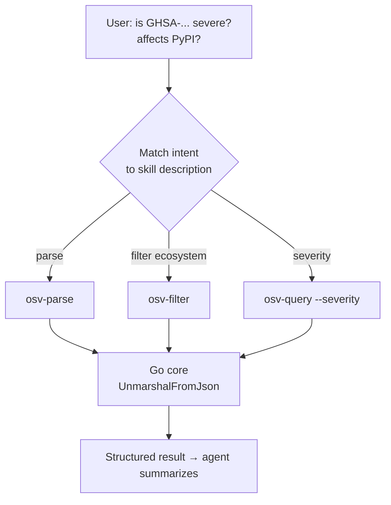
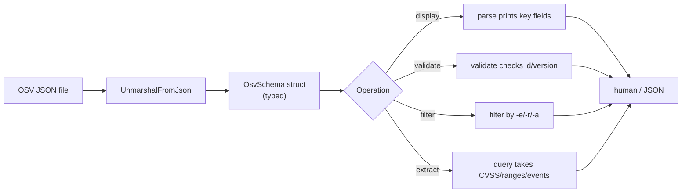
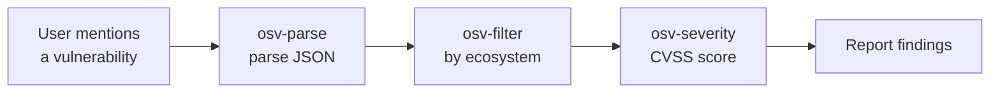

---

### 📊 By the numbers

| | |
|---|---|
| **7** Claude Code Skills | 6 data skills + 1 setup guide, auto-triggering |
| **5** CLI subcommands | `parse` · `validate` · `filter` · `query` · `version` |
| **7** pre-built binaries | Linux (amd64/arm64/arm) · macOS (amd64/arm64) · Windows (amd64/arm64) |
| **19** ecosystems | npm · PyPI · Maven · NuGet · RubyGems · Go · Cargo · Hex · Pub · Packagist · … |
| **1** Go core | Same typed `OsvSchema` kernel under all three access layers |

### ⚡ Install in one line

```bash
# Pre-built binary (Linux amd64 example — swap version/platform for yours)
curl -fsSL https://github.com/scagogogo/osv-schema-skills/releases/download/v0.1.0/osv_v0.1.0_linux_amd64.tar.gz | tar -xz osv && sudo mv osv /usr/local/bin/ && osv version
```

```bash
# Or via Go (1.18+)
go install github.com/scagogogo/osv-schema-skills/cmd/osv@latest
```

Prefer the **AI Agent route**? Copy one prompt into Claude Code or Codex — the agent installs itself. ↓

---

### 🤖 One prompt to onboard your AI agent

The fastest path: **copy this prompt, paste it into Claude Code or Codex, hit Enter.** The agent installs the CLI, discovers the skills, and is ready to work with OSV vulnerability data. Full version on the [AI Agent Integration](/guide/ai-agent) page.

```text
You now have access to the OSV Schema Skills toolkit
(https://github.com/scagogogo/osv-schema-skills), an AI-native Go library + CLI + Claude Code
Skills bundle for the OSV vulnerability schema. Set it up now:
1. Install the `osv` CLI — download a pre-built binary from the GitHub Release matching my
   OS/arch, or `go install github.com/scagogogo/osv-schema-skills/cmd/osv@latest`. Verify `osv version`.
2. Commands: `osv parse [-v] <file>`, `osv validate <file>…`, `osv filter -e/-r/-a <file>`,
   `osv query --severity cvss3|cvss2 --maven --ranges --events <file>`. Use `-o json` for parsing.
3. Clone the repo to activate the 7 Claude Code Skills (osv-parse/validate/filter/query/severity/affected/installation).
When I ask about a vulnerability, pick the right command automatically, filter by ecosystem if I
name one, extract CVSS + affected ranges, and report concisely. Don't ask me which command to run.
```

→ [Get the full copy-paste prompt →](/guide/ai-agent)

---

### The problem

Working with vulnerability data is painful for both humans and AI:

- **OSV JSON is deeply nested** — affected packages, CVSS scores, version ranges, references, event timelines. Inspecting one by hand means scrolling a 500-line file.
- **Filtering needs throwaway code** every time — "just show me the PyPI packages" or "only the FIX references" each becomes a custom script.
- **Validation against the schema** is error-prone without tooling (missing `id`, malformed ranges, wrong severity types).
- **AI agents had no structured entry point** — before this project, an agent would `cat` the JSON and hallucinate its way through it.

### The solution

One Go core, **three access layers**, so the same parsing/filtering/querying logic is reachable from anywhere:



| Layer | Best for | Example |
|-------|----------|---------|
| 🤖 **Skills** | Claude Code, AI workflows | Agent auto-triggers `osv-parse` when you mention a vuln file |
| 🖥️ **CLI** | Shell, CI pipelines | `osv filter -e PyPI -o json vuln.json` |
| 📦 **SDK** | Go applications | `v.Affected.FilterByEcosystem(osv.EcosystemPyPI)` |

### How it works — the principle

The trick is **intent-to-skill routing**: each `SKILL.md` declares *when* it triggers (its `description`) and *what tool* it may call (`allowed-tools: Bash(osv:*)`). The agent matches your request against those descriptions and picks the right `osv` subcommand — you never have to name it.



Under the hood, every command calls the same typed Go core (`OsvSchema[EcosystemSpecific, DatabaseSpecific any]`) — so the CLI, the SDK, and the skills can never disagree. The skills are thin **declarative contracts**; all real logic lives in one place.

### How data flows: from JSON to report



### A typical AI agent workflow



---

Ready to wire up your agent? **[Copy the prompt →](/guide/ai-agent)**
