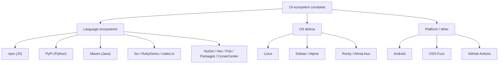
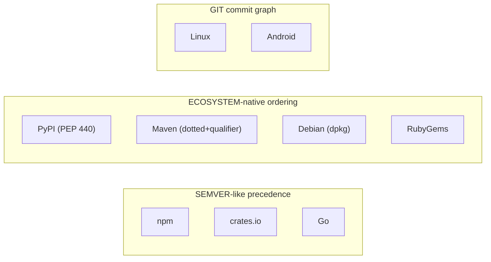
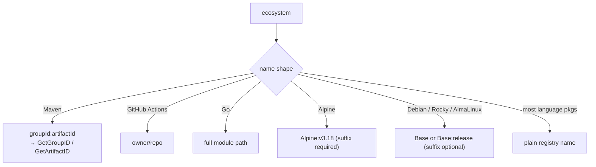
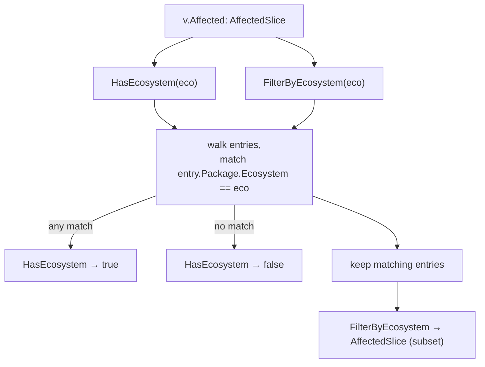
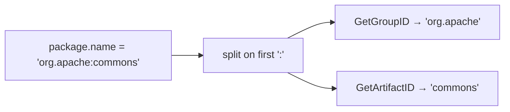

# Ecosystems

The SDK defines all 19 OSV ecosystems as typed constants — no stringly-typed mistakes.

## Full list

| Constant | Value | Notes |
|----------|-------|-------|
| `EcosystemGo` | `Go` | Go module path |
| `EcosystemNpm` | `npm` | NPM package name |
| `EcosystemPyPI` | `PyPI` | Normalized PyPI name |
| `EcosystemRubyGems` | `RubyGems` | Gem name |
| `EcosystemCratesIo` | `crates.io` | Rust crate |
| `EcosystemPackagist` | `Packagist` | PHP |
| `EcosystemMaven` | `Maven` | Java — name is `groupId:artifactId` |
| `EcosystemNuGet` | `NuGet` | .NET |
| `EcosystemHex` | `Hex` | Erlang/Elixir |
| `EcosystemPub` | `Pub` | Dart |
| `EcosystemLinux` | `Linux` | Kernel only |
| `EcosystemDebian` | `Debian` | May have `:<RELEASE>` suffix |
| `EcosystemAlpine` | `Alpine` | Requires `:v<RELEASE>` suffix |
| `EcosystemRocky` | `Rocky` | May have `:<RELEASE>` suffix |
| `EcosystemAlmaLinux` | `AlmaLinux` | May have `:<RELEASE>` suffix |
| `EcosystemAndroid` | `Android` | Component name |
| `EcosystemOSSFuzz` | `OSS-Fuzz` | Fuzz target |
| `EcosystemConanCenter` | `ConanCenter` | C/C++ |
| `EcosystemGitHubActions` | `GitHub Actions` | `{owner}/{repo}` |

## Grouped by category



## Ecosystem → version scheme

An ecosystem doesn't just name a registry — it also implies *how versions sort*, which is exactly what a `range.type` needs (see [RangeType](/reference/osv-schema#rangetype-—-how-versions-are-compared)). This mapping is why you can't compare versions with a plain string `<`.



## Naming conventions & suffixes

The `package.name` string is not free-form — each ecosystem has its own shape, and some carry a mandatory or optional `:<release>` suffix. Getting this wrong is the most common reason a `HasEcosystem` match silently fails.



::: tip Distro suffixes are part of the ecosystem, not the name
For Alpine the release suffix (`Alpine:v3.18`) is **required**; for Debian/Rocky/AlmaLinux it is optional. The suffix lives on the *ecosystem* string, so an exact-match `HasEcosystem(EcosystemAlpine)` will not match `Alpine:v3.18`. Compare with the base constant only when you have normalized the suffix away.
:::

## Usage

```go
// Check a single ecosystem
if v.Affected.HasEcosystem(osv.EcosystemPyPI) {
    // ...
}

// Filter affected entries
pypiAffected := v.Affected.FilterByEcosystem(osv.EcosystemPyPI)

// Maven decomposition
for _, a := range v.Affected {
    if a.Package != nil && a.Package.IsMaven() {
        fmt.Println(a.Package.GetGroupID())    // groupId
        fmt.Println(a.Package.GetArtifactID()) // artifactId
    }
}
```

Two entry points consume an `Ecosystem` constant — one asks a yes/no question, the other returns a narrowed slice. Both walk the same `AffectedSlice`:



::: tip `Ecosystem` is a typed string, not a free string
Pass a constant like `osv.EcosystemPyPI`, not the literal `"PyPI"`. The constant carries the exact casing the OSV spec requires, so the comparison is case-sensitive and typo-proof.
:::

::: warning `FilterByEcosystem` assumes `Package` is non-nil
`HasEcosystem` skips entries whose `Package` is `nil` (it checks `item.Package != nil` first). `FilterByEcosystem` does **not** — it dereferences `affected.Package.Ecosystem` directly, so an `affected` entry with a `null`/missing `package` will panic. In practice every well-formed OSV `affected` entry carries a `package`, but if you parse untrusted data, validate first with [[osv-validate]] or guard the slice yourself.
:::

## Maven name decomposition



`GetGroupID` / `GetArtifactID` use `strings.SplitN(name, ":", 2)`, so a name like `org.apache.commons:collections4` splits into `org.apache.commons` (group) and `collections4` (artifact) — only the **first** `:` is a separator. Both are nil-safe: a `nil` `Package` or a name without a `:` returns `""` rather than panicking. They work on any `Package` but only carry meaning when `IsMaven()` is true.

Source: [`package.go`](https://github.com/scagogogo/osv-schema-skills/blob/main/package.go)
