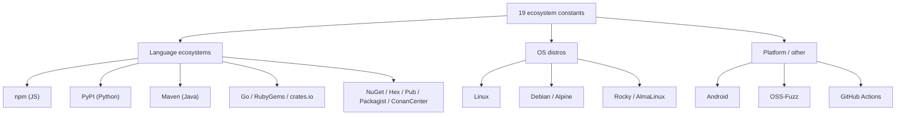
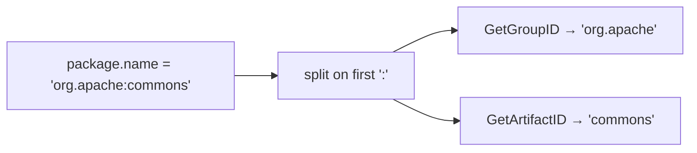

# Ecosystems

The SDK defines all 19 OSV ecosystems as typed constants — no stringly-typed mistakes.

## Full list

| Constant | Value | Notes |
|----------|-------|-------|
| `EcosystemGo` | `Go` | Go module path |
| `EcosystemNpm` | `npm` | NPM package name |
| `EcosystemPyPI` | `PyPI` | Normalized PyPI name |
| `EcosystemRubyGems` | `RubyGems` | Gem name |
| `EcosystemCratesIo` | `crates.io` | Rust crate |
| `EcosystemPackagist` | `Packagist` | PHP |
| `EcosystemMaven` | `Maven` | Java — name is `groupId:artifactId` |
| `EcosystemNuGet` | `NuGet` | .NET |
| `EcosystemHex` | `Hex` | Erlang/Elixir |
| `EcosystemPub` | `Pub` | Dart |
| `EcosystemLinux` | `Linux` | Kernel only |
| `EcosystemDebian` | `Debian` | May have `:<RELEASE>` suffix |
| `EcosystemAlpine` | `Alpine` | Requires `:v<RELEASE>` suffix |
| `EcosystemRocky` | `Rocky` | May have `:<RELEASE>` suffix |
| `EcosystemAlmaLinux` | `AlmaLinux` | May have `:<RELEASE>` suffix |
| `EcosystemAndroid` | `Android` | Component name |
| `EcosystemOSSFuzz` | `OSS-Fuzz` | Fuzz target |
| `EcosystemConanCenter` | `ConanCenter` | C/C++ |
| `EcosystemGitHubActions` | `GitHub Actions` | `{owner}/{repo}` |

## Grouped by category



## Usage

```go
// Check a single ecosystem
if v.Affected.HasEcosystem(osv.EcosystemPyPI) {
    // ...
}

// Filter affected entries
pypiAffected := v.Affected.FilterByEcosystem(osv.EcosystemPyPI)

// Maven decomposition
for _, a := range v.Affected {
    if a.Package != nil && a.Package.IsMaven() {
        fmt.Println(a.Package.GetGroupID())    // groupId
        fmt.Println(a.Package.GetArtifactID()) // artifactId
    }
}
```

## Maven name decomposition



Source: [`package.go`](https://github.com/scagogogo/osv-schema-skills/blob/main/package.go)
