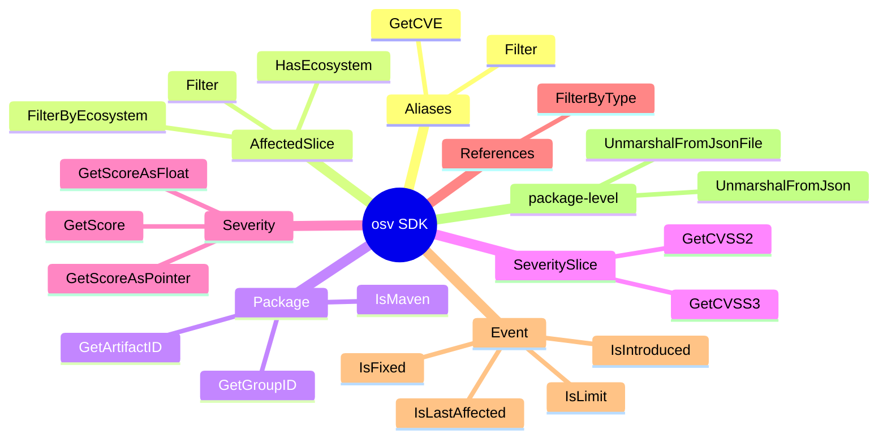
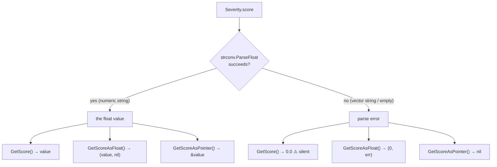
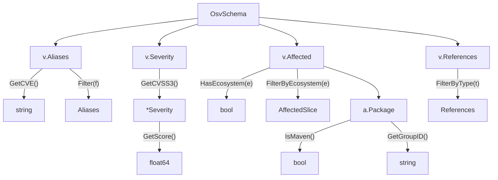
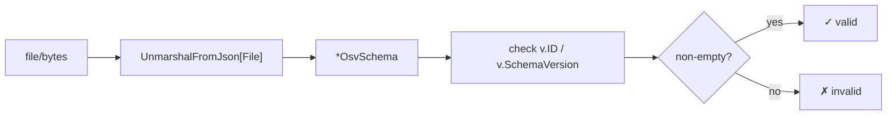
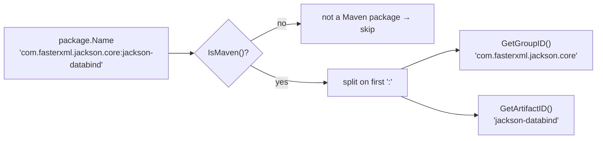
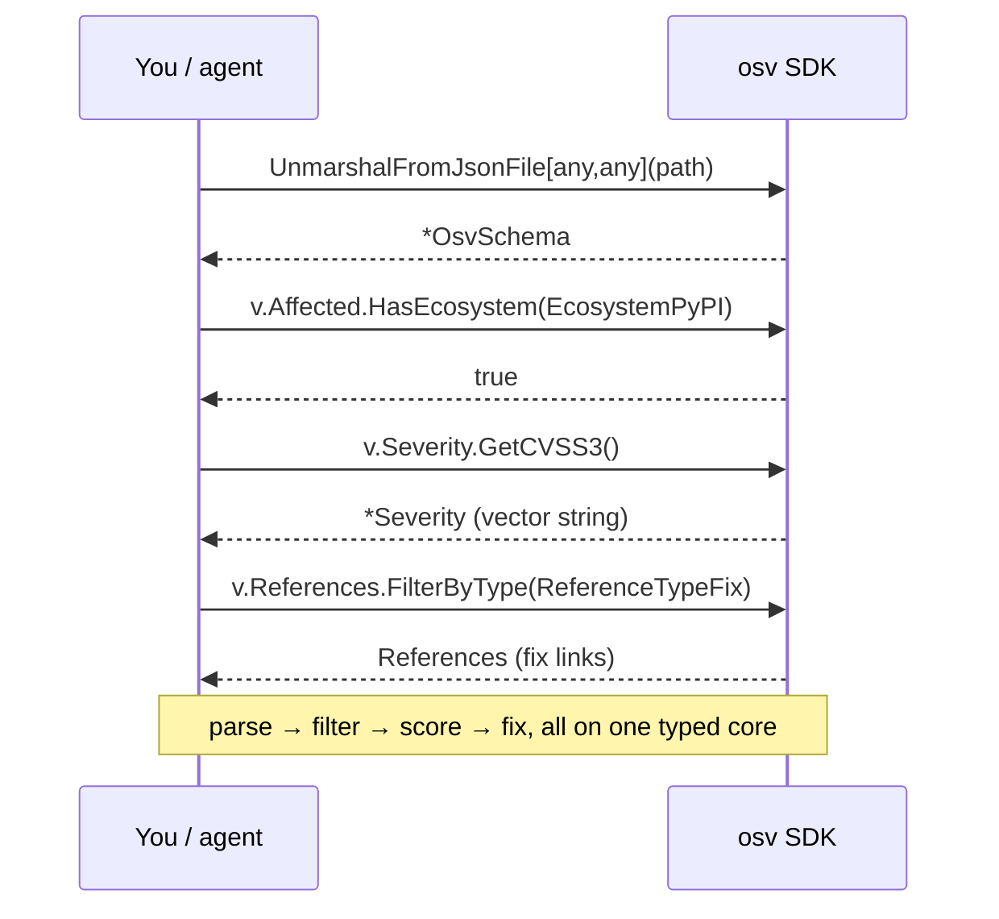
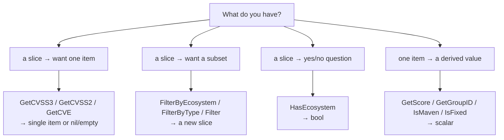

# Methods

Quick reference for the SDK's most-used methods. All verified against source.

## Methods at a glance

Grouped by receiver type — this is the whole surface you will use day to day.



## Aliases

| Method | Signature | Description |
|--------|-----------|-------------|
| `GetCVE` | `() string` | First identifier starting with `CVE-` |
| `Filter` | `(func(string) bool) Aliases` | Filter aliases by predicate |

## AffectedSlice

| Method | Signature | Description |
|--------|-----------|-------------|
| `HasEcosystem` | `(Ecosystem) bool` | Whether any affected entry matches ecosystem |
| `FilterByEcosystem` | `(Ecosystem) AffectedSlice` | Narrow to one ecosystem |
| `Filter` | `(func(*Affected) bool) AffectedSlice` | Custom predicate filter |

## Package

| Method | Signature | Description |
|--------|-----------|-------------|
| `IsMaven` | `() bool` | `Ecosystem == Maven` |
| `GetGroupID` | `() string` | Maven `groupId` (left of `:`) |
| `GetArtifactID` | `() string` | Maven `artifactId` (right of `:`) |

## SeveritySlice

| Method | Signature | Description |
|--------|-----------|-------------|
| `GetCVSS3` | `() *Severity` | CVSS v3 entry, or `nil` |
| `GetCVSS2` | `() *Severity` | CVSS v2 entry, or `nil` |

## Severity

| Method | Signature | Description |
|--------|-----------|-------------|
| `GetScore` | `() float64` | Parse the CVSS score as `float64` |
| `GetScoreAsFloat` | `() (float64, error)` | Parse score, returning an error if the vector string is malformed |
| `GetScoreAsPointer` | `() *float64` | Score as pointer (for nullable fields) |

All three share one parser (`GetScoreAsFloat`); the other two only differ in **how they report a parse failure** — and a `score` that holds a CVSS *vector string* (e.g. `CVSS:3.1/AV:N/…`) rather than a number *is* a parse failure. Pick the variant whose failure shape you can handle:



::: warning `GetScore()` hides the vector-string case
Because `GetScore()` drops the error, a vector-string score is indistinguishable from a real `0.0`. When the distinction matters, use `GetScoreAsFloat()` (check `err`) or `GetScoreAsPointer()` (check `nil`) — and read the CVSS vector from `Severity.Score` directly.
:::

## References

| Method | Signature | Description |
|--------|-----------|-------------|
| `FilterByType` | `(...ReferenceType) References` | Filter by `ADVISORY`, `FIX`, etc. (accepts multiple) |

## Event

| Method | Signature | Description |
|--------|-----------|-------------|
| `IsIntroduced` | `() bool` | Event marks an introduced version |
| `IsFixed` | `() bool` | Event marks a fixed version |
| `IsLastAffected` | `() bool` | Event marks last affected version |
| `IsLimit` | `() bool` | Event marks a range limit |

## Parsing

| Function | Signature | Description |
|----------|-----------|-------------|
| `UnmarshalFromJson` | `([]byte) (*OsvSchema[Eco,DB], error)` | Parse from bytes |
| `UnmarshalFromJsonFile` | `(string) (*OsvSchema[Eco,DB], error)` | Parse from file path |

```go
// General-purpose parsing — use `any` for both generics
v, err := osv.UnmarshalFromJsonFile[any, any]("vuln.json")

// Or attach ecosystem/database-specific data
v, err := osv.UnmarshalFromJsonFile[MyEco, MyDB]("vuln.json")
```

## Method call graph



## Parse & validate data flow



## Maven coordinate decomposition

`GetGroupID` / `GetArtifactID` split a Maven package name on the first `:`. They only make sense when `IsMaven()` is true.



## A real query, method by method

"Is `GHSA-…` a high-severity PyPI issue, and where's the fix?" — here's the exact method chain an agent (or your code) walks.



## Which method returns what



## Serialization helpers

Most types implement `sql.Scanner` and `driver.Valuer`, so they store cleanly as JSON columns under GORM. The complex nested types (`AffectedSlice`, `SeveritySlice`, `Package`, `Credits`) marshal themselves to/from JSON automatically.

Source: root package [`*.go`](https://github.com/scagogogo/osv-schema-skills)
