# OSV Schema

The core type models the [OSV Schema](https://ossf.github.io/osv-schema/) (currently `1.4.0`).

## Top-level structure

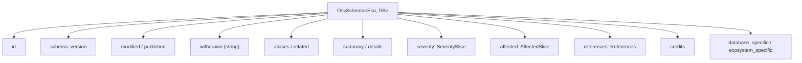

## Required vs optional

| Field | Required | Notes |
|-------|----------|-------|
| `schema_version` | ✅ | Currently `1.4.0` |
| `id` | ✅ | Unique record identifier |
| `modified` | ✅ | Last modification time |
| `published` | ❌ | First publication time |
| `withdrawn` | ❌ | **String**, not `time.Time` |
| `aliases` | ❌ | e.g. CVE-2024-XXXX |
| `affected` | ❌ | But usually present |
| `severity` | ❌ | CVSS v2 / v3 / v4 |

`osv validate` enforces `id` and `schema_version`.

```mermaid
flowchart TD
  FILE["file.json"] --> READ{"os.ReadFile<br/>ok?"}
  READ -->|"no (missing/perm)"| E1["error: cannot read file"]
  READ -->|yes| JSON{"json.Valid?"}
  JSON -->|no| E2["error: not valid JSON"]
  JSON -->|yes| U["UnmarshalFromJson"]
  U --> ID{"id != \"\" ?"}
  ID -->|no| E3["error: missing id"]
  ID -->|yes| SV{"schema_version != \"\" ?"}
  SV -->|no| E4["error: missing schema_version"]
  SV -->|yes| OK["valid ✓<br/>exit 0"]
  E1 --> FAIL["invalid ✗<br/>exit 1"]
  E2 --> FAIL
  E3 --> FAIL
  E4 --> FAIL
```

The check is intentionally shallow — it confirms the record is *parseable* and carries the two identity fields, not that every optional field is well-formed. `affected`, `severity`, and `references` are not checked; a record with no affected entries still validates.

## Full type relationship

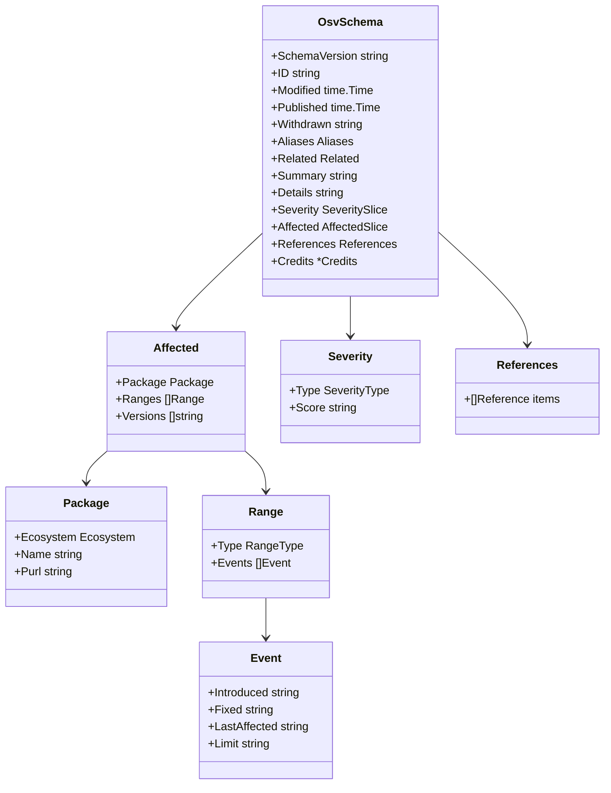

## Affected → package → ranges → events

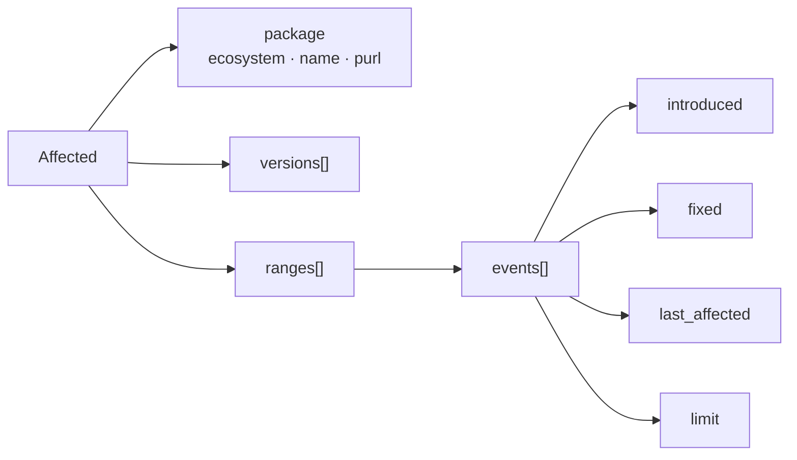

The `package` object carries three fields: `ecosystem` (one of the [typed constants](/reference/ecosystems)), `name` (the package name — for Maven this is `groupId:artifactId`), and `purl` (an optional [Package URL](https://github.com/package-url/purl-spec) string). `purl` is informational; the SDK doesn't parse it, so for ecosystem-specific decomposition (like Maven GAV) use `name` via `GetGroupID` / `GetArtifactID`, not `purl`.

## Lifecycle of a record

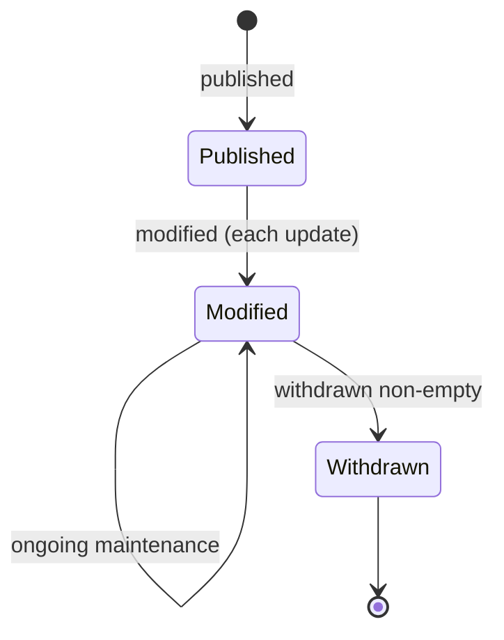

## Field quick-lookup by intent

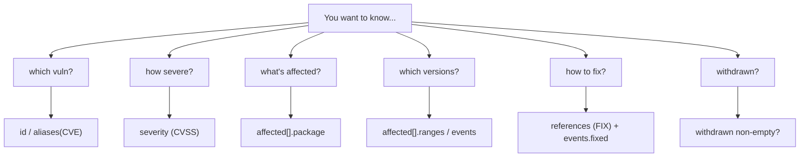

## Is a version affected? — event-timeline resolution

The single most important algorithm when consuming OSV data is: *given a concrete version, is it vulnerable?* OSV answers this not with prose but with the ordered `events` inside each range. You walk the timeline left to right, toggling an "affected" flag.

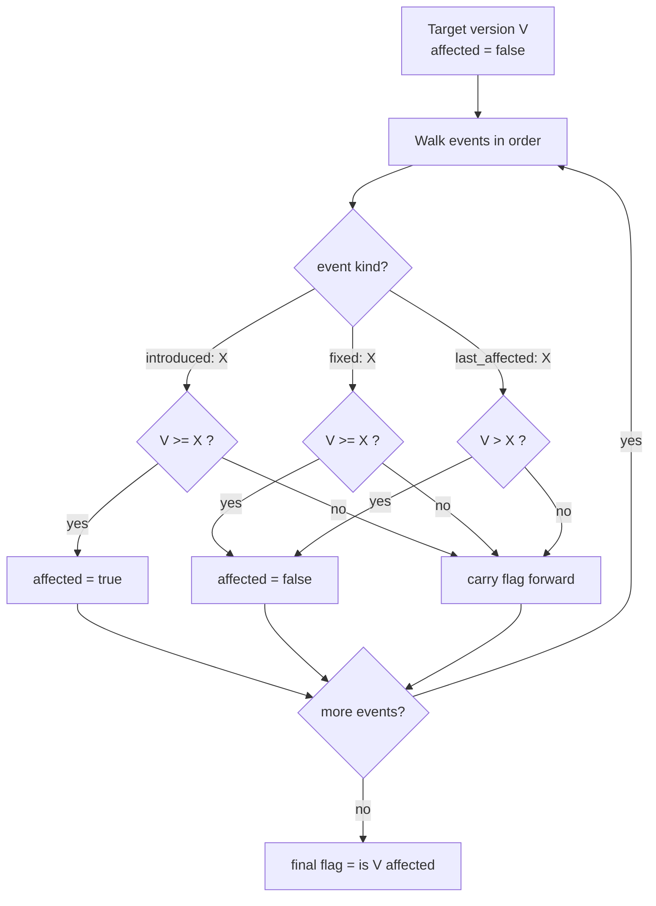

The special value `introduced: "0"` means "from the very first version". The SDK gives you the per-event predicates to implement this yourself:

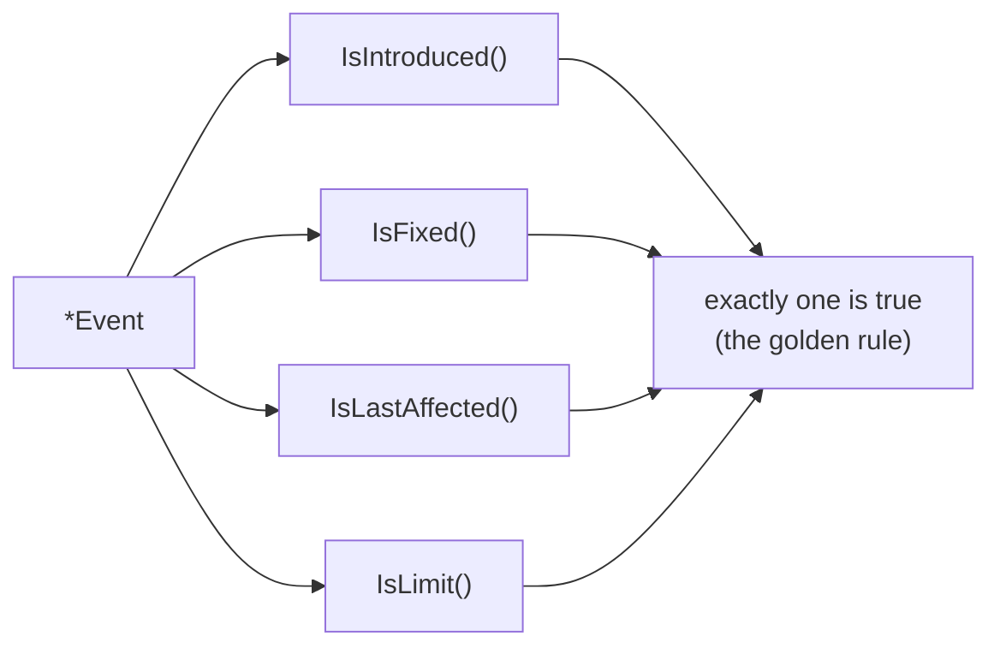

::: tip Why the golden rule matters here
Because each event carries exactly one non-empty key, the walk above can `switch` on "which predicate is true" without ambiguity. That is also why `osv query --events` emits `omitempty` JSON — a stray `"fixed": ""` would make two predicates look true.
:::

## RangeType — how versions are compared

The `<` / `>=` comparisons in the algorithm above are **not** universal string comparisons. The range's `type` decides the ordering rules.

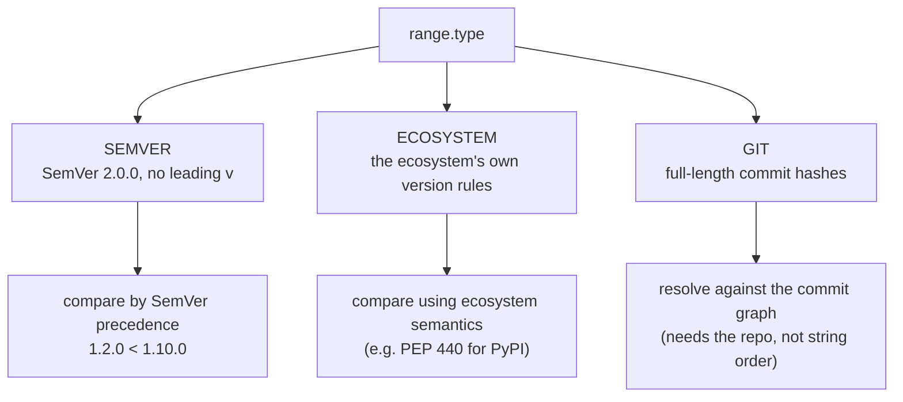

| `RangeType` | Constant | Version tokens are… |
|-------------|----------|---------------------|
| `SEMVER` | `RangeTypeSemver` | SemVer 2.0.0 strings, compared by precedence |
| `ECOSYSTEM` | `RangeTypeEcosystem` | Opaque strings ordered by the ecosystem (PyPI→PEP 440, etc.) |
| `GIT` | `RangeTypeGit` | Git commit hashes, resolved via the commit graph |

::: warning GIT ranges are not string-sortable
For `GIT` ranges you cannot decide affectedness by comparing hash strings — you need the repository's commit ancestry. Treat `GIT` ranges as "requires graph resolution", not "compare like SEMVER".
:::

## Severity scoring internals

`severity[].score` holds a **CVSS vector string**, not a number. The SDK exposes three getters that share one lazily-parsed, memoized backing value.

```mermaid
flowchart TD
  CALL["GetScore() / GetScoreAsFloat() / GetScoreAsPointer()"] --> CACHE{"cached score or err?"}
  CACHE -->|hit| RET["return cached"]
  CACHE -->|miss| EMPTY{"Score == \"\" ?"}
  EMPTY -->|yes| ERR["err = 'score can not be empty'"]
  EMPTY -->|no| PARSE["strconv.ParseFloat(Score, 64)"]
  PARSE -->|ok| STORE["memoize float → return it"]
  PARSE -->|fail<br/>(vector string!)| ERR
  ERR --> OUT{"which getter?"}
  OUT -->|GetScore| Z["returns 0.0 (error swallowed)"]
  OUT -->|GetScoreAsFloat| EF["returns (0, error)"]
  OUT -->|GetScoreAsPointer| NP["returns nil"]
```

| Getter | On a vector string | Use when |
|--------|--------------------|----------|
| `GetScore()` | `0.0` | You just want a float and treat 0 as "n/a" |
| `GetScoreAsFloat()` | `(0, error)` | You must distinguish a real 0 from a parse failure |
| `GetScoreAsPointer()` | `nil` | You want `nil` to mean "no numeric score" |

To rank severity when the score is a vector, read `SeveritySlice.GetCVSS3()` / `GetCVSS2()` and interpret the vector — see [Skills → severity](/guide/skills/severity).

## Serialization: one struct, six tag namespaces

Every core field is tagged for six ecosystems at once, so the same struct round-trips through JSON, YAML, config decoding, raw SQL, MongoDB, and GORM without adapters.

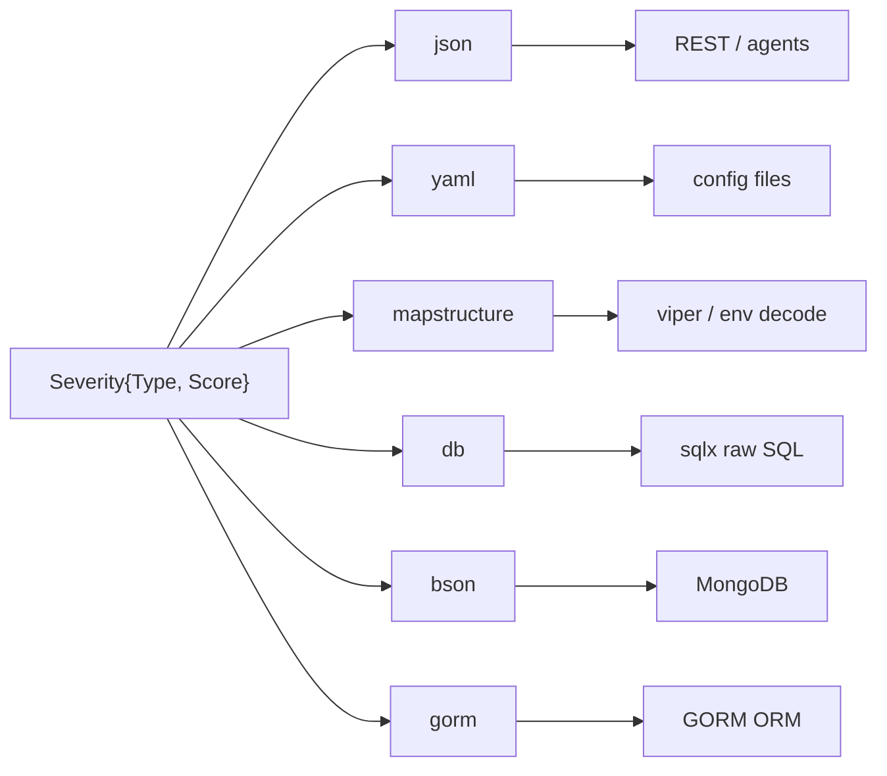

### Database strategy: columns vs JSON blobs

Simple scalar fields become plain columns. Complex nested slices (`AffectedSlice`, `SeveritySlice`, `Range`, …) implement `sql.Scanner` + `driver.Valuer`, so GORM stores them as a single JSON string and rehydrates them on read.

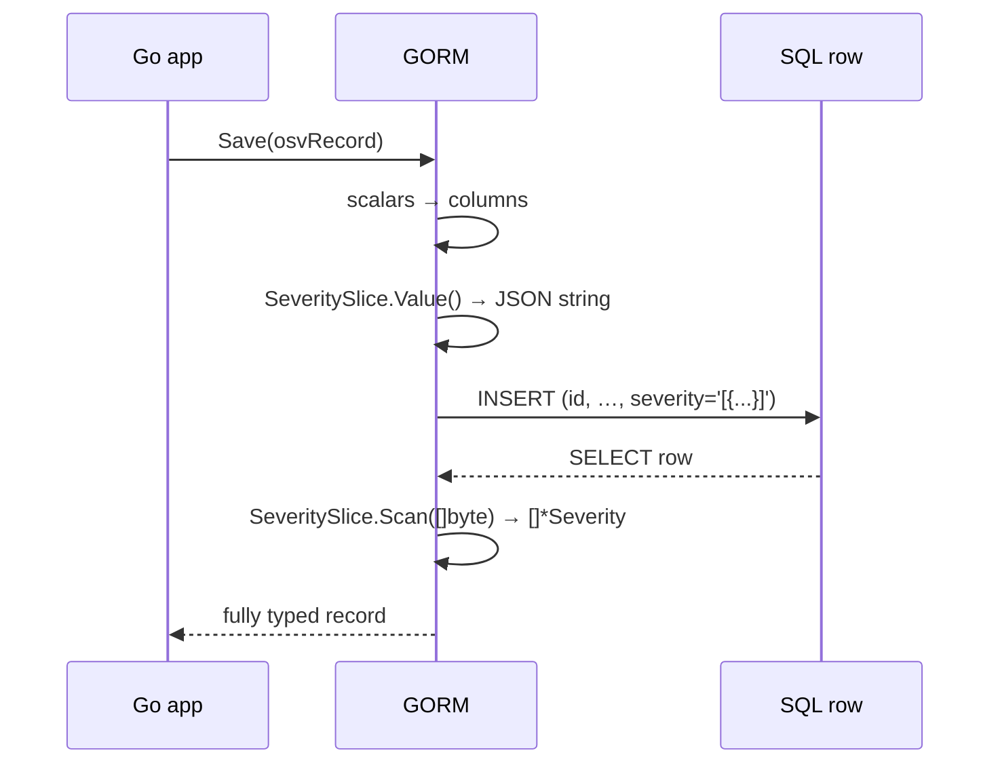

## Generic type parameters

`OsvSchema[EcosystemSpecific, DatabaseSpecific]` carries two type parameters that flow down into `Affected` and `Range`, so vendor-specific blobs stay typed instead of collapsing to `map[string]any`.

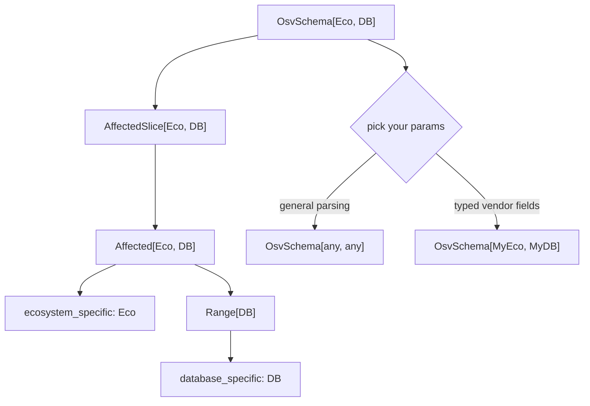

For everyday parsing use `[any, any]` (as every CLI command does). Supply concrete structs only when you need typed access to `ecosystem_specific` / `database_specific`.

## Source files

All types live in the root package `osv_schema`:

| File | Contents |
|------|----------|
| `osv_schema.go` | `OsvSchema` top-level type |
| `package.go` | `Package`, `Ecosystem` constants |
| `affected.go` | `Affected`, `AffectedSlice` |
| `severity.go` | `Severity`, `SeveritySlice` |
| `range.go` | `Range` |
| `event.go` | `Event` |
| `references.go` | `References` |
| `aliases.go` | `Aliases` |
| `related.go` | `Related` |
| `credits.go` | `Credits` |
| `unmarshal.go` | `UnmarshalFromJson` / `UnmarshalFromJsonFile` |
