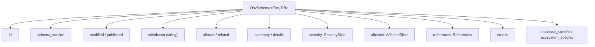
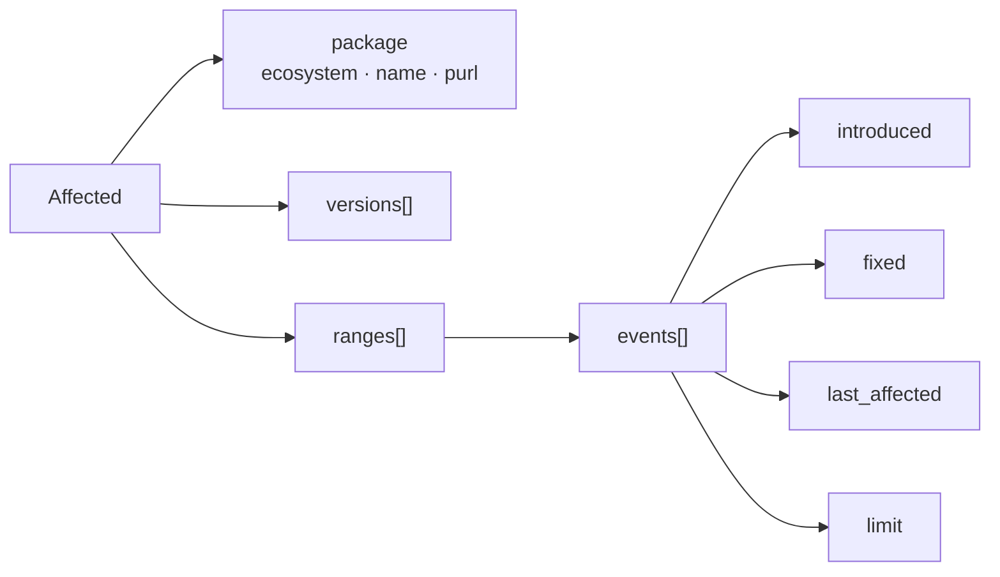

# OSV Schema

The core type models the [OSV Schema](https://ossf.github.io/osv-schema/) (currently `1.4.0`).

## Top-level structure

## Required vs optional

| Field | Required | Notes |
|-------|----------|-------|
| `schema_version` | ✅ | Currently `1.4.0` |
| `id` | ✅ | Unique record identifier |
| `modified` | ✅ | Last modification time |
| `published` | ❌ | First publication time |
| `withdrawn` | ❌ | **String**, not `time.Time` |
| `aliases` | ❌ | e.g. CVE-2024-XXXX |
| `affected` | ❌ | But usually present |
| `severity` | ❌ | CVSS v2 / v3 / v4 |

`osv validate` enforces `id` and `schema_version`.

## Affected → package → ranges → events

## Source files

All types live in the root package `osv_schema`:

| File | Contents |
|------|----------|
| `osv_schema.go` | `OsvSchema` top-level type |
| `package.go` | `Package`, `Ecosystem` constants |
| `affected.go` | `Affected`, `AffectedSlice` |
| `severity.go` | `Severity`, `SeveritySlice` |
| `range.go` | `Range` |
| `event.go` | `Event` |
| `references.go` | `References` |
| `aliases.go` | `Aliases` |
| `related.go` | `Related` |
| `credits.go` | `Credits` |
| `unmarshal.go` | `UnmarshalFromJson` / `UnmarshalFromJsonFile` |
