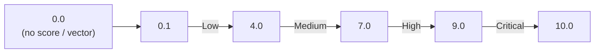

# CVSS Scoring Standard

**CVSS** (Common Vulnerability Scoring System) is the standard OSV uses to encode vulnerability severity. This page explains how CVSS works, how OSV carries it, and how this toolkit interprets it.

---

## What is CVSS?

CVSS is an open standard maintained by [FIRST.org](https://www.first.org/cvss/) that assigns a numeric score (0.0–10.0) to a vulnerability based on a structured set of metrics. The score is derived from a **vector string** — a compact encoding of the metrics, not just a number.

Three major versions exist:

| Version | OSV `type` | Example vector |
|---------|-----------|----------------|
| CVSS v2 | `CVSS_V2` | `AV:N/AC:M/Au:N/C:P/I:P/A:P` |
| CVSS v3.1 | `CVSS_V3` | `CVSS:3.1/AV:N/AC:L/PR:N/UI:N/S:U/C:N/I:N/A:H` |
| CVSS v4.0 | (not yet in OSV 1.4.0) | `CVSS:4.0/AV:N/AC:L/AT:N/PR:N/UI:N/...` |

---

## The vector string

A CVSS v3.1 vector encodes 8 base metrics, each as `KEY:VALUE` pairs separated by `/`:

```
CVSS:3.1/AV:N/AC:L/PR:N/UI:N/S:U/C:N/I:N/A:H
       │   │   │   │   │   │   │   │
       │   │   │   │   │   │   │   └─ A:H  Availability: High
       │   │   │   │   │   │   └─ C:N    Integrity: None
       │   │   │   │   │   └─ C:N      Confidentiality: None
       │   │   │   │   └─ S:U        Scope: Unchanged
       │   │   │   └─ UI:N          User Interaction: None
       │   │   └─ PR:N            Privileges Required: None
       │   └─ AC:L              Attack Complexity: Low
       └─ AV:N                Attack Vector: Network
```

The vector tells you *how* the score was derived — you can see at a glance that this is a network-reachable, no-auth-required, availability-impacting vulnerability.

---

## Score bands

The numeric score maps to a qualitative rating:

| Score | Rating | Meaning |
|-------|--------|---------|
| 0.0 | None | No impact (or vector not parseable) |
| 0.1–3.9 | Low | Minimal impact |
| 4.0–6.9 | Medium | Significant but limited |
| 7.0–8.9 | High | Serious, exploit likely |
| 9.0–10.0 | Critical | Catastrophic, immediate action |



---

## How OSV carries CVSS

In an OSV record, severity lives in the `severity[]` array, each entry with a `type` and a `score`:

```json
{
  "severity": [
    {
      "type": "CVSS_V3",
      "score": "CVSS:3.1/AV:N/AC:L/PR:N/UI:N/S:U/C:N/I:N/A:H"
    }
  ]
}
```

**Important**: The `score` field holds the **vector string**, not a number. This is mandated by the OSV spec — the vector is more informative than a bare number because it shows the reasoning.

---

## How this toolkit interprets it

The SDK exposes `GetCVSS3()` and `GetCVSS2()` to pull the relevant severity entry:

```go
v, _ := osv_schema.UnmarshalFromJsonFile[any, any]("vuln.json")

if s := v.Severity.GetCVSS3(); s != nil {
    fmt.Println("Vector:", s.Score)         // the vector string
    fmt.Println("Numeric:", s.GetScore())    // 0.0 (see below!)
}
```

::: warning The vector-vs-number gotcha
`GetScore()` uses `strconv.ParseFloat` on the `Score` field. When `Score` is a CVSS vector string (the common case), `ParseFloat` fails and `GetScore()` returns **`0.0`** — not the actual computed score.

To get a numeric score from a vector, you must parse the vector with a CVSS library (e.g. [go-cvss](https://github.com/goark/go-cvss)). This toolkit deliberately does not bundle a CVSS calculator — it gives you the raw vector and lets you choose how to score it.
:::

### CLI usage

```bash
# Pull the CVSS v3 entry
osv query --severity cvss3 vuln.json

# As JSON (includes the raw vector)
osv query --severity cvss3 -o json vuln.json
```

**Sample JSON output**:

```json
{
  "severity": {
    "type": "CVSS_V3",
    "score": "CVSS:3.1/AV:N/AC:L/PR:N/UI:N/S:U/C:N/I:N/A:H"
  }
}
```

The `score` here is the vector. `GetScore()` would return `0.0` because the field is not a plain number.

---

## Why a vector, not a number?

A bare score (e.g. `7.5`) tells you *what* the severity is but not *why*. The vector encodes the reasoning:

- `AV:N` (network-reachable) vs `AV:L` (local access) changes the urgency
- `PR:N` (no privileges) vs `PR:H` (admin) changes who can exploit it
- `S:C` (scope change) means the vulnerability crosses trust boundaries

Two vulnerabilities with the same numeric score can have very different operational implications. The vector preserves that information.

---

## Cross-database consistency

Because OSV standardizes on CVSS vectors, you can compare severity across databases:

- A GitHub advisory (`GHSA-...`) and an NVD entry (`CVE-...`) for the same vulnerability will carry the same CVSS vector
- This toolkit's `aliases[]` linking lets you find both records and verify their severities match

---

## See also

- [osv-severity skill](/guide/skills/severity) — skill-level docs
- [Methods → severity](/reference/methods#severity) — SDK method signatures
- [OSV Schema standard](/standards/osv-spec) — the parent standard
- [FIRST CVSS spec](https://www.first.org/cvss/) — the canonical CVSS standard