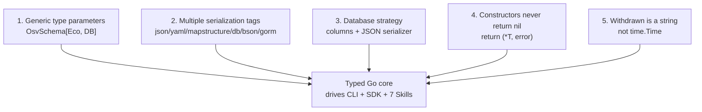

# Design Decisions (RFC)

> This page records **why** the OSV Schema Skills core types are shaped the way they are.
> Here "RFC" means the project's Architecture Decision Records (ADRs) — not RFC 3339
> (the timestamp format used by the `Modified`/`Published` fields) and not the upstream
> OSV spec's RFC-style proposals. Each decision below lists the choice, the rationale,
> the alternative we rejected, and the exact source line that enforces it.

## Scope

The OSV schema is large and nested. Rather than hand-writing one-off structs per
ecosystem or database, the SDK makes five deliberate structural decisions up front.
Five decisions, in priority order:



---

## Decision 1 — Generic type parameters

**Decision.** `OsvSchema[EcosystemSpecific, DatabaseSpecific any]` is generic over two
type parameters, so each ecosystem/database can attach typed metadata without forking
the library.

**Rationale.** The OSV schema lets every `affected` entry carry an
`ecosystem_specific` object (free-form fields unique to that ecosystem) and a
`database_specific` object (fields unique to the publishing database). A generic core
captures those as typed Go structs instead of `map[string]any`, so the compiler — not
a runtime assertion — guarantees field correctness. Callers who don't care pass `any`.

**Alternative rejected.** A non-generic `OsvSchema` with `EcosystemSpecific any`
as `map[string]any` everywhere. Rejected because it loses compile-time typing on the
fields most likely to be queried (a Maven record's `group_id`/`artifact_id`, a GitHub
record's `ghsa_id`), forcing every caller back into untyped map access.

**Source evidence.** `osv_schema.go` — `type OsvSchema[EcosystemSpecific, DatabaseSpecific any] struct { ... }`.

**Go deeper.** See [Custom Ecosystem & Database Specifics](/advanced/custom-specifics)
for the full worked example with a class diagram and typed `Eco`/`DB` structs.

---

## Decision 2 — Multiple serialization tags per field

**Decision.** Every core field carries six tags: `json`, `yaml`, `mapstructure`,
`db`, `bson`, `gorm`.

**Rationale.** The same `OsvSchema` struct must round-trip through five unrelated
ecosystems: JSON (the OSV wire format), YAML (human-edited configs), mapstructure
(config loading), BSON (MongoDB), and GORM (SQL). Tagging one struct for all of them
means a single source of truth — the struct — stays valid across every access layer
(CLI, SDK, Skills). Adding a field once updates every serialization path; there is no
second place to forget.

**Alternative rejected.** Separate DTOs per serialization target (a `JsonOsv`, a
`BsonOsv`, ...). Rejected because vulnerability data flows between all five formats in
practice (read JSON → store in Postgres via GORM → export to BSON), and maintaining N
structs in sync multiplies the chance of drift — exactly the bug class tags eliminate.

**Source evidence.** Every field on `OsvSchema` and `Package` carries the full tag
set. For example, the `Withdrawn` field (see Decision 5) and `Package.Name` both carry
all six tags. See `osv_schema.go` and `package.go`.

**Go deeper.** See [GORM & BSON Serialization](/advanced/serialization) for the full
tag table and per-target usage.

---

## Decision 3 — Database strategy: columns for scalars, JSON serializer for nested

**Decision.** Simple scalar fields (`id`, `summary`, `withdrawn`, ...) are stored as
**columns**; complex nested structures (`AffectedSlice`, `SeveritySlice`, `Aliases`,
`Related`) are stored as **JSON strings** via the GORM `serializer:json` option.

**Rationale.** Scalars are exactly what SQL indexes and `WHERE` clauses want — a
column on `id` lets you query `WHERE id = ?` directly, with an index. The nested OSV
structures are arbitrarily deep (an `affected` entry holds ranges, events, ecosystem
specifics), which maps poorly to relational columns and would need many join tables.
Storing them as a JSON column keeps one row per vulnerability, queryable on the scalar
keys, while the nested payload survives intact for the SDK to unmarshal back into the
typed struct — no data loss, no schema migration per OSV spec change.

**Alternative rejected.** Full relational normalization (a table per nested entity,
join tables for ranges/events). Rejected because the OSV schema evolves and the nested
shapes are open-ended (`ecosystem_specific` is free-form); normalizing would couple the
DB schema to every upstream spec revision and require migrations on each change.

**Source evidence.** In `osv_schema.go`, scalar fields use plain `gorm:"column:<name>"`
(e.g. `SchemaVersion`, `Id`, `Summary`), while nested slices use
`gorm:"column:<name>;serializer:json"` (e.g. `Aliases`, `Related`, `Affected`).

**Go deeper.** See [GORM & BSON Serialization](/advanced/serialization) for the
GORM mapping and an end-to-end store-and-reload example.

---

## Decision 4 — Constructors never return nil; errors are explicit

**Decision.** `NewVersion`-style unmarshal functions return `(*OsvSchema[Eco, DB], error)`
— never a non-nil pointer hiding a partial/invalid value. On any failure they return
`nil, err`.

**Rationale.** A nil-returning "constructor" that silently produces a zero-value struct
on bad input is the classic Go footgun: the caller gets a non-nil pointer, dereferences
it, and operates on empty data without knowing parsing failed. By returning an explicit
`error` and `nil` on failure, the type system forces every caller to decide — handle
the error, or propagate it. There is no "looks fine, is actually empty" middle state.

**Alternative rejected.** A `MustUnmarshal`-only API that panics on bad JSON. Rejected
because vulnerability data is untrusted external input (advisories from many databases);
panicking on malformed input is inappropriate for CLI tools and long-running services.

**Source evidence.** `unmarshal.go`:

```go
func UnmarshalFromJson[EcosystemSpecific, DatabaseSpecific any](
    jsonBytes []byte,
) (*OsvSchema[EcosystemSpecific, DatabaseSpecific], error) {
    r := &OsvSchema[EcosystemSpecific, DatabaseSpecific]{}
    err := json.Unmarshal(jsonBytes, &r)
    if err != nil {
        return nil, err   // nil pointer, explicit error — never a partial value
    }
    return r, nil
}
```

`UnmarshalFromJsonFile` follows the same contract.

---

## Decision 5 — `Withdrawn` is a string, not `time.Time`

**Decision.** The `Withdrawn` field is typed `string`, not `time.Time`. A record is
withdrawn when the string is non-empty.

**Rationale.** The OSV spec formats `withdrawn` as an RFC 3339 timestamp *when
present*, but the field is optional — most records are never withdrawn. If the field
were `time.Time`, Go's zero value (`0001-01-01T00:00:00Z`) would be a valid `time.Time`
that is meaningless as a "withdrawn" marker, forcing every consumer to remember the
"`time.Time` zero value doesn't mean not-withdrawn" rule. A `string` makes absence
unambiguous: empty string = not withdrawn, non-empty string = withdrawn (and the
string is the timestamp). The tradeoff is that consumers wanting a `time.Time` must
parse it themselves — but only when they actually need to, which is rare.

**Alternative rejected.** `*time.Time` (nilable pointer) to distinguish absent from
present. Rejected because it complicates every struct copy and comparison with nil
checks, and because the same six-tag serialization contract (Decision 2) would have to
special-case a pointer across json/yaml/bson/gorm. A string serializes identically
everywhere with zero special-casing.

**Source evidence.** `osv_schema.go`:

```go
// TODO 2023-5-23 19:10:45 草这个字段啥意思...
Withdrawn string `mapstructure:"withdrawn" json:"withdrawn" yaml:"withdrawn" db:"withdrawn" bson:"withdrawn" gorm:"column:withdrawn"`
```

Note the contrast with sibling fields on the same struct: `Modified` and `Published`
*are* `time.Time` (they are always present in a published record), while `Withdrawn`
is `string` precisely because it is the optional one.

---

## Summary

| # | Decision | One-line rationale | Source |
|---|----------|--------------------|--------|
| 1 | Generic `[Eco, DB]` | Compile-typed ecosystem/db specifics | `osv_schema.go` |
| 2 | Six tags per field | One struct, five serializers, no drift | all core `.go` |
| 3 | Scalars → columns, nested → JSON | Indexable keys + intact nested payload | `osv_schema.go` |
| 4 | `(*T, error)`, never nil-on-failure | Forces explicit error handling | `unmarshal.go` |
| 5 | `Withdrawn string` | Optional-field absence is unambiguous | `osv_schema.go` |

These five decisions are why the same typed core can drive the CLI, the Go SDK, and the
seven Claude Code Skills without the three layers ever drifting apart.
