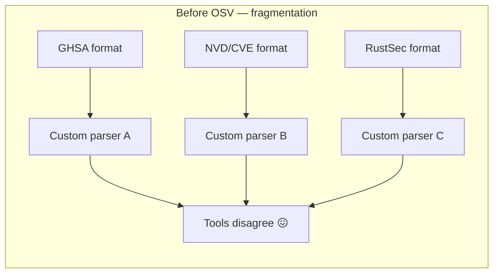
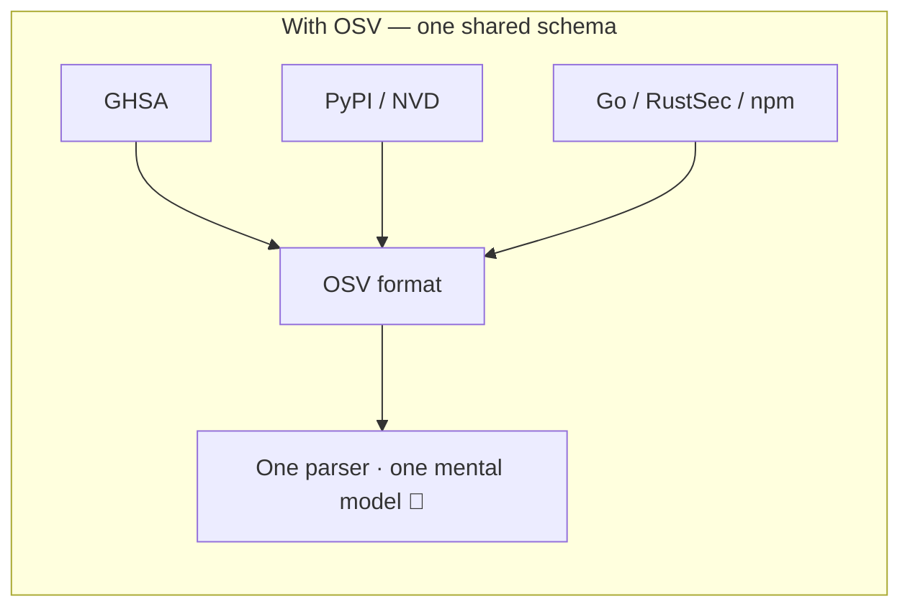
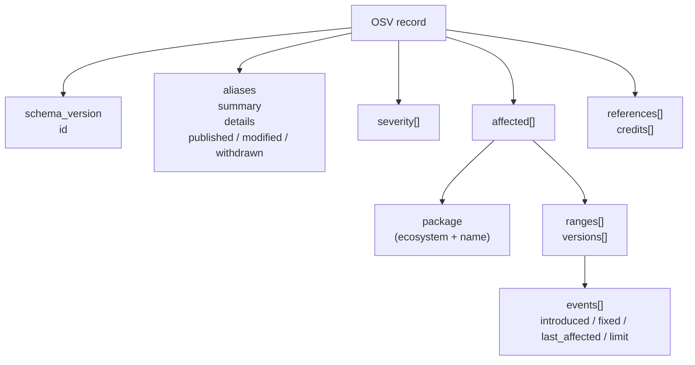

# The OSV Schema Standard

**OSV** (Open Source Vulnerability) is an open schema for describing vulnerabilities in open source packages. This page explains the standard itself — its origins, governance, design principles, and how this toolkit implements it.

---

## What is OSV?

OSV is a JSON-based schema maintained by the [Open Source Security Foundation (OpenSSF)](https://openssf.org/), a Linux Foundation project. It defines a **single, shared shape** for vulnerability records so that:

- Databases (GitHub, PyPI, Go, RustSec, npm, ...) can publish advisories in one common format
- Tools can consume advisories from any source without writing bespoke parsers
- Automation (CI, scanners, AI agents) can reason about vulnerabilities uniformly

The canonical specification lives at [ossf.github.io/osv-schema](https://ossf.github.io/osv-schema/).

---

## Why OSV exists

Before OSV, every vulnerability database spoke its own dialect:



A tool that understood GitHub advisories couldn't read NVD entries. Version ranges were prose ("before 2.4.1") that machines couldn't reliably compare. Package identity was ambiguous — `requests` could be a PyPI package, a RubyGem, or an npm module.

OSV solves all three:



---

## Design principles of the schema

The OSV schema is built on three core ideas:

### 1. Ecosystem-scoped package identity

A package is never just `requests`. It is `requests` *in the PyPI ecosystem*. The `ecosystem` + `name` pairing is globally unambiguous:

```json
{
  "package": { "ecosystem": "PyPI", "name": "requests" }
}
```

This is why `osv filter -e PyPI` works — the ecosystem is a first-class field, not a guess.

### 2. Version ranges as event timelines

Instead of prose like "affects versions before 2.4.1", OSV records an ordered list of events:

```json
{
  "ranges": [{
    "type": "ECOSYSTEM",
    "events": [
      { "introduced": "0" },
      { "fixed": "2.4.1" }
    ]
  }]
}
```

A machine walks this timeline to decide whether any concrete version falls inside it — no English parsing required. See [Version Range Semantics](/advanced/version-ranges) for the full mechanism.

### 3. Machine-readable severity

Severity is recorded as a CVSS vector string (a structured formula), not a free-text label:

```json
{
  "severity": [{
    "type": "CVSS_V3",
    "score": "CVSS:3.1/AV:N/AC:L/PR:N/UI:N/S:U/C:N/I:N/A:H"
  }]
}
```

This lets tools derive a numeric score, compare severities, and reason about *why* a vulnerability is rated the way it is. See [CVSS Scoring Standard](/standards/cvss).

---

## The record shape

A complete OSV record has these top-level fields:



| Field | Purpose |
|-------|---------|
| `schema_version` | Which OSV spec version this record follows (currently `1.4.0`) |
| `id` | Globally unique record ID (e.g. `GHSA-...`, `CVE-...`) |
| `aliases` | Other IDs for the same vulnerability (e.g. a GHSA record aliasing a CVE) |
| `summary` / `details` | Human-readable description |
| `published` / `modified` / `withdrawn` | Lifecycle timestamps (RFC 3339) |
| `severity` | CVSS v2 / v3 / v4 vectors |
| `affected` | The heart: which packages, which versions |
| `references` | Links to advisories, fixes, reports |
| `credits` | Who reported or fixed it |

This toolkit's `OsvSchema[Eco, DB]` struct mirrors this shape field-for-field. See the [OSV Schema reference](/reference/osv-schema) for the exhaustive list.

---

## Schema versioning

The OSV schema itself is versioned (semver). The current version this toolkit targets is **1.4.0**, exposed via:

```bash
osv version
# OSV schema version: 1.4.0
```

When the schema adds new fields, this toolkit adopts them in minor releases. Existing fields are never removed in a way that breaks older records — that's the schema's backward-compatibility promise.

---

## Governance

- **Maintainer**: OpenSSF Vulnerability Disclosures Working Group
- **Process**: Open GitHub repository ([github.com/OSSF/osv-schema](https://github.com/OSSF/osv-schema)), RFC-style proposals
- **Adopters**: GitHub Advisory Database, PyPI Advisory Database, Go Vulnerability Database, RustSec, npm audit, PyTornado, and more
- **Aggregation**: [osv.dev](https://osv.dev/) aggregates all participating databases into a single queryable API

---

## How this toolkit implements the standard

| Standard requirement | Our implementation |
|----------------------|---------------------|
| Parse all OSV fields | `OsvSchema[Eco, DB]` struct with full JSON tags |
| Validate required fields | `osv validate` checks `id` + `schema_version` |
| Filter by ecosystem | `FilterByEcosystem()` + `osv filter -e` |
| Extract severity | `GetCVSS*()` + `osv query --severity` |
| Walk event timelines | `Range.Events` + `osv query --events` |
| Cross-database aliases | `aliases[]` + `osv filter -a` |
| Reference classification | `references[].type` + `osv filter -r` |

Every CLI command and SDK method maps onto a specific part of the standard — nothing more, nothing less.

---

## See also

- [OSV Schema reference](/reference/osv-schema) — exhaustive field list
- [CVSS Scoring Standard](/standards/cvss) — how severity is encoded
- [Version Range Semantics](/advanced/version-ranges) — how ranges work
- [Ecosystem naming](/standards/ecosystems) — the ecosystem registry
- [Official OSV spec](https://ossf.github.io/osv-schema/) — the canonical source