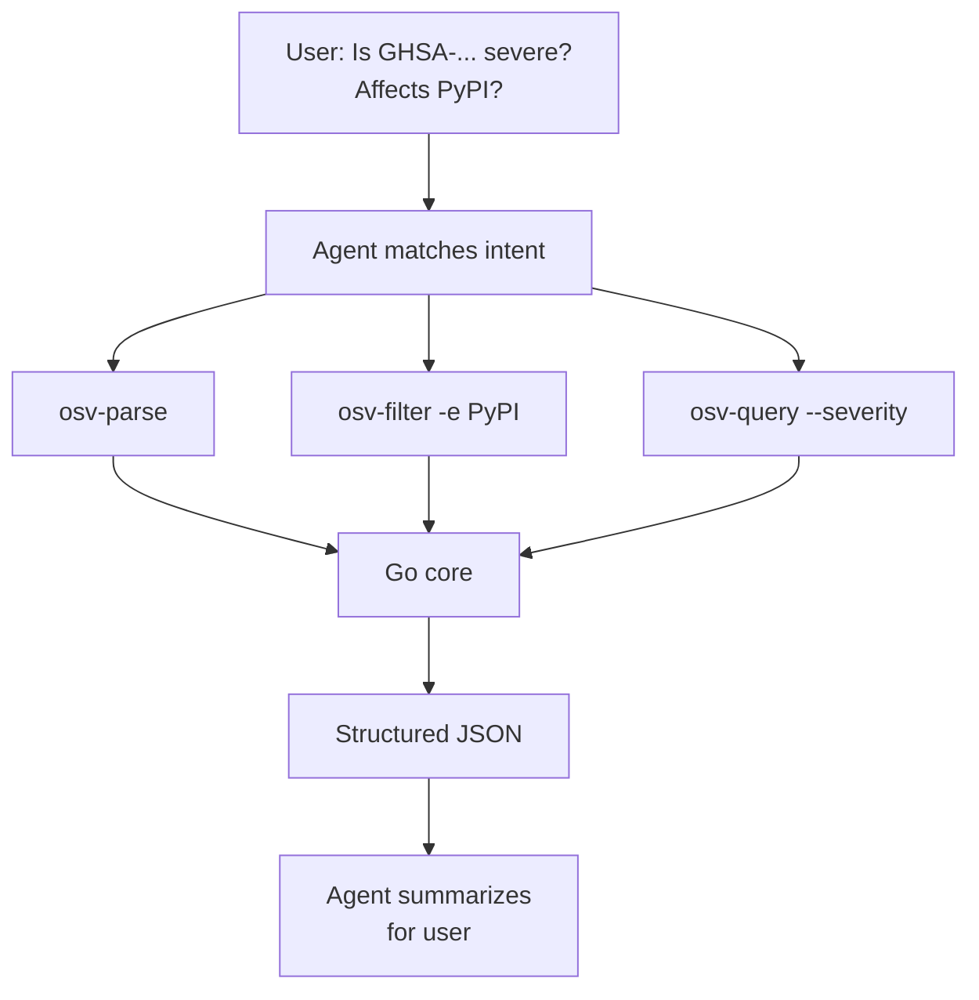

# AI Agent Automation

Let an AI agent (Claude Code, Codex, or similar) handle vulnerability data by triggering the right skill automatically.

---

## The pattern



The agent never needs to know the `osv` command names — it matches your natural-language request against the skill descriptions and picks the right subcommand.

---

## One prompt to wire up the agent

Copy this into Claude Code or Codex:

```text
You now have access to the OSV Schema Skills toolkit
(https://github.com/scagogogo/osv-schema-skills), an AI-native Go library + CLI + Claude Code
Skills bundle for the OSV vulnerability schema. Set it up now:
1. Install the `osv` CLI — download a pre-built binary from the GitHub Release matching my
   OS/arch, or `go install github.com/scagogogo/osv-schema-skills/cmd/osv@latest`. Verify `osv version`.
2. Commands: `osv parse [-v] <file>`, `osv validate <file>…`, `osv filter -e/-r/-a <file>`,
   `osv query --severity cvss3|cvss2 --maven --ranges --events <file>`. Use `-o json` for parsing.
3. Clone the repo to activate the 7 Claude Code Skills (osv-parse/validate/filter/query/severity/affected/installation).
When I ask about a vulnerability, pick the right command automatically, filter by ecosystem if I
name one, extract CVSS + affected ranges, and report concisely. Don't ask me which command to run.
```

After the agent runs this setup, it will automatically invoke the correct `osv` subcommand when you mention a vulnerability file.

---

## Example interactions

**User**: "What's in `GHSA-vxv8-r8q2-63xw.json`?"

**Agent** (internal): matches "describe a vulnerability file" → `osv-parse`
```bash
osv parse test_data/GHSA-vxv8-r8q2-63xw.json
```

**Agent (reply)**: "GHSA-vxv8-r8q2-63xw is a directory traversal vulnerability in Django admin affecting PyPI package `django`. Fixed in 2.2.24, 3.1.4, 3.2.1."

---

**User**: "Is it severe?"

**Agent** (internal): matches "severity" → `osv-query --severity`
```bash
osv query --severity cvss3 test_data/GHSA-vxv8-r8q2-63xw.json
```

**Agent (reply)**: "No CVSS score recorded in this GHSA entry."

---

**User**: "Which PyPI packages are affected?"

**Agent** (internal): matches "affected PyPI" → `osv-filter -e PyPI`
```bash
osv filter -e PyPI -o json test_data/GHSA-vxv8-r8q2-63xw.json
```

**Agent (reply)**: "`django` on PyPI, versions 2.2.24, 3.1.4, 3.2.1."

---

## Skill auto-triggering

When you clone the repo, the 7 skills in `.claude/skills/*/SKILL.md` become active. Each skill's `description` field declares **when** it should trigger:

- `osv-parse` → "You need to inspect the contents of an OSV vulnerability JSON file"
- `osv-filter` → "You need to narrow down a vulnerability record to a specific ecosystem, reference type, or alias pattern"
- `osv-query` → "You need to extract specific sub-information from an OSV record: CVSS severity, Maven GAV, version ranges, or event timelines"

The agent matches your request against these descriptions — you never have to memorize the subcommand names.

---

## Why this works

- **Structured output**: `-o json` gives the agent clean, parseable data — no hallucinating over raw text
- **Single source of truth**: All skills call the same Go core, so results are consistent
- **No custom integration**: Clone the repo, paste one prompt, and the agent is ready

---

## See also

- [AI Agent Integration](/guide/ai-agent) — full setup guide with copy-paste prompt
- [Skills overview](/guide/skills) — what each skill does and when it triggers
- [Examples: AI workflow](/guide/examples#7-ai-agent-workflow-from-intent-to-report) — detailed walkthrough