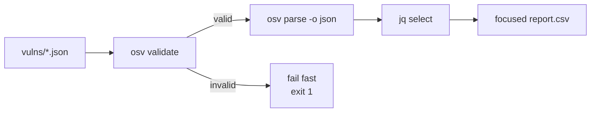

# Batch Vulnerability Scanning

Scan a directory of OSV records, extract the fields that matter, and produce a focused report.

---

## The pipeline



---

## Step 1: Validate everything

```bash
osv validate vulns/*.json
```

If any file is malformed, fix it before proceeding. Failing fast saves you from running a broken pipeline on bad data.

---

## Step 2: Extract the fields you care about

For each valid record, pull the ID, summary, CVSS score, and affected ecosystems:

```bash
for f in vulns/*.json; do
  osv parse -o json "$f" | jq -r '
    [
      .id,
      (.summary // "(no summary)"),
      ((.severity[0].score // "") | tostring),
      ([.affected[].package.ecosystem] | unique | join(","))
    ] | @csv
  '
done > report.csv
```

**Sample output** (`report.csv`):

```csv
"GHSA-vxv8-r8q2-63xw","Potential directory traversal in Django admin","","PyPI"
"CVE-2024-1234","RCE in log4j","CVSS:3.1/AV:N/AC:L/PR:N/UI:N/S:U/C:H/I:H/A:H","Maven"
```

::: warning Vector scores
When `severity[].score` is a CVSS vector string (not a number), `GetScore()` returns `0.0`. The CSV above keeps the raw vector — to get a numeric score, parse the vector with a CVSS library. See [Methods → severity](/reference/methods#severity).
:::

---

## Step 3: Filter by ecosystem

Only show PyPI-affected vulnerabilities:

```bash
for f in vulns/*.json; do
  osv filter -e PyPI -o json "$f" | jq -r '.id'
done
```

Or batch-aggregate the ecosystem counts across the whole corpus:

```bash
for f in vulns/*.json; do
  osv parse -o json "$f" | jq -r '.affected[].package.ecosystem'
done | sort | uniq -c | sort -rn
```

**Sample output**:

```
   42 PyPI
   28 npm
   15 Maven
    8 Go
```

---

## Step 4: Find all FIX references

Collect every fix commit/PR URL:

```bash
for f in vulns/*.json; do
  osv filter -r FIX -o json "$f" | jq -r '.references[].url'
done | sort -u > all-fixes.txt
```

Useful for tracking which vulnerabilities have a known patch.

---

## Full pipeline as a script

```bash
#!/usr/bin/env bash
# scan-vulns.sh — scan a directory of OSV records
set -euo pipefail

DIR="${1:-vulns}"

# 1. Validate (fail fast)
osv validate "$DIR"/*.json

# 2. Extract summary CSV
for f in "$DIR"/*.json; do
  osv parse -o json "$f" | jq -r '
    [.id, (.summary // ""), ((.severity[0].score // "") | tostring),
     ([.affected[].package.ecosystem] | unique | join(","))] | @csv'
done > report.csv

# 3. Ecosystem breakdown
for f in "$DIR"/*.json; do
  osv parse -o json "$f" | jq -r '.affected[].package.ecosystem'
done | sort | uniq -c | sort -rn > ecosystem-breakdown.txt

# 4. All FIX references
for f in "$DIR"/*.json; do
  osv filter -r FIX -o json "$f" | jq -r '.references[].url'
done | sort -u > all-fixes.txt

echo "Done. See report.csv, ecosystem-breakdown.txt, all-fixes.txt"
```

---

## See also

- [Examples](/guide/examples) — more one-liner patterns
- [osv-filter skill](/guide/skills/filter) — filtering reference
- [osv-query skill](/guide/skills/query) — extraction reference
