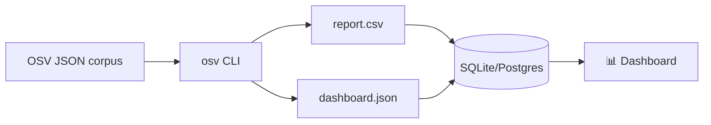

# Security Dashboard Data Source

Feed OSV vulnerability data into a security dashboard (Grafana, Tableau, custom) by producing clean CSV/JSON with the CLI.

---

## Architecture



---

## Produce a dashboard CSV

Extract ID, severity, affected ecosystem, and FIX availability for each record:

```bash
for f in vulns/*.json; do
  osv parse -o json "$f" | jq -r '
    [
      .id,
      (.summary // "" | tostring),
      ((.severity[0].score // "") | tostring),
      ([.affected[].package.ecosystem] | unique | join("/")),
      (if any(.references[]?; .type == "FIX") then "yes" else "no" end)
    ] | @csv
  '
done > dashboard.csv
```

**Sample output** (`dashboard.csv`):

```csv
"GHSA-vxv8-r8q2-63xw","Potential directory traversal in Django admin","","PyPI","yes"
"CVE-2024-1234","RCE in log4j","CVSS:3.1/AV:N/AC:L/PR:N/UI:N/S:U/C:H/I:H/A:H","Maven","yes"
"CVE-2024-5678","DoS in express","","npm","no"
```

---

## Load into SQLite

```bash
# Create the table
sqlite3 dashboard.db <<'SQL'
CREATE TABLE IF NOT EXISTS vulns (
  id TEXT PRIMARY KEY,
  summary TEXT,
  cvss_vector TEXT,
  ecosystems TEXT,
  has_fix TEXT
);
.mode csv
.import dashboard.csv vulns
SQL

# Query: how many vulns per ecosystem?
sqlite3 dashboard.db "SELECT ecosystems, COUNT(*) FROM vulns GROUP BY ecosystems ORDER BY COUNT(*) DESC;"
```

**Sample output**:

```
PyPI|42
npm|28
Maven|15
Go|8
```

---

## Ecosystem breakdown (for a pie chart)

```bash
for f in vulns/*.json; do
  osv parse -o json "$f" | jq -r '.affected[].package.ecosystem'
done | sort | uniq -c | sort -rn | awk '{print $2","$1}' > ecosystem-pie.csv
```

`ecosystem-pie.csv`:

```csv
PyPI,42
npm,28
Maven,15
Go,8
```

Drop this into Grafana's pie chart panel, or open it in Excel/Sheets.

---

## "Has fix?" report

Which vulnerabilities have a known fix?

```bash
for f in vulns/*.json; do
  has_fix=$(osv filter -r FIX -o json "$f" | jq 'if (.references | length) > 0 then "yes" else "no" end' -r)
  id=$(osv parse -o json "$f" | jq -r '.id')
  echo "$id,$has_fix"
done | sort > fix-status.csv
```

---

## Schedule it (cron)

Run the dashboard refresh nightly:

```cron
# crontab -e
0 2 * * * /path/to/refresh-dashboard.sh /path/to/vulns
```

`refresh-dashboard.sh`:

```bash
#!/usr/bin/env bash
set -euo pipefail
DIR="${1:?usage: refresh-dashboard.sh <vulns-dir>}"
cd "$DIR"

for f in *.json; do
  osv parse -o json "$f" | jq -r '
    [.id, (.summary // ""),
     ((.severity[0].score // "") | tostring),
     ([.affected[].package.ecosystem] | unique | join("/"))] | @csv'
done > dashboard.csv

sqlite3 dashboard.db <<'SQL'
DROP TABLE IF EXISTS vulns;
CREATE TABLE vulns (id TEXT, summary TEXT, cvss TEXT, ecosystems TEXT);
.mode csv
.import dashboard.csv vulns
SQL
```

---

## See also

- [Examples: aggregate by ecosystem](/guide/examples#3-aggregate-affected-packages-by-ecosystem)
- [CLI reference](/guide/cli) — full command list
- [Batch scanning](/use-cases/batch-scanning) — deeper batch patterns