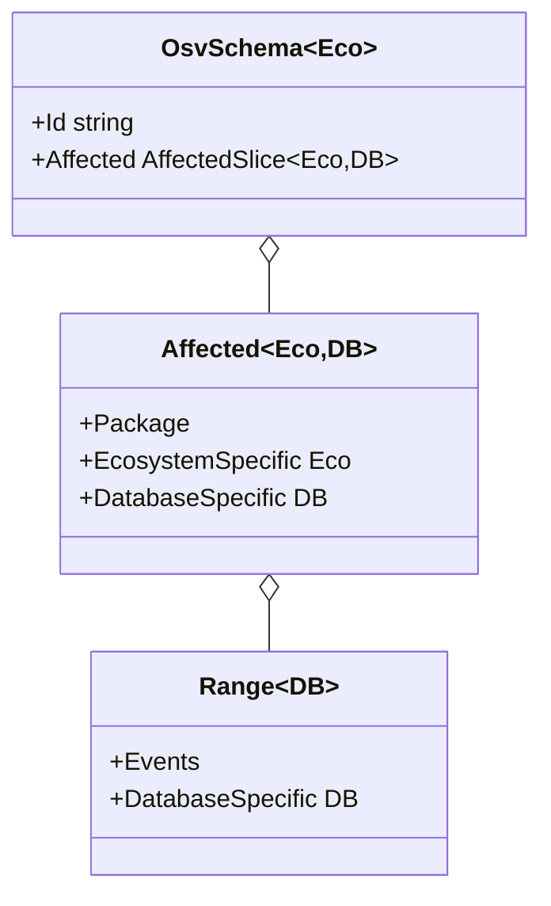

# 自定义生态与数据库特定字段

`OsvSchema` 类型是泛型的，你可以附加**生态特定**和**数据库特定**的元数据，而无需 fork 库。本页展示怎么做。

---

## 为什么用泛型

OSV schema 允许每个 `affected` 条目携带一个 `ecosystem_specific` 对象（该生态独有的自由字段）和一个 `database_specific` 对象（发布该记录的数据库独有的字段）。泛型内核让你把这些字段捕获为带类型的 Go 结构体，而非 `map[string]any`。



注意：`Range` 只携带 `DatabaseSpecific`——range 上没有 `EcosystemSpecific`（遵循 OSV 规范）。

---

## 默认：通用解析用 `any`

如果你不关心具体形状，做通用解析：

```go
v, err := osv_schema.UnmarshalFromJsonFile[any, any]("vuln.json")
```

`ecosystem_specific` 和 `database_specific` 字段就是 `any`（JSON 反序列化后通常是 `map[string]any`）。

---

## 自定义生态特定结构体

如果你知道记录来自（比如）PyPI，想类型化访问 PyPI 特定字段：

```go
package main

import (
    "fmt"
    "github.com/scagogogo/osv-schema-skills"
)

// PyPI 把自己的字段放在 ecosystem_specific 下
type PyPISpecific struct {
    AffectedArchitectures []string `json:"affected_architectures"`
}

type AnyDB struct{} // 未使用；占位

func main() {
    v, err := osv_schema.UnmarshalFromJsonFile[PyPISpecific, AnyDB]("pypi-vuln.json")
    if err != nil { panic(err) }

    for _, a := range v.Affected {
        fmt.Println(a.EcosystemSpecific.AffectedArchitectures)
    }
}
```

---

## 自定义数据库特定结构体

GitHub 安全公告把元数据放在 `database_specific` 下：

```go
type GitHubDB struct {
    Severity       string `json:"severity"`
    CvssScore      float64 `json:"cvss_score"`
    References     []string `json:"references"`
}

v, err := osv_schema.UnmarshalFromJsonFile[any, GitHubDB]("ghsa-vuln.json")
if err != nil { panic(err) }

// 顶层记录上：
fmt.Println(v.DatabaseSpecific.Severity)

// 每个 affected 条目上：
for _, a := range v.Affected {
    fmt.Println(a.DatabaseSpecific.CvssScore)
}

// 每个 range 上：
for _, a := range v.Affected {
    for _, r := range a.Ranges {
        fmt.Println(r.DatabaseSpecific)
    }
}
```

---

## 同时使用两者

可以同时指定生态和数据库类型：

```go
v, err := osv_schema.UnmarshalFromJsonFile[PyPISpecific, GitHubDB]("vuln.json")
```

内核反序列化会填充带类型字段。任何不匹配你结构体的 JSON 键会被静默忽略（标准 `encoding/json` 行为）——所以部分覆盖也没问题。

---

## GORM 持久化

`ecosystem_specific` 和 `database_specific` 字段通过 GORM 的 `serializer:json` 存为 JSON 字符串：

```go
import "gorm.io/gorm"

db, _ := gorm.Open(/* ... */, &gorm.Config{})
db.AutoMigrate(&osv_schema.OsvSchema[PyPISpecific, GitHubDB]{})

v, _ := osv_schema.UnmarshalFromJsonFile[PyPISpecific, GitHubDB]("vuln.json")
db.Create(&v)

// 之后——读回来
var loaded osv_schema.OsvSchema[PyPISpecific, GitHubDB]
db.First(&loaded, "id = ?", "GHSA-vxv8-r8q2-63xw")
```

`Affected` 和 `Severity` 切片存为 JSON 列；简单字段（id、summary 等）存为普通列。

---

## 另见

- [OSV Schema 参考](/zh/reference/osv-schema) —— 完整字段清单
- [方法清单](/zh/reference/methods) —— SDK 暴露的方法
- [SDK 指南](/zh/guide/sdk) —— Go SDK 入门