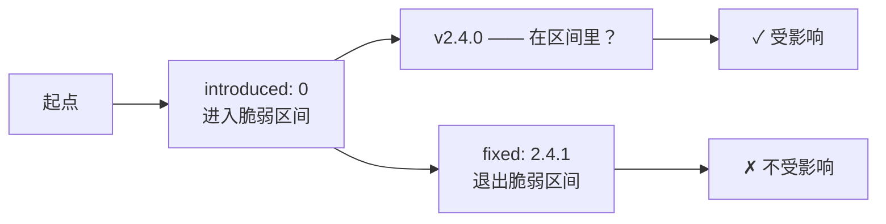

# 版本范围语义

OSV 用**事件时间线**而非散文描述哪些版本受影响。本页解释时间线如何工作，以及 SDK 如何解读它们。

---

## "X 之前"的问题

像"影响 2.4.1 之前的版本"这样的短语对人很简单，但对机器很难：

- `2.4.0-rc2` 怎么算？它在 `2.4.1` 之前吗？
- `2.4.1-alpha` 怎么算？
- 不同生态有不同的版本排序规则。

OSV 的解决方案是把版本范围编码为**有序事件**——一条机器可以步进的时间线，无需解析自然语言。

---

## 事件时间线

一个 `range` 是一串 `events`，每个事件恰好携带一个键：`introduced`、`fixed`、`last_affected`、`limit`。

```json
{
  "ranges": [
    {
      "type": "ECOSYSTEM",
      "events": [
        { "introduced": "0" },
        { "fixed": "2.4.1" }
      ]
    }
  ]
}
```

读作：*"从最初（`0`）起脆弱，直到（不含）`2.4.1`。"*

要判断版本 `2.4.0` 是否受影响，机器沿着时间线走：



---

## 时间线类型

`type` 字段说明如何比较版本字符串：

| 类型 | 含义 |
|------|------|
| `ECOSYSTEM` | 使用该生态的原生排序规则（PyPI 类 semver、Go 伪版本等） |
| `SEMVER` | 严格语义版本比较 |
| `GIT` | 比较提交哈希（拓扑排序） |

CLI 和 SDK **不**自己做比较——它们把事件暴露出来，让你喂给适合该生态的版本比较库。

---

## 多事件

时间线可以有超过两个事件：

```json
{
  "events": [
    { "introduced": "0" },
    { "fixed": "1.0.0" },
    { "introduced": "2.0.0" },
    { "fixed": "2.1.0" }
  ]
}
```

意思是：在 `[0, 1.0.0)` 和 `[2.0.0, 2.1.0)` 两个区间脆弱。

SDK 把 `Range.Events` 暴露为可迭代的切片：

```go
for _, a := range v.Affected {
    for _, r := range a.Ranges {
        for _, e := range r.Events {
            if e.Introduced != "" {
                fmt.Println("introduced:", e.Introduced)
            }
            if e.Fixed != "" {
                fmt.Println("fixed:", e.Fixed)
            }
        }
    }
}
```

---

## `last_affected` 与 `limit`

- `last_affected`：已知最后一个受影响版本。区间是 `[introduced, last_affected]` ——两端都闭。当尚未有修复时用它。
- `limit`：上界，超过该边界数据库不追踪。不是脆弱标记——只是数据边界。

---

## CLI：提取时间线

```bash
osv query --events -o json vuln.json | jq '.ranges[]'
```

**示例输出**：

```json
{
  "package": { "ecosystem": "PyPI", "name": "django" },
  "type": "ECOSYSTEM",
  "events": [
    { "introduced": "0" },
    { "fixed": "2.2.24" }
  ]
}
```

---

## SDK：遍历事件

```go
v, _ := osv_schema.UnmarshalFromJsonFile[any, any]("vuln.json")
for _, a := range v.Affected {
    for _, r := range a.Ranges {
        for _, e := range r.Events {
            // 每个事件恰好有一个非空字段：
            // e.Introduced, e.Fixed, e.LastAffected, e.Limit
            switch {
            case e.Introduced != "":
                fmt.Println("从以下版本开始脆弱:", e.Introduced)
            case e.Fixed != "":
                fmt.Println("在以下版本修复:", e.Fixed)
            }
        }
    }
}
```

---

## 为什么同时有 `versions[]`

有些记录还有 `versions` 数组——已知受影响版本的显式列表。这更简单，但无法覆盖记录发布后才释出的版本。

实践中，大部分真实记录用 `ranges[]`（时间线）而非 `versions[]`（枚举列表）。SDK 两者都给你。

---

## 另见

- [osv-query 技能](/zh/guide/skills/query) —— `--events` 标志
- [OSV Schema 参考](/zh/reference/osv-schema#affectedranges) —— 字段规范
- [Affected 技能](/zh/guide/skills/affected) —— `versions[]` 与 `ranges[]` 如何互动