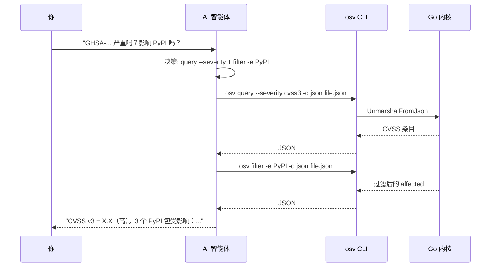
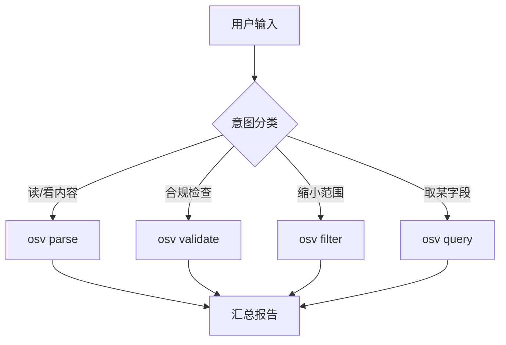

# AI Agent 接入

本页是整个项目的核心目的。**复制一段提示词，粘贴进 Claude Code 或 Codex，智能体就会自行安装 CLI 并开始处理 OSV 漏洞数据。** 无需手动配置。

## 你将得到什么

粘贴提示词后，AI 智能体能自主：

- 安装 `osv` CLI（下载二进制或 `go install`）
- 解析 / 校验 / 过滤 / 查询任意 OSV JSON 文件
- 根据你的意图自动触发正确的技能（无需点名命令）
- 以结构化方式汇报 CVE、CVSS 严重程度、受影响包与版本范围


---

## Claude Code 提示词——复制即用

> 点击下方代码块右上角的复制图标，粘贴进 Claude Code，回车。然后描述你要做的漏洞任务即可。

```text
You now have access to the OSV Schema Skills toolkit (https://github.com/scagogogo/osv-schema-skills),
an AI-native Go library + CLI + Claude Code Skills bundle for the OSV (Open Source Vulnerability)
schema. It can parse, validate, filter, and query OSV vulnerability JSON.

Set it up now, then use it for any vulnerability task I give you:

1. Ensure the `osv` CLI is available on PATH.
   - Preferred: download a pre-built binary from the latest GitHub Release
     (https://github.com/scagogogo/osv-schema-skills/releases). Pick the archive matching my
     OS/arch (linux/mac amd64/arm64/arm; windows amd64/arm64), extract the `osv` binary, make it
     executable, and put it on PATH.
   - Fallback: `go install github.com/scagogogo/osv-schema-skills/cmd/osv@latest` (requires Go 1.18+).
   - Verify with `osv version`.
2. This repository also ships 6 Claude Code Skills in `.claude/skills/` (osv-parse, osv-validate,
   osv-filter, osv-query, osv-severity, osv-affected). If you want the skills active, clone the
   repo locally: `git clone https://github.com/scagogogo/osv-schema-skills.git` and open that
   directory; the skills auto-trigger on vulnerability tasks. You don't have to clone if you only
   need the CLI.
3. Available CLI commands (use `-o json` when you want machine-readable output I can parse):
   - `osv parse <file>` (add `-v` for all fields)
   - `osv validate <file> [<file>...]`
   - `osv filter -e <ecosystem> -r <ref-type> -a <alias-pattern> <file>`
   - `osv query --severity cvss3|cvss2 --maven --ranges --events <file>`
4. Confirm setup by running: `osv parse test_data/GHSA-vxv8-r8q2-63xw.json` (clone the repo first
   to get the sample, or point it at any OSV JSON I provide).

When I ask about a vulnerability, choose the right skill/command automatically — parse the file,
filter by ecosystem if I name one, extract CVSS severity and affected version ranges, and report
findings concisely. Prefer `-o json` + your own summarization over raw text dumps. Don't ask me
which command to run; decide based on my intent.
```

::: tip
这段提示词故意做成意图驱动——它告诉智能体 *做什么* 和 *如何决策*，而不是一步步的按键操作。这正是"脚本"与"技能"的区别。
:::

---

## Codex（OpenAI）提示词——复制即用

> Codex 不会自动发现 `.claude/skills/`，所以提示词是自包含的：它内嵌了 CLI 全貌与决策逻辑。

```text
You have access to the `osv` CLI from https://github.com/scagogogo/osv-schema-skills — a toolkit
for the OSV (Open Source Vulnerability) schema. It parses, validates, filters and queries OSV
vulnerability JSON.

Set up now:
1. Install the CLI. Preferred: download a pre-built binary from
   https://github.com/scagogogo/osv-schema-skills/releases (pick the archive for my OS/arch:
   linux/mac amd64/arm64/arm, windows amd64/arm64), extract `osv`, chmod +x, put on PATH.
   Fallback: `go install github.com/scagogogo/osv-schema-skills/cmd/osv@latest` (Go 1.18+).
2. Verify: `osv version`.

Commands (append `-o json` for machine-readable output):
- `osv parse <file>`            — key fields; `-v` for all fields (dates, details, ranges, credits)
- `osv validate <file> [file…]` — schema check; exits 1 if any invalid
- `osv filter -e <eco> -r <ref-type> -a <alias> <file>` — filter by ecosystem / reference type / alias
- `osv query --severity cvss3|cvss2 --maven --ranges --events <file>` — extract sub-info

Decision rule for my requests:
- "parse / read / what's in" → osv parse
- "is it valid / schema check" → osv validate
- "only npm/PyPI/Maven…", "show FIX/ADVISORY refs", "CVE/GHSA only" → osv filter
- "how severe / CVSS", "Maven groupId/artifactId", "version ranges", "event timeline" → osv query
Combine flags when I ask for several things. Report concisely; prefer `-o json` + summarize over
raw text dumps. Decide which command to run yourself based on my intent — don't ask me.
```

---

## 为什么用提示词而不是装插件？

| 方案 | 优点 | 缺点 |
|------|------|------|
| **复制粘贴提示词**（本页） | 适用于任何智能体（Claude Code、Codex、Cursor）；无安装摩擦；用户能看到智能体将做什么 | 用户需粘贴一次 |
| `claude plugin add` | 一条命令 | 仅限 Claude Code；尚未发布 |

提示词是 **通用** 路径。当插件上架市场后，提示词对非 Claude 智能体仍是回退方案。

## 智能体在底层做了什么



## 决策路径总览



## 交叉引用

- [快速开始](/zh/guide/quick-start) — 想自己驱动的话，手动安装
- [技能总览](/zh/guide/skills) — 每个技能何时触发
- [CLI 参考](/zh/guide/cli) — 完整命令面
