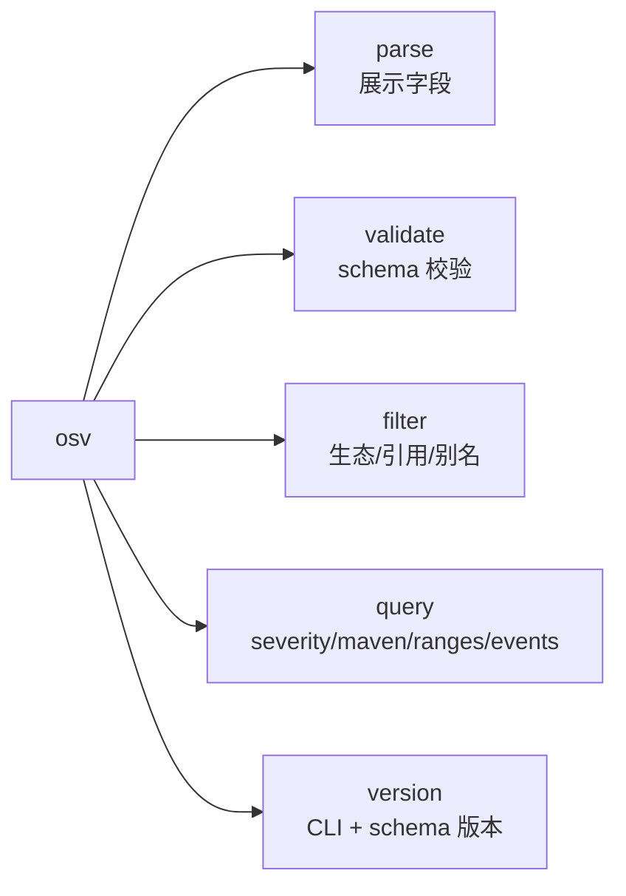
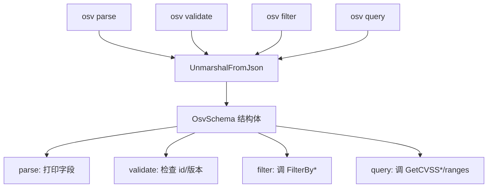
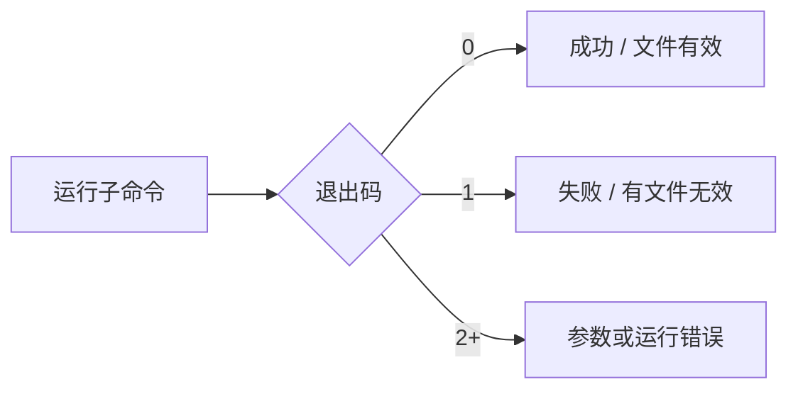
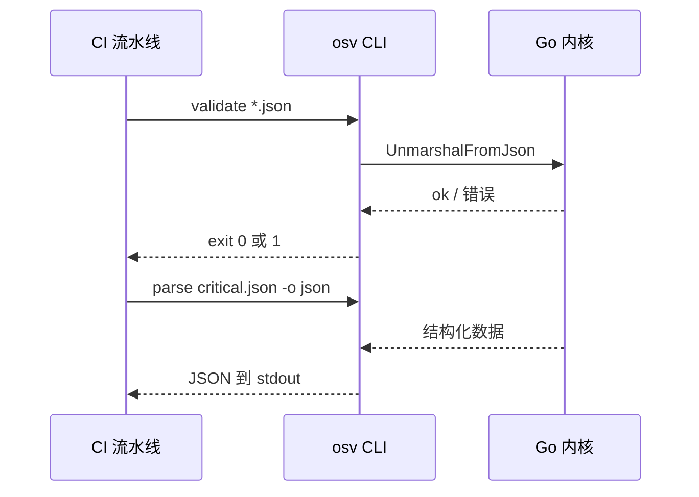
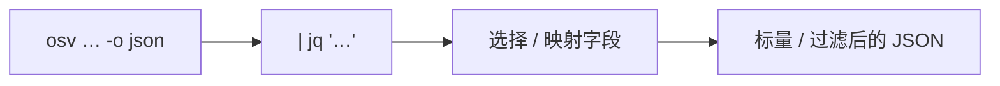

# CLI 命令行

`osv` CLI 是 Go 内核之上的一层薄壳——适合快速查询、shell 脚本和 CI 流水线。

## 安装

安装方式见 [快速开始](/zh/guide/quick-start)（预编译二进制、`go install` 或源码构建）。预编译二进制覆盖：

| 操作系统 | 架构 |
|----------|------|
| Linux | amd64、arm64、arm (v7) |
| macOS | amd64、arm64 |
| Windows | amd64、arm64 |

下载地址：[GitHub Releases](https://github.com/scagogogo/osv-schema-skills/releases)。

## 命令一览



## 命令如何映射到内核



### `osv parse`

解析 OSV JSON 文件并展示其字段。

```bash
osv parse vulnerability.json           # 关键字段（文本）
osv parse -v vulnerability.json        # 全字段（日期、详情、鸣谢、范围）
osv parse -o json vulnerability.json   # JSON 输出
```

| 标志 | 说明 |
|------|------|
| `-v, --verbose` | 展示全字段：published/modified、withdrawn、related、details、credits、每段 range 事件 |
| `-o, --output` | 输出格式：`text`（默认）或 `json` |

输出含 ID、schema 版本、摘要、aliases/CVE、severity、受影响包和引用。

### `osv validate`

校验一个或多个 OSV JSON 文件是否符合 schema（解析，检查必需的 `id` 和 `schema_version`）。

```bash
osv validate vulnerability.json              # 单文件
osv validate file1.json file2.json           # 批量
osv validate -o json vulnerability.json      # JSON 输出
```

若有文件无效则以退出码 `1` 退出——对 CI 闸门友好。

| 标志 | 说明 |
|------|------|
| `-o, --output` | 输出格式：`text`（默认）或 `json` |

### `osv filter`

按受影响包生态、引用类型或别名模式过滤。至少需要一个过滤标志；标志可组合。

```bash
osv filter -e PyPI vulnerability.json        # 按生态过滤受影响
osv filter -r FIX vulnerability.json         # 按引用类型过滤
osv filter -a CVE vulnerability.json         # 按别名模式过滤
osv filter -e PyPI -r FIX vulnerability.json # 组合
osv filter -o json -e PyPI vulnerability.json
```

| 标志 | 说明 |
|------|------|
| `-e, --ecosystem` | 生态名，按 OSV 规范区分大小写（`PyPI`、`npm`、`Maven`） |
| `-r, --ref-type` | 引用类型，自动转大写（`ADVISORY`、`FIX`、`WEB`） |
| `-a, --alias` | 别名前缀模式，匹配前转大写（`CVE`、`GHSA`、`CVE-2024` 均大小写不敏感匹配） |
| `-o, --output` | `text`（默认）或 `json` |

### `osv query`

提取聚焦的子信息。至少需要一个标志；标志可组合。

```bash
osv query --severity cvss3 vulnerability.json  # CVSS v3 条目 + 解析分数（向量串时为 0.0）
osv query --severity cvss2 vulnerability.json  # CVSS v2
osv query --maven vulnerability.json           # Maven groupId/artifactId 拆分
osv query --ranges vulnerability.json          # 每个受影响包的版本范围
osv query --events vulnerability.json          # 事件时间线（introduced/fixed/…）
osv query --ranges --events vulnerability.json # 组合
```

| 标志 | 说明 |
|------|------|
| `--severity` | `cvss3` 或 `cvss2` |
| `--maven` | 拆分 Maven `groupId:artifactId` |
| `--ranges` | 显示版本范围 |
| `--events` | 显示事件时间线 |
| `-o, --output` | `text`（默认）或 `json` |

::: tip
当 OSV 的 `score` 字段是 CVSS 向量字符串而非数字时，`GetScore()` 返回 `0.0`——见 [方法清单](/zh/reference/methods#severity)。
:::

### `osv version`

```bash
osv version
```

打印 CLI 版本（构建时由 goreleaser 注入）和所支持的 OSV schema 版本：

```text
osv-cli version: dev
OSV schema version: 1.4.0
```

`dev` 占位符会被 goreleaser 的 ldflags 替换为发布 tag。与其他子命令不同，`version` 忽略 `-o json`——它总是打印这两行文本。

## 全局标志

| 标志 | 说明 |
|------|------|
| `-o, --output` | `text`（默认）或 `json`——适用于 `parse`/`validate`/`filter`/`query`；`version` 忽略它 |

## 退出码约定



## 典型流水线



## 与 `jq` 组合

由于每个子命令都会说 `-o json`，CLI 能直接接进 Unix 管道。`-o json` 的输出就是同一个带类型内核重新 marshal 的结果，字段名与 [OSV Schema](/zh/reference/osv-schema) 完全一致。



```bash
# 只取 CVSS v3 向量字符串
osv query --severity cvss3 -o json vuln.json | jq -r '.severity.score'

# 列出一个目录里所有受影响生态并去重
for f in advisories/*.json; do
  osv parse -o json "$f" | jq -r '.affected[].package.ecosystem'
done | sort -u

# CI 闸门：任一文件无效即失败，再报告有 severity 的记录
osv validate advisories/*.json || exit 1
for f in advisories/*.json; do
  osv parse -o json "$f" | jq 'select(.severity != null)'
done
```

::: tip 退出码 + JSON 天然组合
`validate` 既设置退出码（`0`/`1`）*又*能输出 JSON，所以一条命令就能既守住流水线又产出机器可读报告——无需再解析第二遍。
:::
