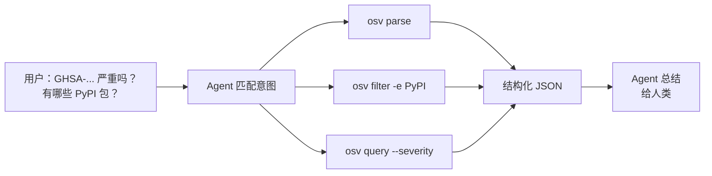

# 实战示例与 Cookbook

CLI、SDK 和 Skills 在流水线、脚本与 AI 工作流中的真实用法。

---

## 1. CI 校验闸门

校验目录下所有 OSV JSON；任一文件无效即中断流水线。

```bash
# 在 CI（GitHub Actions、GitLab CI 等）中
osv validate advisories/*.json
```

**原理**：`osv validate` 在任一文件校验失败时以退出码 `1` 退出，阻断流水线。加 `-o json` 可产出机器可读报告供下游消费。

```yaml
# .github/workflows/validate.yml
name: Validate OSV
on: [push, pull_request]
jobs:
  validate:
    runs-on: ubuntu-latest
    steps:
      - uses: actions/checkout@v4
      - uses: actions/setup-go@v5
      - run: go install github.com/scagogogo/osv-schema-skills/cmd/osv@latest
      - run: osv validate advisories/*.json
```

---

## 2. 批量提取 CVSS 分数

遍历目录，从每条记录抽取 CVSS v3 向量与解析分数。

```bash
for f in vulns/*.json; do
  echo "=== $f ==="
  osv query --severity cvss3 -o json "$f" | jq -r '.severity.score, .severity.scoreVector'
done
```

**输出**（每文件）：
```
7.5
CVSS:3.1/AV:N/AC:L/PR:N/UI:N/S:U/C:N/I:N/A:H
```

**注意**：当 OSV 的 `score` 字段是向量字符串而非数字时，`GetScore()` 返回 `0.0`——见 [方法清单 → severity](/zh/reference/methods#severity)。此时需自行解析向量或使用 CVSS 库。

---

## 3. 按生态聚合并统计受影响包

列出所有出现的生态系统及其频次。

```bash
for f in vulns/*.json; do
  osv parse -o json "$f" | jq -r '.affected[].package.ecosystem'
done | sort | uniq -c | sort -rn
```

**示例输出**：
```
    42 PyPI
    28 npm
    15 Maven
     8 Go
```

---

## 4. 按生态过滤 → 管道接 `jq`

只取 PyPI 受影响包及其版本范围。

```bash
osv filter -e PyPI -o json vuln.json | jq '.affected[] | {name: .package.name, ranges: .ranges}'
```

**要点**：`osv filter -e` 只返回匹配该生态的 `affected` 条目——记录其余部分（id、summary、severity）保持不变。若只要 affected 切片，用 `jq` 提取。

---

## 5. 收集所有 FIX 引用

跨多文件收集所有 `FIX` 类型引用的 URL。

```bash
for f in vulns/*.json; do
  osv filter -r FIX -o json "$f" | jq -r '.references[].url'
done | sort -u
```

---

## 6. Maven GAV 拆分

当包生态为 `Maven` 时，`name` 字段是 `groupId:artifactId`。用 `--maven` 拆分。

```bash
osv query --maven -o json vuln.json | jq '.maven | {groupId, artifactId}'
```

**示例输出**：
```json
{
  "groupId": "org.apache.logging.log4j",
  "artifactId": "log4j-core"
}
```

---

## 7. AI Agent 工作流：意图 → 报告

AI Agent 收到用户请求后自动选择合适的 CLI 调用。



**提示词模板**（复制到 Claude Code / Codex）：

```text
你已安装 osv-schema-skills 的 osv CLI。
当我问及漏洞文件时：
1. 用 `osv parse -o json <file>` 检视。
2. 若我提到生态，用 `osv filter -e <生态> -o json <file>` 过滤。
3. 若我问严重程度，用 `osv query --severity cvss3 -o json <file>`。
返回简洁答案——除非我要求，否则不要输出原始 JSON。
```

---

## 8. 校验 + 报告一次完成

产出 JSON 报告的同时守住流水线闸门。

```bash
osv validate -o json *.json > validation-report.json
# 退出码仍是 0/1，但现在多了一份报告：
cat validation-report.json | jq '.[] | select(.valid == false)'
```

---

## 9. 抽取事件时间线

展示每个受影响包的 introduced/fixed 时间线。

```bash
osv query --events -o json vuln.json | jq '.ranges[] | {package: .package.name, events: .events}'
```

---

## 10. SDK 模式：Go 中过滤

```go
package main

import (
    "fmt"
    "github.com/scagogogo/osv-schema-skills"
)

func main() {
    v, err := osv_schema.UnmarshalFromJsonFile[any, any]("vuln.json")
    if err != nil { panic(err) }

    pypi := v.Affected.FilterByEcosystem(osv_schema.EcosystemPyPI)
    for _, a := range pypi {
        fmt.Println(a.Package.Name)
    }
}
```

---

## 另见

- [CLI 参考](/zh/guide/cli) —— 所有命令与标志
- [Skills 总览](/zh/guide/skills) —— 自动触发的 Agent 技能
- [方法清单](/zh/reference/methods) —— SDK 方法签名
