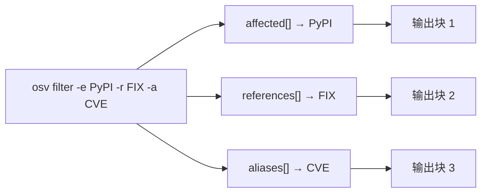

# 常见问题与排错

使用 CLI、SDK 和 Skills 时的常见疑问与坑。

---

## CLI

### 问：为什么 `osv version` 忽略 `-o json`？

`osv version` **不是数据子命令**——它总是只打印两行文本：

```text
osv-cli version: v0.1.0
OSV schema version: 1.4.0
```

这是设计如此：版本号是固定的两字段事实，不是可查询数据。`-o` 是持久（全局）标志，所有子命令都继承，但只有 `parse`/`validate`/`filter`/`query` 真正读取 `outputFormat`。给 `version` 传 `-o json` 会被静默忽略。

### 问：为什么 `osv parse` 里同一个包（如 `PyPI/tensorflow`）出现多行？

因为 `parse` 遍历 `affected[]`，**每个受影响条目打印一次**——不是每个范围打印一次。一条 OSV 记录可以包含同名包的多个 `affected` 条目（例如每个补丁分支一条），所以 `PyPI/tensorflow` 出现 3 次是合法的。

这是忠实于源数据，不是 bug。

### 问：`osv validate` 会遇到第一个错误就短路吗？

**不会。** `validate` 独立收集"缺少 `id`"和"缺少 `schema_version`"两个错误——如果记录两者都缺，你会得到两个错误，而不只是第一个。见 [CLI 页](/zh/guide/cli#osv-validate)。

### 问：`-o yaml` 能用吗？

不能。`-o` 只接受 `text`（默认）或 `json`。无效值（如 `-o yaml`）在数据子命令上静默回退为 text。

### 问：`osv parse -o json` 和 `osv filter -o json` 有什么区别？

都输出 JSON，但走的层不同：

- `parse -o json` marshal **原始** `*OsvSchema` 结构体（无 `omitempty`）——你能看到每个字段，包括空字符串。
- `filter`/`query -o json` 经过 **DTO 层**（带 `omitempty`）——空字段被省略，给 AI Agent 的输出更干净。

这就是同一文件下 `filter` 输出常比 `parse` 短的原因。

---

## 过滤

### 问：`osv filter -e PyPI -r FIX` 是"PyPI 包内的 FIX 引用"吗？

**不是。** 三个过滤标志（`-e`、`-r`、`-a`）作用在**独立的切片**上：

- `-e` 过滤 `affected[]`
- `-r` 过滤 `references[]`
- `-a` 过滤 `aliases[]`

每个发出自己的输出块。`-e PyPI -r FIX` 给你的是"PyPI 受影响条目"**加**"FIX 引用"——两个独立的过滤视图，不是嵌套查询。



### 问：生态匹配区分大小写吗？

是的，遵循 OSV 规范。`PyPI`（大写 P、大写 I）才对；`pypi` 或 `PyPi` 不会匹配。引用类型（`-r`）和别名模式（`-a`）在匹配前自动转大写，所以那两个是大小写不敏感的。

---

## 严重程度

### 问：为什么 `GetScore()` 对一个明显严重的漏洞返回 `0.0`？

因为 OSV 的 `score` 字段通常是 **CVSS 向量字符串**（如 `CVSS:3.1/AV:N/AC:L/...`），不是数字。`GetScore()` 只在 `score` 是纯数字字符串时返回非零值。当它是向量时，你必须自行解析向量才能得到数字分数。

完整解释见 [方法清单 → severity](/zh/reference/methods#severity)。

---

## 安装

### 问：`go install` 能用，但预编译二进制下载失败。

确认你用了对应平台的 archive 名：

| 系统 | 架构 | Archive |
|------|------|---------|
| Linux | amd64 | `osv_v0.1.0_linux_amd64.tar.gz` |
| Linux | arm64 | `osv_v0.1.0_linux_arm64.tar.gz` |
| Linux | arm (v7) | `osv_v0.1.0_linux_arm.tar.gz` |
| macOS | amd64 (Intel) | `osv_v0.1.0_darwin_amd64.tar.gz` |
| macOS | arm64 (Apple Silicon) | `osv_v0.1.0_darwin_arm64.tar.gz` |
| Windows | amd64 | `osv_v0.1.0_windows_amd64.zip` |
| Windows | arm64 | `osv_v0.1.0_windows_arm64.zip` |

务必校验 checksum：

```bash
sha256sum -c checksums.txt --ignore-missing
```

### 问：最新 Release 没有预编译资产，怎么办？

回退到 `go install`：

```bash
go install github.com/scagogogo/osv-schema-skills/cmd/osv@latest
```

需要 Go 1.18+。

---

## Skills 技能

### 问：7 个 Skills 是怎么激活的？

克隆仓库即可。当仓库是你的工作目录时，Claude Code 会自动发现 `.claude/skills/*/SKILL.md` 文件。每个 skill 的 `description` 字段告诉 Agent **何时**触发；`allowed-tools: Bash(osv:*)` 告诉它**能调用什么**。

你无需按名字调用 skill——Agent 把你的意图与各 description 匹配，自动挑出正确的 `osv` 子命令。

### 问：没装 CLI，Skills 能用吗？

不能。Skills 是**声明式契约**——它们告诉 Agent 该跑哪条 `osv` 命令，但真正的逻辑在 CLI（及其下的 Go 内核）里。如果 CLI 不在 `PATH` 上，skill 的 `Bash(osv:*)` 调用会失败。

先装 CLI（见 [安装](/zh/guide/installation)）。

---

## SDK

### 问：为什么 `Withdrawn` 是字符串，不是 `time.Time`？

按 OSV 规范，`withdrawn` 是 RFC 3339 时间戳字符串。我们保留为字符串（而非 `time.Time`），这样在时间戳格式错误时反序列化也不会失败——你只需检查字符串非空即可判断是否撤回。

### 问：为什么 `OsvSchema` 用泛型？

这样你能给 `Affected` 和 `Range` 附加**生态特定**和**数据库特定**的元数据，而不必 fork 库。通用解析用 `any`：

```go
v, err := osv_schema.UnmarshalFromJsonFile[any, any]("vuln.json")
```

若某生态有额外字段，自定义一个结构体替换进去即可。

---

## 还有问题？

- [实战示例](/zh/guide/examples) —— 可用模式
- [CLI 参考](/zh/guide/cli) —— 每条命令与标志
- [GitHub Issues](https://github.com/scagogogo/osv-schema-skills/issues) —— 报 bug 或提问
