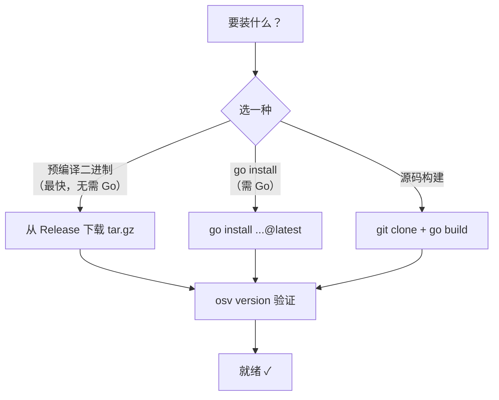
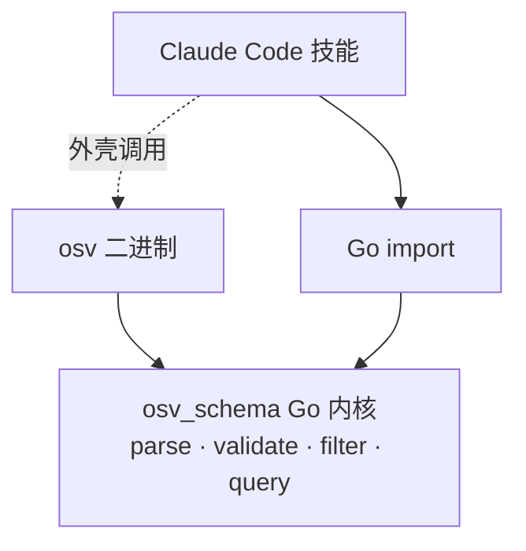
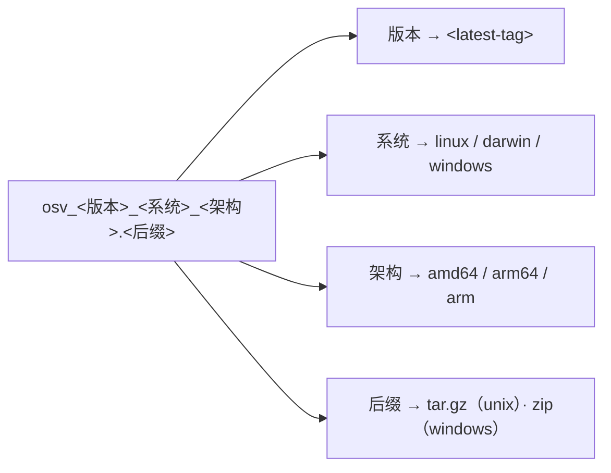
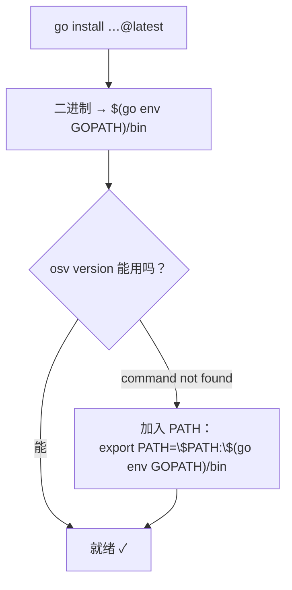

# 安装

安装 `osv` CLI、Go SDK，并启用 Claude Code 技能。

## 环境要求

- **Go 1.18+**（用于 SDK 和源码构建）
- 仅 `go get` / `go install` / 下载二进制时需要联网

## 安装方式一图览



## 三条路，一个内核

无论装哪一种，三层访问方式最终都汇到同一个 Go 内核——所以你从 CLI 学到的事实，在 SDK 和技能里同样成立。



## CLI

::: tabs
== 预编译二进制

每个 tag 都通过 goreleaser 发布预编译二进制。若最新 release 暂无预编译资产（例如首个 goreleaser 打的 tag 尚未发布），改用下方的 `go install`。

| 操作系统 | 架构 |
|----------|------|
| Linux | amd64、arm64、arm (v7) |
| macOS | amd64、arm64 |
| Windows | amd64、arm64 |

压缩包名由版本号、操作系统和架构拼成——按同一模板填空即可拼出你要的那个：



```bash
# Linux amd64 示例——按你的情况替换版本号/平台。
# 将 <latest-tag> 替换为 Releases 页面上最新的 tag。
VERSION=<latest-tag>
curl -fsSL -o osv.tar.gz \
  https://github.com/scagogogo/osv-schema-skills/releases/download/${VERSION}/osv_${VERSION}_linux_amd64.tar.gz
tar -xzf osv.tar.gz osv
chmod +x osv && sudo mv osv /usr/local/bin/
osv version
```

用自带的 `checksums.txt` 校验完整性：

```bash
sha256sum -c checksums.txt --ignore-missing
```

Release 地址：<https://github.com/scagogogo/osv-schema-skills/releases>

== go install

```bash
go install github.com/scagogogo/osv-schema-skills/cmd/osv@latest
osv version
```

`go install` 会把二进制放进 `$(go env GOPATH)/bin`。如果这时 `osv version` 报 *command not found*，说明该目录不在你的 `PATH` 里：



== 源码构建

```bash
git clone https://github.com/scagogogo/osv-schema-skills.git
cd osv-schema-skills
go build -o osv ./cmd/osv/
./osv version
```
:::

## Go SDK

```bash
go get -u github.com/scagogogo/osv-schema-skills
```

```go
import osv "github.com/scagogogo/osv-schema-skills"
```

用法见 [Go SDK 指南](/zh/guide/sdk)。

## Claude Code 技能

当 Claude Code 打开本仓库时，7 个技能自动激活——无需安装步骤：

```bash
git clone https://github.com/scagogogo/osv-schema-skills.git
cd osv-schema-skills
claude   # 技能已生效
```

或作为插件安装——`.claude-plugin/` 里的 manifest 已就绪，待 marketplace 上线后即可直接添加：

```bash
claude plugin add scagogogo/osv-schema-skills
```

见 [技能总览](/zh/guide/skills)。

## 验证

```bash
osv version                                   # CLI + schema 版本
osv parse test_data/GHSA-vxv8-r8q2-63xw.json  # 解析一条样例记录
```
