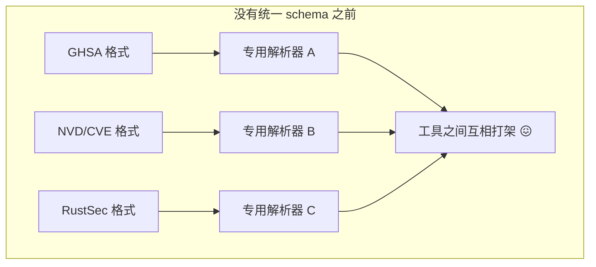
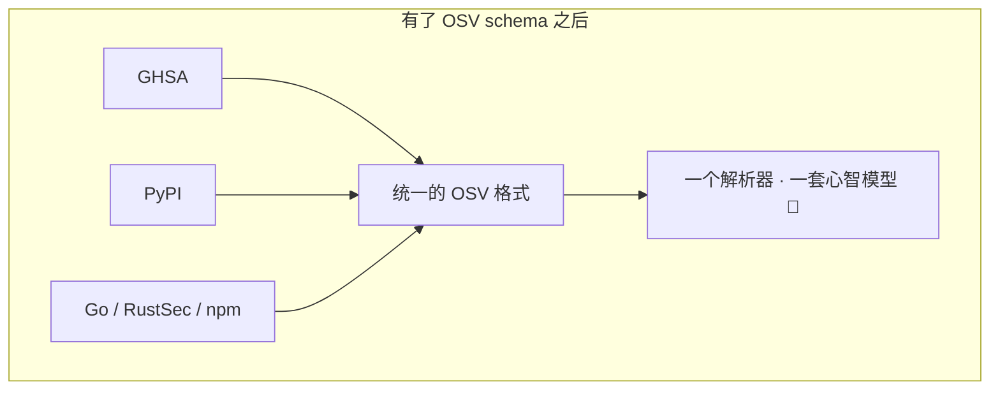
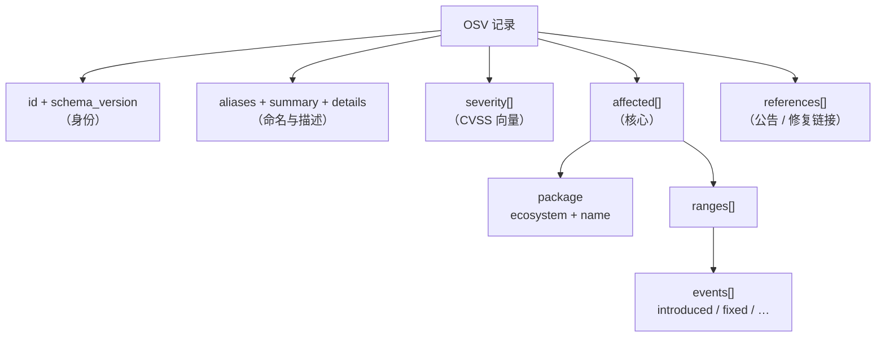
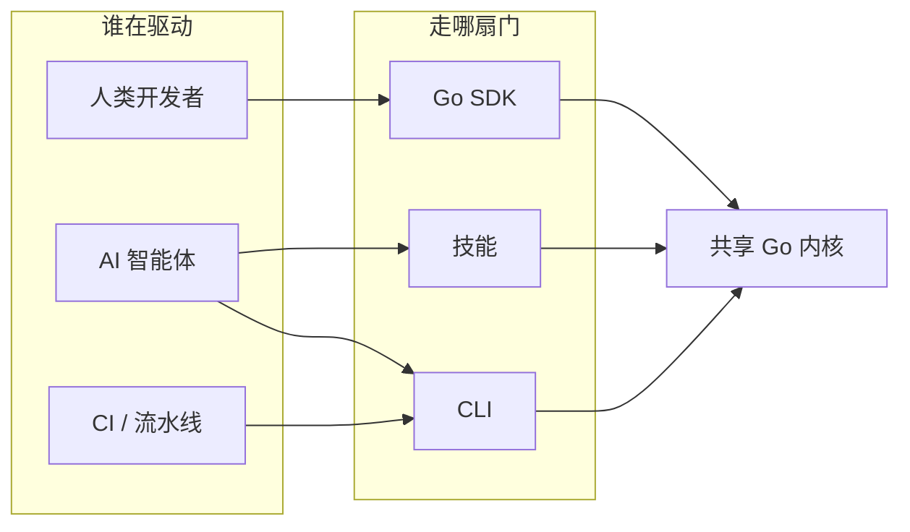
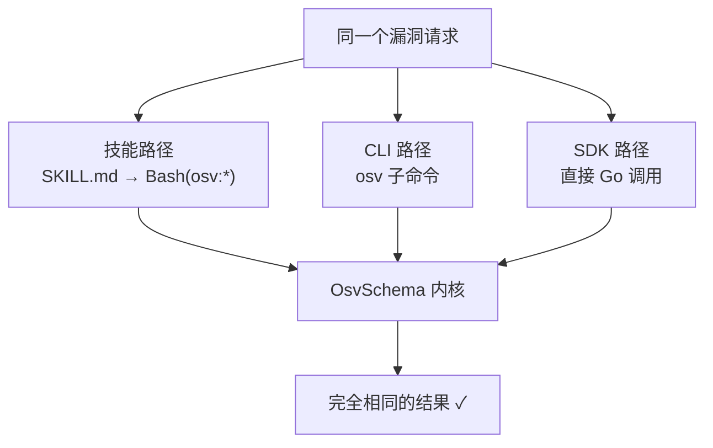
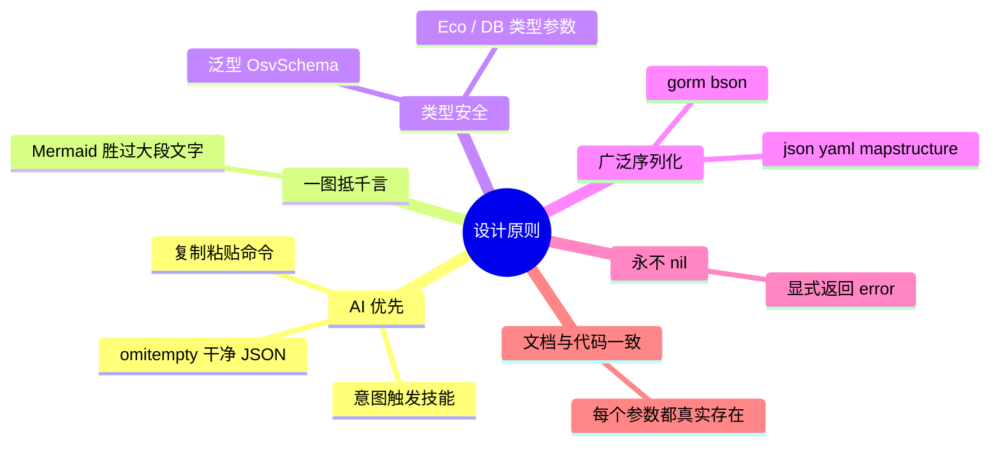

# 项目介绍

**OSV Schema Skills** 是一个面向 [OSV（Open Source Vulnerability，开源漏洞）Schema](https://ossf.github.io/osv-schema/) 的 **AI 原生（AI-native）** Go 库 + CLI + 技能包。它让你能够解析、校验、过滤、查询漏洞数据——通过 **Go SDK**、**CLI 命令行工具**，或者直接借助 **AI 智能体技能**。

如果你只有三十秒，整个理念就一句话：

> 一个 Go 内核读懂 OSV 漏洞格式，三层薄薄的外壳把它暴露出来——给程序用的库、给 Shell 用的命令、给 AI 智能体用的技能。无论你从哪扇门进来，得到的答案都一样。

本页的写法刻意像一本书的第一章：从"漏洞数据为什么难处理"讲起，逐步建立起"OSV 是什么"，再把"数据模型逐字段展开"，最后说明"本工具箱如何落位"。你无需任何 OSV 前置知识——每个术语在首次出现时都会解释。

## 架构一览


三层访问方式共用**同一个 Go 内核**，因此无论驱动它的是 AI 智能体、Shell 脚本还是 Go 程序，行为都完全一致。

---

## 第 1 章 —— 漏洞数据为什么难处理

设想你维护着一个依赖两百个开源包的服务。某天早上你读到某个热门库爆出安全漏洞，立刻有三个问题要紧：

1. **我中招了吗？** 我用的这些具体版本里，哪些是脆弱的？
2. **有多严重？** 是"这个季度打个补丁"，还是"今晚就得叫人起来处理"？
3. **该怎么办？** 有修复版本吗？是哪一个？

要在规模上自动回答这些问题——横跨成百上千个包——你需要的是**结构化、机器可读**的答案。而这恰恰是 OSV 出现之前一切崩坏的地方：

- **每个数据库都说自己的方言。** GitHub 安全公告（GHSA）、美国国家漏洞库（NVD/CVE）、Go 漏洞库、RustSec、PyPA、npm audit——它们发布的是*同样的底层事实*，却用了*不同的形状*。能读懂其中一个的工具，读不了另一个。
- **版本范围是散文，不是数据。** "影响 2.4.1 之前的版本"对人类很好懂，但对一台需要把 `2.4.0-rc2` 拿去比对的机器毫无用处。
- **包的身份含混不清。** `requests` 到底是 PyPI 包、RubyGem，还是 npm 模块？没有明确的*生态系统*，光有名字什么也说明不了。

这种碎片化的代价是实打实的：每个安全工具都得为每个来源写一套专用解析器还得维护，即便如此它们彼此之间仍会给出矛盾的结论。



## 第 2 章 —— OSV 是什么

**OSV**（Open Source Vulnerability，开源漏洞）是一套 schema——一种共享的 JSON 格式——由 [OpenSSF](https://openssf.org/) 牵头创建，用来终结这种碎片化。它的前提简单却有力：

> 如果每个数据库都用*同一种*形状描述漏洞，那么一个工具就能读懂*全部*数据库。

两个关键思想让 OSV 成功，而此前的尝试都卡住了：

- **生态系统限定的包名。** 一个包永远不只是 `requests`，而是 *PyPI 生态里的* `requests`。这个组合（`ecosystem` + `name`）在全球范围内唯一无歧义。
- **版本范围是事件，不是句子。** OSV 不写"2.4.1 之前"这样的散文，而是记录一条有序的时间线：在 `0` 处*引入（introduced）*，在 `2.4.1` 处*修复（fixed）*。机器可以沿着这条时间线走一遍，判断任意一个具体版本是否落在其中——完全不需要懂英语。

如今 GitHub、PyPI、Go、RustSec、npm 等都原生导出 OSV 格式，并汇聚到 [osv.dev](https://osv.dev/)。学会 OSV 一次，就能读懂它们全部。



## 第 3 章 —— 数据模型：一次一个字段

理解 OSV 最好的方式，是从零开始把一条记录"养大"，每次只加一层。下面每一步都是*合法*的 OSV——这个格式允许你说得极少，也允许说得极多。

### 第 1 层 —— 身份

每条记录都需要一个全局唯一的 `id`，并声明它遵循哪个 schema 版本。

```json
{
  "schema_version": "1.4.0",
  "id": "GHSA-vxv8-r8q2-63xw"
}
```

这个 `id` 就是主键。前缀告诉你来源：`GHSA-…` 来自 GitHub，`CVE-…` 来自 NVD，`GO-…` 来自 Go 数据库，`PYSEC-…` 来自 PyPA，以此类推。

### 第 2 层 —— 别名与人类可读的摘要

同一个漏洞在不同数据库里常有好几个 ID。`aliases` 把它们串起来；`summary` 和 `details` 面向人类描述它。

```json
{
  "id": "GHSA-vxv8-r8q2-63xw",
  "aliases": ["CVE-2021-33203"],
  "summary": "Django admin 存在潜在的目录遍历",
  "details": "对该问题更长的 Markdown 说明……"
}
```

这就是为什么用本工具箱"根据 GHSA 找对应 CVE"是一行代码的事——映射关系本来就存在于记录里。

### 第 3 层 —— 有多严重？（`severity`）

`severity` 携带机器可读的分数，几乎总是以 **CVSS 向量字符串**（Common Vulnerability Scoring System，通用漏洞评分系统）的形式出现。像 `CVSS:3.1/AV:N/AC:L/PR:N/UI:N/S:U/C:N/I:N/A:H` 这样的向量，编码的是分数*如何推导出来*，而不只是那个数字。

```json
{
  "severity": [
    { "type": "CVSS_V3", "score": "CVSS:3.1/AV:N/AC:L/PR:N/UI:N/S:U/C:N/I:N/A:H" }
  ]
}
```

::: warning 你一定会碰到的一个坑
`score` 字段存的是*向量字符串*，不是数字。把它变成 `7.5` 需要解析这个向量。本工具箱会替你做这件事——但要注意：当该字段是向量而非纯数字时，`GetScore()` 返回 `0.0`。详见 [方法清单 → severity](/zh/reference/methods#severity)。
:::

### 第 4 层 —— 谁受影响？（`affected`）

这是整条记录的核心。`affected` 是一个列表；每一项指明一个 `package`（生态系统 + 名字）并描述哪些版本中招。

```json
{
  "affected": [
    {
      "package": { "ecosystem": "PyPI", "name": "django" },
      "ranges": [ /* 见第 5 层 */ ],
      "versions": ["3.1.0", "3.1.1", "3.2.0"]
    }
  ]
}
```

表达"哪些版本"有两种方式：

- **`versions`**——显式枚举的列表。简单、精确，但覆盖不到之后才发布的版本。
- **`ranges`**——一条覆盖开放区间的规则。真实数据里更常用。这就是第 5 层。

### 第 5 层 —— 范围即事件时间线

一个 `range` 是一串有序的 `events`。最常见的事件是 `introduced`（漏洞开始）和 `fixed`（漏洞结束）。把它们当成一条时间线来读。

```json
{
  "ranges": [
    {
      "type": "ECOSYSTEM",
      "events": [
        { "introduced": "0" },
        { "fixed": "2.2.24" }
      ]
    }
  ]
}
```

读作：*"从最初的版本（`0`）起脆弱，直到 `2.2.24`（不含）为止。"* 要判断版本 `2.2.10` 是否受影响，机器沿着时间线走一遍即可；它永远不必解析一个句子。`type` 说明如何比较版本——`ECOSYSTEM`（该生态自己的版本规则）、`SEMVER`，或 `GIT`（提交哈希）。

::: tip 事件的黄金法则
每个事件对象**恰好**携带一个键——`introduced`、`fixed`、`last_affected` 或 `limit`。这正是本工具箱的 JSON 输出使用 `omitempty` 的原因：在一个真实的 `"introduced"` 旁边输出 `"fixed": ""` 会违反规范，并让读它的 AI 智能体困惑。
:::

### 第 6 层 —— 去哪了解更多？（`references`）

最后，`references` 链接到公告、修复和讨论。每一项都有 `type`（`ADVISORY`、`FIX`、`WEB`、`REPORT` 等）和 `url`。

```json
{
  "references": [
    { "type": "ADVISORY", "url": "https://github.com/advisories/GHSA-vxv8-r8q2-63xw" },
    { "type": "FIX", "url": "https://github.com/django/django/commit/abc123" }
  ]
}
```

### 拼到一起

把这六层叠起来，你就有了一条完整的记录。整个形状用一张图表示：



本工具箱里的每个方法都对应上面某个方框——`GetCVE()` 读 `aliases`，`FilterByEcosystem()` 读 `affected[].package`，`query --events` 读 `ranges[].events`，以此类推。一旦上面这个模型在你脑中"咔哒"一声接通，整套 API 就变得可预测。

---

## 第 4 章 —— 本工具箱如何落位

理解模型只是一半功夫；另一半是*对它采取行动*，而不必每次都重写解析器。这正是三层访问方式给你的——一个内核，三扇门。



| 层 | 最适合 | 你要写的 |
|----|--------|----------|
| 🤖 **技能** | Claude Code、AI 工作流 | 什么都不用写——智能体从你的意图里挑技能 |
| 🖥️ **CLI** | Shell、CI 流水线 | `osv filter -e PyPI -o json vuln.json` |
| 📦 **SDK** | Go 应用 | `v.Affected.FilterByEcosystem(osv.EcosystemPyPI)` |

因为三者都调用*同一个*带类型的内核，CLI、SDK 和技能绝不可能彼此不一致——这正是我们兑现"AI First"承诺时重度依赖的性质。



## 第 5 章 —— 设计原则



| 原则 | 如何体现 |
|------|----------|
| **AI First（AI 优先）** | 技能从意图自动触发；文档以智能体可直接执行的复制粘贴命令开头；JSON 输出用 `omitempty` 保持干净，智能体永不会读到误导性的空字段 |
| **一图抵千言** | 本站大量使用 Mermaid 图，而非成片的文字 |
| **类型安全** | 泛型 `OsvSchema[EcosystemSpecific, DatabaseSpecific any]`——可按生态/数据库定制，通用解析用 `any` 即可 |
| **广泛序列化** | 每个核心类型都支持 JSON、YAML、mapstructure、GORM、BSON 标签 |
| **构造器绝不返回 nil** | Unmarshal 函数显式返回 `error`，绝不静默返回 `nil` |
| **文档与代码一致** | 文档里展示的每条命令都真实存在——照着文档走的智能体不会撞上不存在的参数 |

## 术语表

初来乍到？这些是贯穿全文档的术语。

| 术语 | 含义 |
|------|------|
| **OSV** | Open Source Vulnerability——本工具箱所讲的那套共享 JSON schema |
| **生态系统（Ecosystem）** | 一个名字所属的包宇宙：`PyPI`、`npm`、`Maven`、`Go`…… |
| **CVE** | Common Vulnerabilities and Exposures——权威的全局漏洞 ID（`CVE-2021-…`） |
| **GHSA** | GitHub 安全公告 ID（`GHSA-…`） |
| **CVSS** | 通用漏洞评分系统——描述严重程度的向量/分数 |
| **别名（Alias）** | 同一漏洞在不同数据库里的另一个 ID |
| **范围（Range）** | 一条规则（事件时间线），描述哪些版本受影响 |
| **事件（Event）** | 范围时间线上的一个点：`introduced`、`fixed`、`last_affected`、`limit` |
| **技能（Skill）** | 一份 `SKILL.md` 契约，告诉 AI 智能体何时行动、调用哪条 `osv` 命令 |

## 下一步

- 🤖 **[AI Agent 接入](/zh/guide/ai-agent)** —— 把一段提示词复制进 Claude Code / Codex，搞定
- [快速开始](/zh/guide/quick-start) —— 30 秒内对着真实记录跑起来
- [Skills 总览](/zh/guide/skills) —— 6 个自动触发的技能
- [OSV Schema 参考](/zh/reference/osv-schema) —— 上面这个模型的详尽字段参考
- [CLI](/zh/guide/cli) / [Go SDK](/zh/guide/sdk) —— 两扇上手的门
