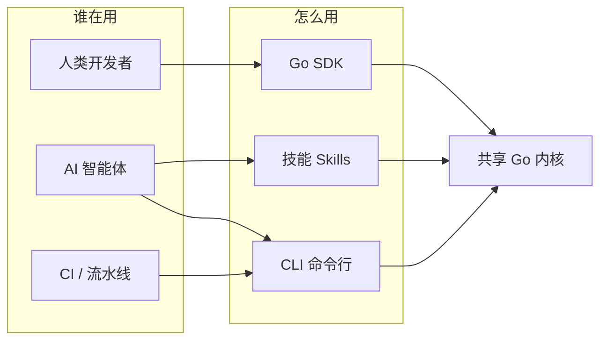
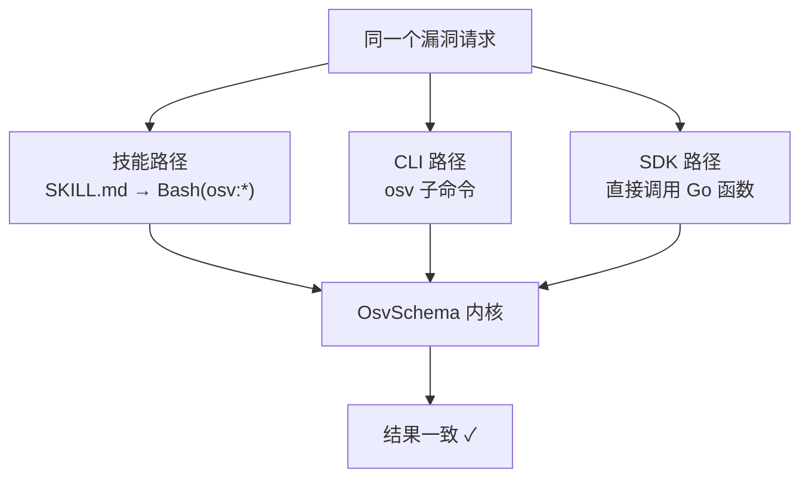

# 项目介绍

**OSV Schema Skills** 是一个 **AI 原生** 的 Go 库 + CLI + 技能包，面向 [OSV（Open Source Vulnerability）Schema](https://ossf.github.io/osv-schema/)。它能解析、校验、过滤、查询漏洞数据——通过 **Go SDK**、**CLI 工具**，或直接经 **AI 智能体技能**。

## 架构一览

三层访问共享 **同一个 Go 内核**，因此无论驱动者是 AI 智能体、shell 脚本，还是 Go 程序，行为都完全一致。

## 它为什么存在

处理漏洞数据很繁琐：

- **OSV JSON** 带着深层嵌套结构（受影响包、CVSS 分数、版本范围、引用），手动检查很困难。
- **过滤** 按生态、严重程度或引用类型，通常意味着写一次性代码。
- **校验** schema 没有工具很容易出错。
- **AI 智能体**（如 Claude Code）过去没有结构化方式与漏洞数据交互——直到现在。

本仓库补上了最后这块：当 Claude Code 打开它，6 个专用技能自动可用。

## 谁在用，怎么用

## 设计原则

| 原则 | 体现 |
|------|------|
| AI 优先 | 技能自动触发；README 以智能体能直接运行的复制粘贴命令开头 |
| 一图抵千言 | 本站大量使用 Mermaid 图，少写散文 |
| 类型安全 | 泛型 `OsvSchema[EcosystemSpecific, DatabaseSpecific any]` |
| 广泛序列化 | 每个核心类型都支持 JSON、YAML、mapstructure、GORM、BSON |
| 构造器永不返回 nil | Unmarshal 函数显式返回 error |

## 三层访问如何对齐

## 接下来

- 🤖 **[AI Agent 接入](/zh/guide/ai-agent)** — 复制一段提示词进 Claude Code / Codex 即可
- [快速开始](/zh/guide/quick-start) — 30 秒跑起来
- [技能总览](/zh/guide/skills) — 6 个自动触发的技能
- [CLI](/zh/guide/cli) / [Go SDK](/zh/guide/sdk)
