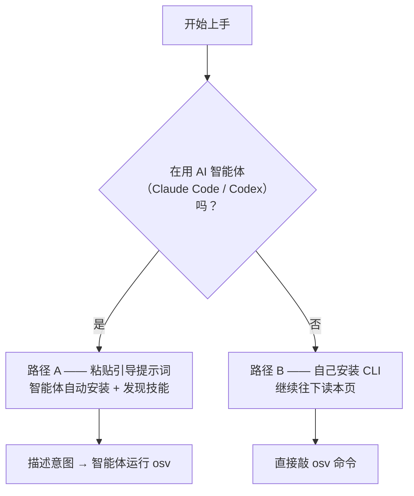
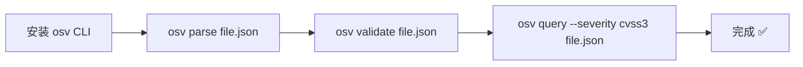
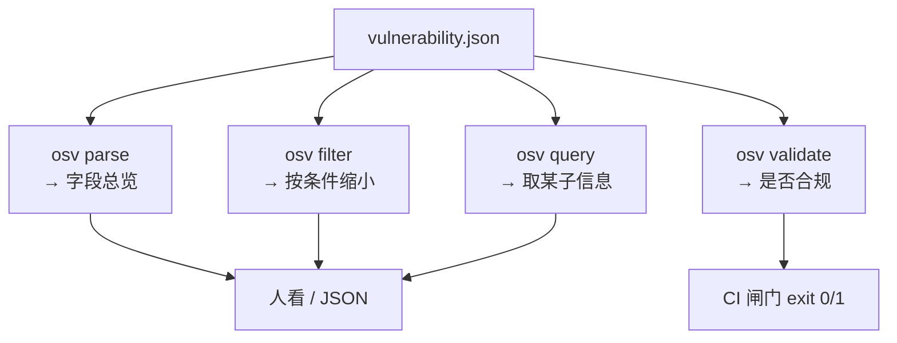
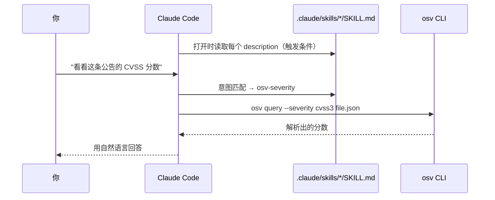

# 快速开始

本章带你从*什么都没装*走到*读懂一条真实漏洞记录*——每一步之后都有一小段说明，让你不只知道**该敲什么**，还明白**刚刚发生了什么**。

## 两条路

上手有两种方式，二选一。

- **路径 A —— 让 AI 替你做（推荐，"AI First"）。** 如果你用 Claude Code 或 Codex，就不必手动安装任何东西。从 [AI Agent 接入](/zh/guide/ai-agent) 页复制那段引导提示词，粘贴给你的智能体，它会自动安装 CLI、发现技能，然后开始干活。想知道为什么这样能行，直接跳到 [启用 Claude Code 技能](#启用-claude-code-技能)。
- **路径 B —— 自己动手。** 手动安装 CLI 并逐条运行命令。这就是本页余下的内容。



---

## 第 1 步 —— 安装 CLI

挑一个适合你机器的方式。三种方式都以 `osv version` 结尾——它既确认安装成功，又打印所支持的 OSV schema 版本。

::: tabs
== 预编译二进制（任意平台）

零依赖方案——不需要 Go 工具链。从 [最新 Release](https://github.com/scagogogo/osv-schema-skills/releases) 下载匹配你 OS/架构的二进制：

```bash
# Linux amd64 示例（把版本号与平台换成你自己的）
VERSION=v0.1.0
curl -fsSL -o osv.tar.gz \
  https://github.com/scagogogo/osv-schema-skills/releases/download/${VERSION}/osv_${VERSION}_linux_amd64.tar.gz
tar -xzf osv.tar.gz osv
sudo mv osv /usr/local/bin/
osv version
```

二进制覆盖 Linux（amd64/arm64/arm）、macOS（amd64/arm64）与 Windows（amd64/arm64）。每个 Release 还附带 `checksums.txt` 供你校验完整性。

== go install

如果你已有 Go 1.18+：

```bash
go install github.com/scagogogo/osv-schema-skills/cmd/osv@latest
osv version
```

它会把 `osv` 放进 `$(go env GOPATH)/bin`——确保该目录在你的 `PATH` 上。

== 源码构建

想改代码或构建某个特定提交：

```bash
git clone https://github.com/scagogogo/osv-schema-skills.git
cd osv-schema-skills
go build -o osv ./cmd/osv/
./osv version
```
:::

::: tip 刚刚发生了什么
你现在有了一个自包含的单文件二进制 `osv`。它把整个 Go 内核嵌在里面——没有运行时、没有配置文件、不用再装别的。下面所有内容，都是这一个二进制在读 JSON。
:::

## 第 2 步 —— 解析你的第一条记录

拿仓库自带的样例来解析：

```bash
osv parse test_data/GHSA-vxv8-r8q2-63xw.json
```

预期输出（节选）：

```
ID:             GHSA-vxv8-r8q2-63xw
Schema Version: 1.4.0
Summary:        ...

Severity:
  CVSS_V3: CVSS:3.1/... (score: 7.5)

Affected Packages:
  ...
```

### 读懂输出

每一行都能对应回 [项目介绍](/zh/guide/introduction#第-3-章-——-数据模型-一次一个字段) 里的某一层 OSV 模型：

| 输出行 | OSV 字段 | 含义 |
|--------|----------|------|
| `ID` | `id` | 记录的唯一主键 |
| `Schema Version` | `schema_version` | 遵循的 OSV 版本 |
| `Summary` | `summary` | 一行人类可读描述 |
| `Severity → CVSS_V3` | `severity[]` | CVSS 向量，外加解析出的数值分数 |
| `Affected Packages` | `affected[]` | 哪个生态 + 包 + 版本中招 |

想看*全部*——日期、关联 ID、完整详情、每个范围的事件？加 `-v`：

```bash
osv parse -v test_data/GHSA-vxv8-r8q2-63xw.json
```

需要给脚本或智能体用的机器可读输出？加 `-o json`：

```bash
osv parse -o json test_data/GHSA-vxv8-r8q2-63xw.json
```

## 第 3 步 —— 30 秒工作流

解析只是第一个动词。实践中你会串起好几个：



对着样例逐个动词试一遍：

```bash
osv validate test_data/GHSA-vxv8-r8q2-63xw.json        # 是否合规？
osv filter -e PyPI test_data/GHSA-vxv8-r8q2-63xw.json  # 只看受影响的 PyPI 项
osv query --severity cvss3 test_data/GHSA-vxv8-r8q2-63xw.json  # 只要 CVSS 分数
```

### 四个命令分别给你什么



把它想成一条自然的递进：**parse** 看清它，**validate** 信任它，**filter** 缩小它，**query** 精确取出一个事实。逐个参数的详情见 [CLI 参考](/zh/guide/cli)。

## 第 4 步 —— 使用 Go SDK（可选）

如果你写的是 Go 而非驱动 Shell，同一个内核只差一个 import：

```bash
go get -u github.com/scagogogo/osv-schema-skills
```

```go
package main

import (
    "fmt"
    "log"

    osv "github.com/scagogogo/osv-schema-skills"
)

func main() {
    v, err := osv.UnmarshalFromJsonFile[any, any]("vulnerability.json")
    if err != nil {
        log.Fatal(err) // 构造器绝不静默返回 nil
    }
    fmt.Printf("ID: %s\n", v.ID)
    fmt.Printf("CVE: %s\n", v.Aliases.GetCVE())
}
```

`[any, any]` 这两个类型参数就是 `EcosystemSpecific` 和 `DatabaseSpecific` 泛型——通用解析用 `any` 即可，或者塞进你自己的结构体，对自定义字段获得带类型的访问。详见 [Go SDK 指南](/zh/guide/sdk)。

## 启用 Claude Code 技能

这里就是 AI-First 的回报所在。在 Claude Code 中打开本仓库，6 个技能自动激活——无需插件、无需配置：

```bash
git clone https://github.com/scagogogo/osv-schema-skills.git
cd osv-schema-skills
claude  # 技能已生效
```

为什么零配置就能行：每个技能都是 `.claude/skills/` 下的一个 `SKILL.md` 文件。Claude Code 在打开时发现它们，读取每个的 `description`（它的*触发条件*），当你的请求匹配时，就替你运行声明好的 `osv` 命令。你从不点名命令——你只描述意图。



每个技能何时触发见 [技能总览](/zh/guide/skills)，能同样用于 Codex 的复制粘贴提示词见 [AI Agent 接入](/zh/guide/ai-agent)。

## 排错

| 现象 | 可能原因与解决 |
|------|----------------|
| `osv: command not found` | 二进制不在 `PATH` 上。用 `go install` 的把 `$(go env GOPATH)/bin` 加进 `PATH`；用二进制的把它移到 `/usr/local/bin`。 |
| `at least one filter flag is required` | `osv filter`/`osv query` 至少需要一个参数——如 `-e PyPI` 或 `--severity cvss3`。 |
| 数值分数显示 `0.0` | `score` 字段是 CVSS *向量字符串* 而非数字——这是预期行为。见 [方法清单 → severity](/zh/reference/methods#severity)。 |
| Go < 1.18 上 `go install` 失败 | 泛型内核需要 Go 1.18+。运行 `go version` 并升级。 |

## 下一步

- [CLI 参考](/zh/guide/cli) —— 每条命令与参数
- [Skills 总览](/zh/guide/skills) —— 6 个自动触发的技能
- [Go SDK 指南](/zh/guide/sdk) —— 从 Go 带类型访问
- [OSV Schema 参考](/zh/reference/osv-schema) —— 完整数据模型
