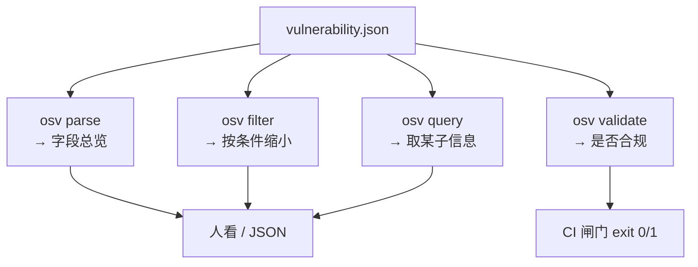

# 快速开始

一分钟内让 `osv` CLI 跑通一条真实漏洞记录。

## 安装 CLI

::: tabs
== 预编译二进制（任意平台）

从 [最新 Release](https://github.com/scagogogo/osv-schema-skills/releases) 下载匹配你 OS/架构 的二进制。

```bash
# Linux amd64 示例（替换版本号与平台）
VERSION=v0.1.0
curl -fsSL -o osv.tar.gz \
  https://github.com/scagogogo/osv-schema-skills/releases/download/${VERSION}/osv_${VERSION}_linux_amd64.tar.gz
tar -xzf osv.tar.gz osv
sudo mv osv /usr/local/bin/
osv version
```

== go install

```bash
go install github.com/scagogogo/osv-schema-skills/cmd/osv@latest
osv version
```

== 源码构建

```bash
git clone https://github.com/scagogogo/osv-schema-skills.git
cd osv-schema-skills
go build -o osv ./cmd/osv/
./osv version
```
:::

## 解析你的第一个 OSV 文件

用自带的样例解析：

```bash
osv parse test_data/GHSA-vxv8-r8q2-63xw.json
```

预期输出：

```
ID:             GHSA-vxv8-r8q2-63xw
Schema Version: 1.4.0
Summary:        ...

Severity:
  CVSS_V3: CVSS:3.1/... (score: 7.5)

Affected Packages:
  ...
```

## 30 秒工作流


## 四个命令分别给你什么



## 使用 Go SDK

```bash
go get -u github.com/scagogogo/osv-schema-skills
```

```go
package main

import (
    "fmt"
    "log"

    osv "github.com/scagogogo/osv-schema-skills"
)

func main() {
    v, err := osv.UnmarshalFromJsonFile[any, any]("vulnerability.json")
    if err != nil {
        log.Fatal(err)
    }
    fmt.Printf("ID: %s\n", v.ID)
    fmt.Printf("CVE: %s\n", v.Aliases.GetCVE())
}
```

## 启用 Claude Code 技能

只需在 Claude Code 中打开本仓库——6 个技能自动激活：

```bash
git clone https://github.com/scagogogo/osv-schema-skills.git
cd osv-schema-skills
claude  # 技能已生效
```

每个技能何时触发，见 [技能总览](/zh/guide/skills)。
