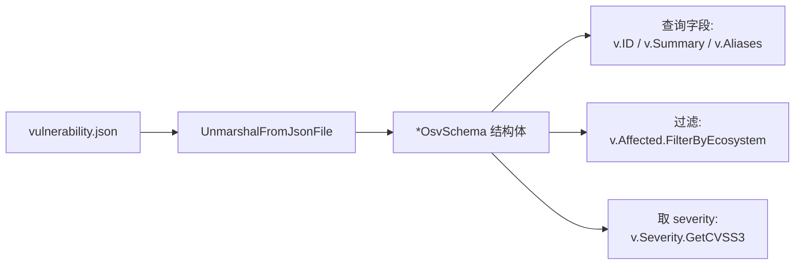
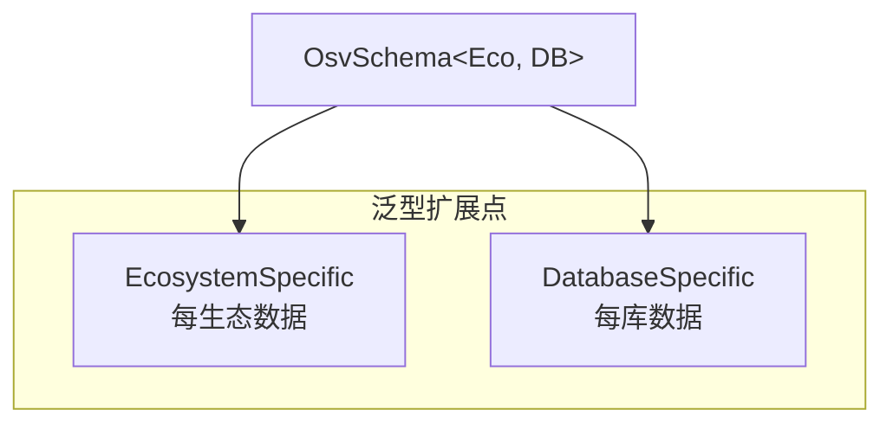
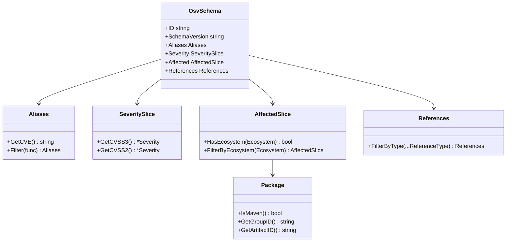
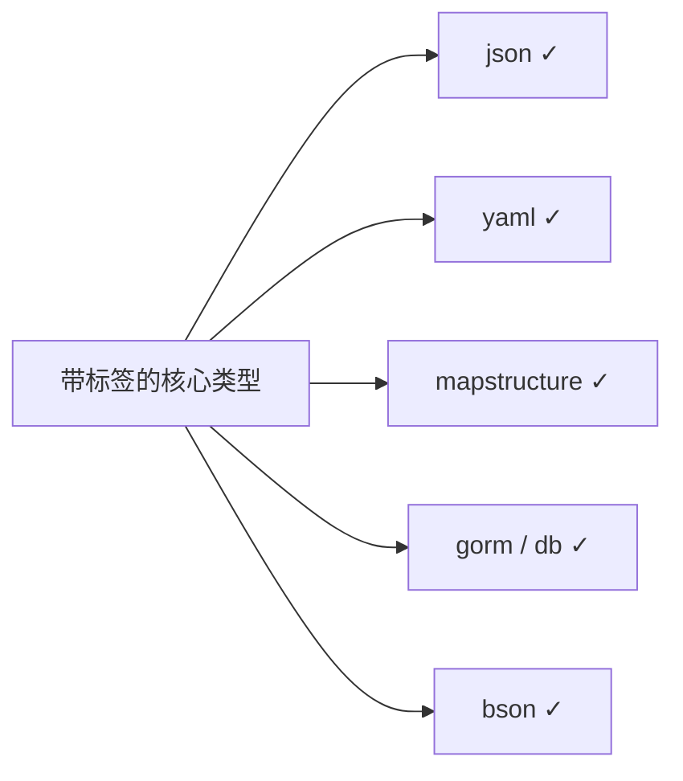

# Go SDK

Go SDK 是 CLI 和技能之下的类型安全基石。当你要把 OSV 解析/过滤/查询嵌入 Go 应用时用它。

## 安装

```bash
go get -u github.com/scagogogo/osv-schema-skills
```

```go
import osv "github.com/scagogogo/osv-schema-skills"
```

## 快速开始

```go
package main

import (
    "fmt"
    "log"

    osv "github.com/scagogogo/osv-schema-skills"
)

func main() {
    // 从 JSON 文件解析 OSV 数据
    v, err := osv.UnmarshalFromJsonFile[any, any]("vulnerability.json")
    if err != nil {
        log.Fatal(err)
    }

    fmt.Printf("ID: %s\n", v.ID)
    fmt.Printf("Summary: %s\n", v.Summary)

    // 从 aliases 取 CVE
    if cve := v.Aliases.GetCVE(); cve != "" {
        fmt.Printf("CVE: %s\n", cve)
    }

    // 检查是否影响某生态
    if v.Affected.HasEcosystem("npm") {
        fmt.Println("影响 npm 包")
    }

    // 取 CVSS v3 分数
    if cvss3 := v.Severity.GetCVSS3(); cvss3 != nil {
        fmt.Printf("CVSS v3: %.1f\n", cvss3.GetScore())
    }
}
```

## 从 JSON 到代码：对象生命周期



## 核心类型

```go
type OsvSchema[EcosystemSpecific, DatabaseSpecific any] struct {
    SchemaVersion    string
    ID               string
    Modified         time.Time
    Published        time.Time
    Withdrawn        string // string，不是 time.Time——非空即表示已撤回
    Aliases          Aliases
    Related          Related
    Summary          string
    Details          string
    Severity         SeveritySlice
    Affected         AffectedSlice[EcosystemSpecific, DatabaseSpecific]
    References       References
    DatabaseSpecific DatabaseSpecific
    Credits          *Credits
}
```

泛型参数 `EcosystemSpecific` 和 `DatabaseSpecific` 让你按生态或漏洞库附加自定义数据。通用解析用 `any`。



## 类型关系一图



## 关键方法

完整表见 [参考 → 方法清单](/zh/reference/methods)。要点：

| 类型 | 方法 | 说明 |
|------|------|------|
| `OsvSchema` | `Affected.HasEcosystem(eco)` | 检查是否影响某生态 |
| `AffectedSlice` | `FilterByEcosystem(eco)` | 过滤受影响包 |
| `Aliases` | `GetCVE()` | 取第一个 CVE 标识 |
| `SeveritySlice` | `GetCVSS3()` / `GetCVSS2()` | 取 CVSS severity 条目 |
| `Severity` | `GetScore()` | 解析分数为 float64 |
| `References` | `FilterByType(t)` | 按引用类型过滤 |
| `Package` | `IsMaven()` / `GetGroupID()` / `GetArtifactID()` | Maven 拆分 |

## 序列化

每个核心类型都带 `json`、`yaml`、`mapstructure`、`db`、`bson`、`gorm` 标签——JSON、YAML、mapstructure、GORM 和 MongoDB（BSON）开箱即用。



## 设计要点

- **构造器永不返回 nil**——`UnmarshalFromJsonFile` / `UnmarshalFromJson` 显式返回 error；成功时结果绝非 nil 指针。
- **Withdrawn 是字符串**——不是 `time.Time`。用非空字符串判断撤回状态。
- **数据库策略**——简单字段做列；复杂嵌套结构（`AffectedSlice`、`SeveritySlice`）经 GORM serializer 存为 JSON 字符串。

## 环境要求

- Go 1.18+
