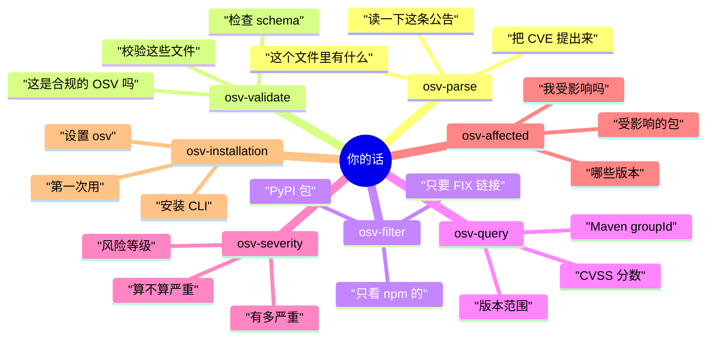
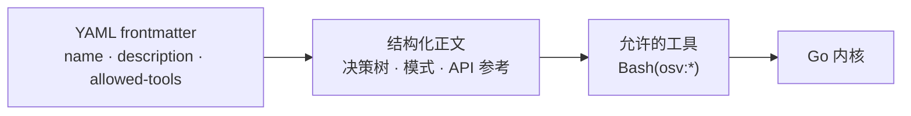
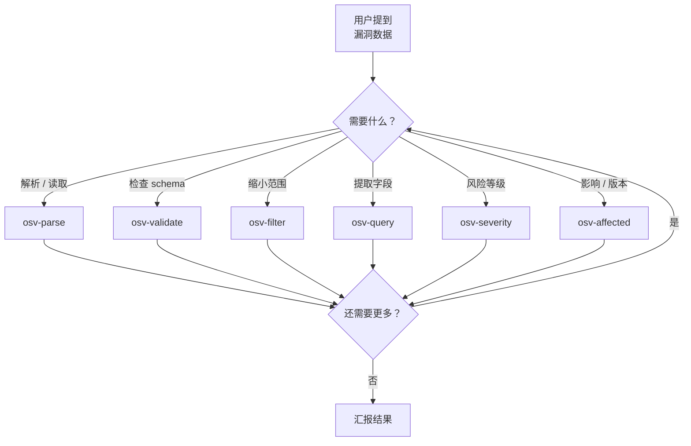
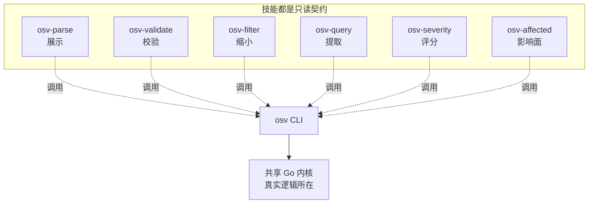
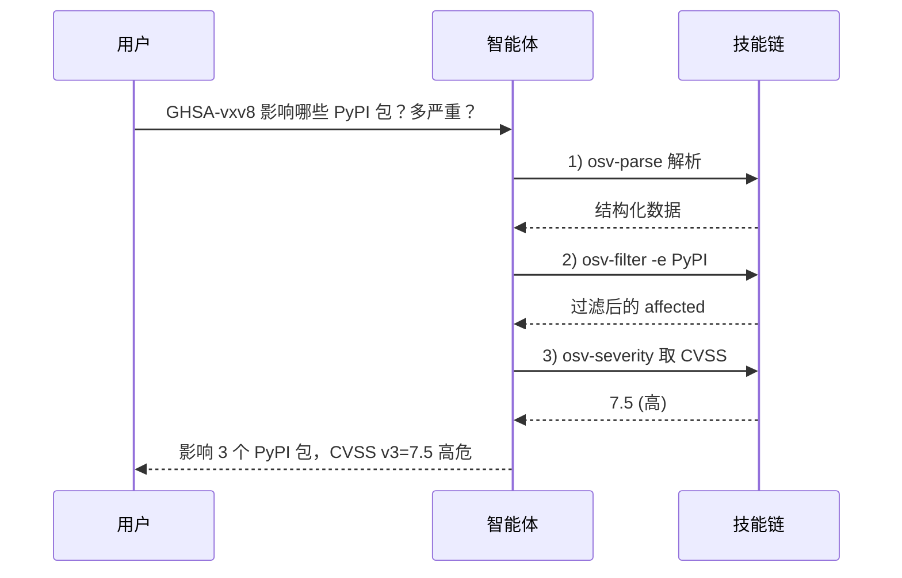

# 技能总览

本仓库被设计为一个 **技能仓库**。当 Claude Code 打开它时，7 个专用技能自动可用——无需集成代码。

## 技能

六个**数据技能**干真正的活——解析、校验、过滤、查询、评分、影响面。第七个 `osv-installation` 是**安装向导**，首次使用时触发；它不调用 `osv`（其 `allowed-tools` 是 `Bash(go:*)`，而非 `Bash(osv:*)`）。

| 技能 | 用途 | 何时自动触发 |
|------|------|--------------|
| [`osv-parse`](/zh/guide/skills/parse) | 解析并展示 OSV JSON 数据 | 你提到解析漏洞文件或提取 CVE/GHSA 数据 |
| [`osv-validate`](/zh/guide/skills/validate) | 校验 OSV JSON 文件 | 你要检查 schema 合规性或验证漏洞文件 |
| [`osv-filter`](/zh/guide/skills/filter) | 按生态 / 引用类型 / 别名过滤 | 你想要 npm/PyPI/Maven 过滤或 FIX 引用 |
| [`osv-query`](/zh/guide/skills/query) | 提取 severity、Maven、ranges、events | 你需要 CVSS 分数、Maven GAV 或版本范围 |
| [`osv-severity`](/zh/guide/skills/severity) | CVSS 严重程度分析 | 你在评估漏洞风险或严重程度 |
| [`osv-affected`](/zh/guide/skills/affected) | 受影响包与版本分析 | 你需要影响分析或版本范围检查 |
| [`osv-installation`](/zh/guide/installation) | 安装与设置指南 | 你是第一次使用这些技能 |

## 什么措辞落到哪个技能

你从不点名技能——你只描述意图，智能体拿你的话去匹配每个技能的 `description`。以下是路由到各技能的典型措辞：



## 技能如何接线

每个技能是 `.claude/skills/<name>/` 下的一个 `SKILL.md` 文件：



1. **YAML frontmatter**——告诉智能体 *何时* 触发以及 *能用什么工具*。
2. **结构化正文**——决策树、任务模式、API 参考、代码示例。

示例——`osv-parse` frontmatter：

```yaml
---
name: osv-parse
description: Parse an OSV JSON file and display structured vulnerability data.
             Triggers on mentions of OSV parsing, CVE/GHSA data extraction...
allowed-tools: "Bash(osv:*)"
argument-hint: <osv-json-file>
---
```

## 技能决策树

当智能体遇到一个漏洞任务，它经由技能路由：



## 技能之间的能力边界



技能本身不含逻辑——它们只声明 *何时触发* 和 *调哪个命令*。

## 真实工作流

```
用户："检查 GHSA-vxv8-r8q2-63xw 是否影响任何 PyPI 包，有多严重"

智能体工作流：
1. → osv-parse:     解析 OSV JSON 文件
2. → osv-filter:    按 PyPI 生态过滤受影响包
3. → osv-severity:  提取 CVSS v3 分数
4. → 向用户汇报结果
```



## 在你的项目里使用技能

**方案一——克隆本仓库。** Claude Code 打开目录时技能自动激活：

```bash
git clone https://github.com/scagogogo/osv-schema-skills.git
cd osv-schema-skills
```

**方案二——作为 Claude Code 插件安装**（即将推出）：

```bash
claude plugin add scagogogo/osv-schema-skills
```

::: tip
技能是只读契约——它们只声明 *何时触发* 和 *调哪个 CLI 命令*。所有真实逻辑都在共享 Go 内核里，所以技能、CLI、SDK 三者行为完全一致。
:::
