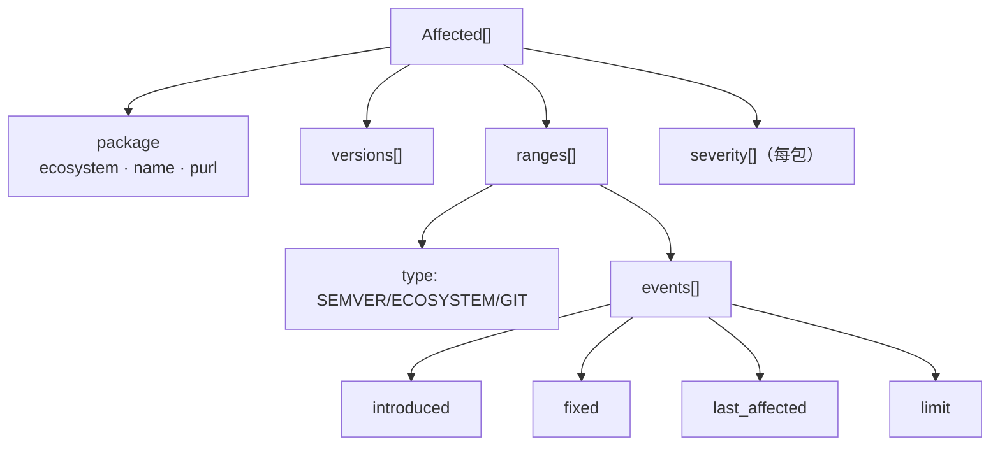
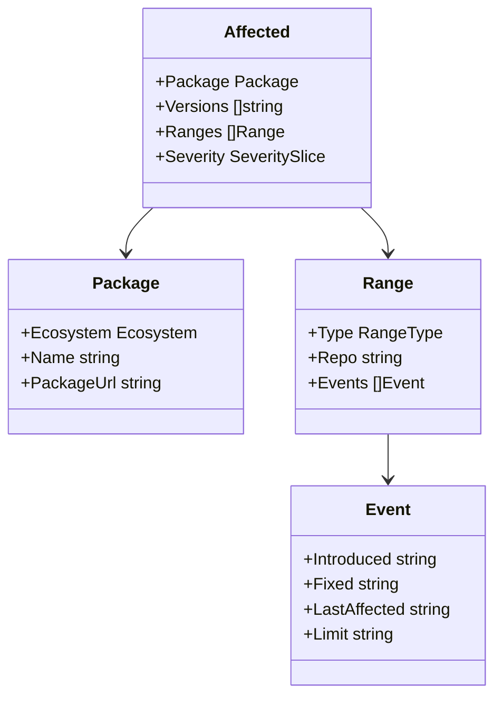
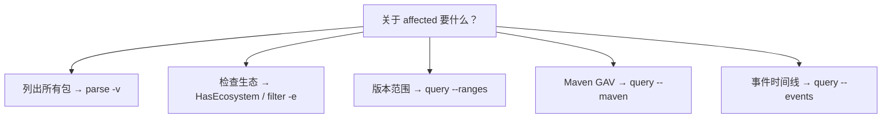
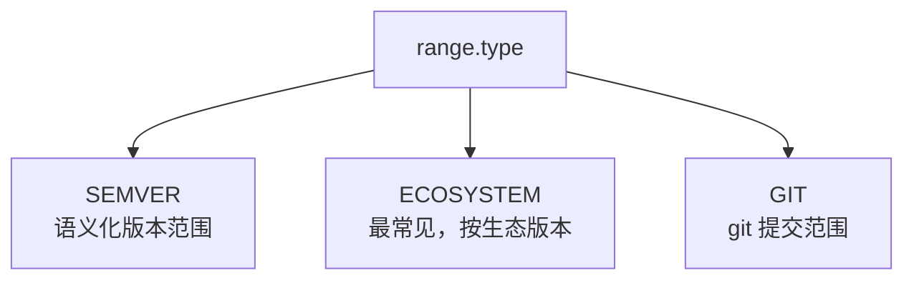
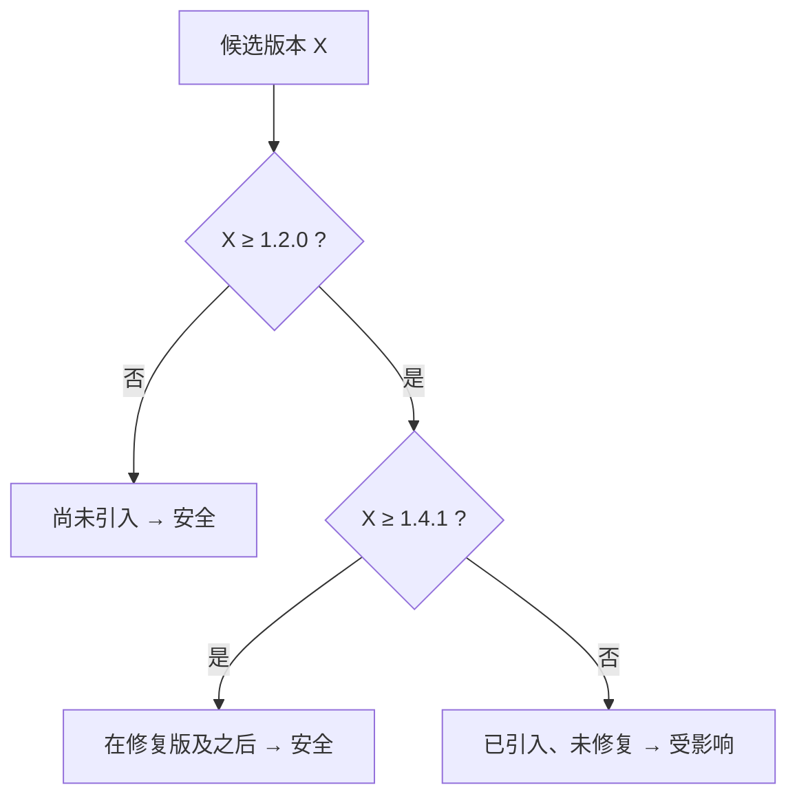

# osv-affected

分析受影响包与版本范围。

> **触发条件：** 提到受影响包、版本范围、受影响生态，或确定哪些包/版本受影响。
> **技能源码：** [`.claude/skills/osv-affected/SKILL.md`](https://github.com/scagogogo/osv-schema-skills/blob/main/.claude/skills/osv-affected/SKILL.md)

## CLI

```bash
osv parse -v vulnerability.json             # 完整 affected 详情 + 范围
osv filter -e PyPI vulnerability.json       # 收窄到一个生态
osv query --ranges vulnerability.json       # 版本范围
osv query --events vulnerability.json       # 事件时间线
```

## SDK

```go
// 是否存在
v.Affected.HasEcosystem(osv.EcosystemPyPI)

// 过滤
pypi := v.Affected.FilterByEcosystem(osv.EcosystemPyPI)

// 遍历范围与事件
for _, a := range v.Affected {
    if a.Package == nil {
        continue // 缺失 package 罕见，但在不受信任的数据上可能发生
    }
    fmt.Println(a.Package.Ecosystem, a.Package.Name)
    for _, r := range a.Ranges {
        fmt.Println("  range type:", r.Type)   // SEMVER / ECOSYSTEM / GIT
        for _, e := range r.Events {
            // e.IsIntroduced() / IsFixed() / IsLastAffected() / IsLimit()
        }
    }
}
```

## 结构



## Affected 数据模型



## 决策树



## 范围类型对比



- `RangeTypeEcosystem`（`ECOSYSTEM`）最常见；`SEMVER` 和 `GIT` 较少见。

## 我的版本受影响吗？—— 实例

`versions[]` 是一份显式枚举，但真实记录更多依赖 `ranges[]`。要从一个 range 回答"`X` 是否受影响"，就解析它的事件。示例：`introduced: 1.2.0`、`fixed: 1.4.1`。



::: warning `versions[]` 与 `ranges[]` 的形态可能不一致
有些记录列出精确受影响的 `versions[]`；有些只给 `ranges[]`；很多两者都给。对"自 1.2.0 起的全部"这类开区间场景优先用 `ranges[]`，当 `versions[]` 存在时把它当作权威枚举。切勿假设其中一个能推出另一个。
:::

## 注意事项

- `RangeTypeEcosystem`（`ECOSYSTEM`）最常见；`SEMVER` 和 `GIT` 较少
- 每个 event 对象的字段互斥
- `affected[].severity` 是可选的每包 severity，与顶层 `severity` 相互独立

## 交叉引用

- [[osv-filter]] — 按生态收窄 affected
- [[osv-query]] — 提取 ranges/events/maven
- [OSV Schema](/zh/reference/osv-schema) — 完整类型模型
