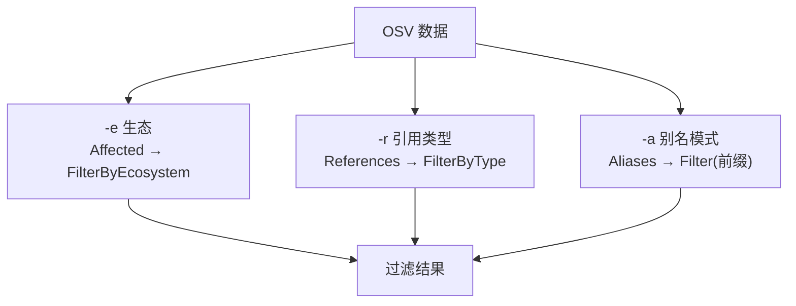
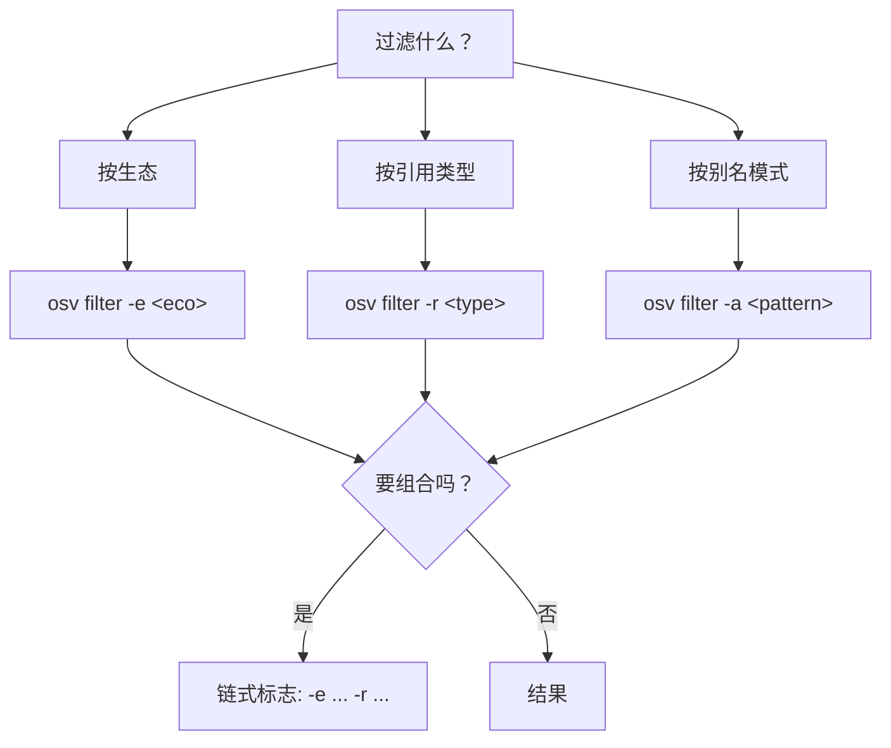
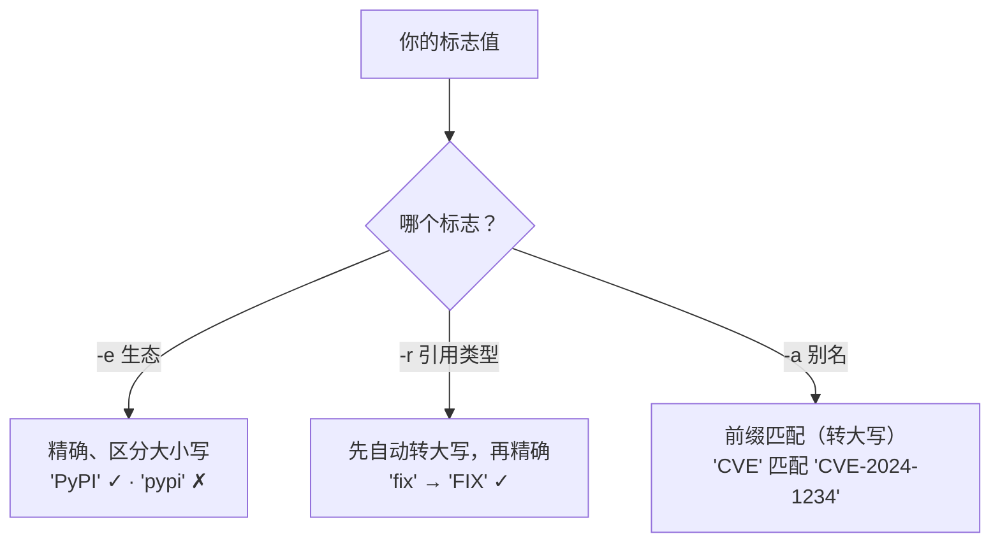

# osv-filter

按生态、引用类型或别名模式过滤 OSV 数据。

> **触发条件：** 提到按包生态过滤（npm、PyPI、Maven）、按引用类型过滤（ADVISORY、FIX），或按别名模式过滤（CVE、GHSA）。
> **技能源码：** [`.claude/skills/osv-filter/SKILL.md`](https://github.com/scagogogo/osv-schema-skills/blob/main/.claude/skills/osv-filter/SKILL.md)

## CLI

```bash
osv filter -e PyPI vulnerability.json        # 按生态
osv filter -r FIX vulnerability.json         # 按引用类型
osv filter -a CVE vulnerability.json         # 按别名模式
osv filter -e PyPI -r FIX vulnerability.json # 组合
osv filter -o json -e PyPI vulnerability.json
```

| 标志 | 说明 |
|------|------|
| `-e, --ecosystem` | 生态，按 OSV 规范区分大小写（`PyPI`、`npm`、`Maven`） |
| `-r, --ref-type` | 引用类型，自动转大写（`ADVISORY`、`FIX`、`WEB`） |
| `-a, --alias` | 别名前缀，匹配前转大写（`CVE`、`GHSA`、`CVE-2024`） |
| `-o, --output` | `text`（默认）或 `json` |

至少需要一个过滤标志。

## 三个过滤维度



## SDK 等价

```go
// 生态
pypi := v.Affected.FilterByEcosystem(osv.EcosystemPyPI)
hasNpm := v.Affected.HasEcosystem(osv.EcosystemNpm)

// 引用
fixes := v.References.FilterByType(osv.ReferenceTypeFix)

// 别名
cves := v.Aliases.Filter(func(a string) bool {
    return strings.HasPrefix(strings.ToUpper(a), "CVE-")
})
```

## 决策树



## 组合过滤的执行顺序


各标志独立作用于原数据的不同切片，组合即取交集。

## 各标志的匹配语义

三个标志的匹配方式**并不相同**——这是"为什么我的过滤什么都没返回？"最常见的根源。



::: warning `-e` 是最严格的那个
生态是逐字对照 OSV 规范里的精确大小写来比较的，所以 `-e pypi` 会静默地什么都不返回。引用类型很宽容（自动转大写），别名是前缀匹配。过滤结果为空时，先对照 [生态系统](/zh/reference/ecosystems) 列表检查 `-e` 的大小写。
:::

## 注意事项

- 生态名区分大小写（`PyPI`，不是 `pypi`）
- 引用类型在 CLI 中自动转大写
- 别名前缀匹配前转大写，所以 `-a cve` 等同于 `-a CVE`
- `HasEcosystem` 返回 bool；`FilterByEcosystem` 返回过滤后的切片

## 交叉引用

- [[osv-parse]] — 先解析
- [[osv-query]] — 过滤后提取字段
- 完整常量列表见 [生态系统](/zh/reference/ecosystems)
