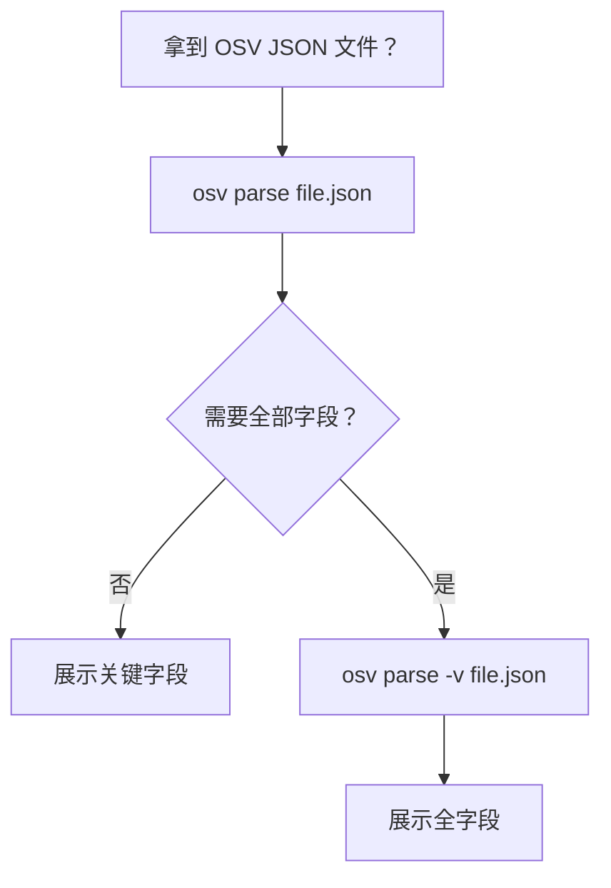
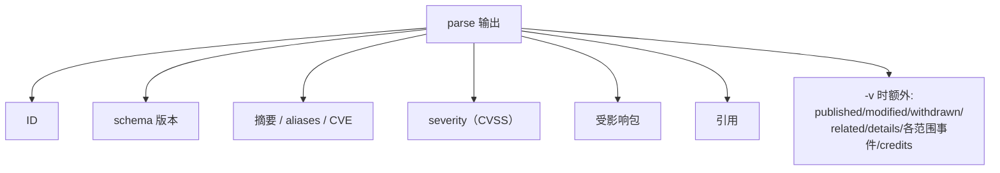

# osv-parse

解析 OSV JSON 文件并展示结构化的漏洞数据。

> **触发条件：** 提到 OSV 解析、漏洞 JSON 读取、CVE/GHSA 数据提取，或用户提供了 OSV JSON 文件路径。
> **技能源码：** [`.claude/skills/osv-parse/SKILL.md`](https://github.com/scagogogo/osv-schema-skills/blob/main/.claude/skills/osv-parse/SKILL.md)

## CLI

```bash
osv parse vulnerability.json           # 关键字段（文本）
osv parse -v vulnerability.json        # 全字段（日期、详情、范围、鸣谢）
osv parse -o json vulnerability.json   # JSON 输出
```

| 标志 | 说明 |
|------|------|
| `-v, --verbose` | 展示全字段 |
| `-o, --output` | `text`（默认）或 `json` |

## SDK 等价

```go
v, err := osv.UnmarshalFromJsonFile[any, any]("vulnerability.json")
fmt.Println(v.ID, v.Summary, v.Aliases.GetCVE())
```

## 决策树



## 输出结构



## 它打印什么

ID、schema 版本、摘要、aliases/CVE、severity、受影响包、引用。加 `-v` 还会展示 published/modified 日期、withdrawn、related、details、每范围事件和 credits。

## 交叉引用

- [[osv-validate]] — 先确认文件 schema 合规
- [[osv-filter]] / [[osv-query]] — 对解析后的数据做收窄或提取
